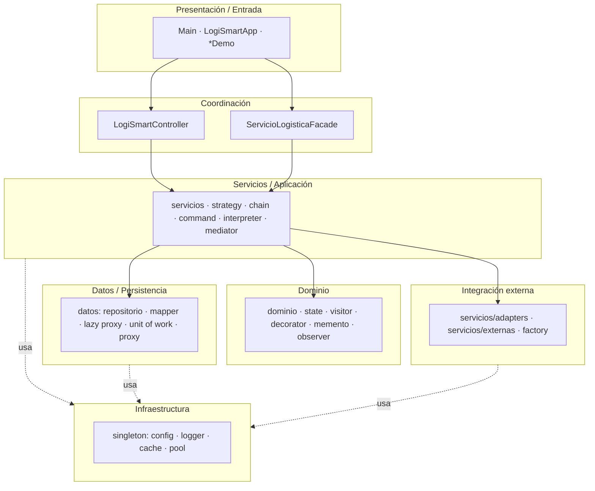
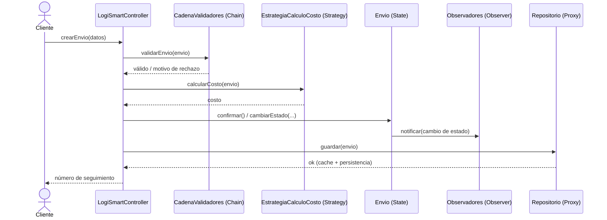

# Arquitectura de LogiSmart

Este documento describe la arquitectura del sistema: sus capas, la organización en paquetes,
los principios de diseño que la sostienen y los flujos principales. Los diagramas UML
están en [diagramas/](diagramas/) y el catálogo de patrones en [PATRONES.md](PATRONES.md).

---

## 1. Visión general

LogiSmart es un monolito modular en **Java 21**, construido con **Maven** y verificado con
**JUnit 5**. Está organizado en una **arquitectura en capas** donde cada capa solo depende de las
inferiores y la comunicación con el exterior (proveedores de envío, pago y mapas) se aísla detrás
de interfaces y adapters.



---

## 2. Capas y responsabilidades

| Capa | Paquetes | Responsabilidad |
|---|---|---|
| **Presentación / Entrada** | raíz (`Main`, `LogiSmartApp`), `*Demo` | Puntos de entrada y demostraciones por consola. |
| **Coordinación** | `controlador`, `facade` | `LogiSmartController` (patrón GRASP Controller) y `ServicioLogisticaFacade` orquestan casos de uso sin contener lógica de dominio. |
| **Servicios / Aplicación** | `servicios`, `strategy`, `chain`, `command`, `interpreter`, `mediator` | Algoritmos de negocio: cálculo de costos, validación, comandos, reglas, coordinación entre subsistemas. |
| **Dominio** | `dominio`, `state`, `visitor`, `decorator`, `memento`, `observer` | Entidades (`Envio`, `Ruta`, `Vehiculo`, `Usuario`, centros) y su comportamiento intrínseco (ciclo de vida, servicios opcionales, notificación). |
| **Datos / Persistencia** | `datos` (`repositorio`, `mapper`, `lazy`, `uow`, `servicio`), `proxy` | Repositorios (en memoria y SQL), mappers, lazy loading vía proxy y *unit of work*. |
| **Integración externa** | `servicios/adapters`, `servicios/externas`, `factory` | Traducción de APIs de terceros a las interfaces del sistema; creación de familias por región. |
| **Infraestructura** | `singleton` | Configuración, logging, cache, pool de conexiones y registro de proveedores (instancias únicas compartidas). |

---

## 3. Principios de diseño

El diseño aplica de forma explícita los principios trabajados en los hitos 1–5 y reforzados por los
patrones de los hitos 6–12.

### SOLID
- **S — Responsabilidad única:** cada validador (`chain`), cada estrategia (`strategy`) y cada generador de reporte (`bridge`) tiene una sola razón de cambio.
- **O — Abierto/Cerrado:** agregar un proveedor, una estrategia de costo o un decorador es crear una clase nueva, sin modificar las existentes (Factory, Strategy, Decorator, Adapter).
- **L — Sustitución de Liskov:** los `Envio` decorados, los adapters y los estados son intercambiables por su tipo base/interfaz.
- **I — Segregación de interfaces:** interfaces específicas (`ProveedorEnvio`, `ProveedorPago`, `ProveedorMapas`) en lugar de una interfaz monolítica.
- **D — Inversión de dependencias:** las capas altas dependen de abstracciones (`Repositorio`, `EstrategiaCalculoCosto`, `ProveedorEnvio`), no de implementaciones concretas.

### GRASP (Hito 5)
- **Controller:** `LogiSmartController` recibe las solicitudes de la capa de entrada.
- **Polymorphism:** estrategias, estados y proveedores resuelven variantes por polimorfismo en vez de condicionales.
- **Pure Fabrication:** repositorios, mappers y factories no son del dominio pero mantienen alta cohesión.
- **Indirection:** adapters y mediator desacoplan componentes que de otro modo se conocerían directamente.
- **Protected Variations:** las interfaces de proveedores protegen al sistema de cambios en las APIs externas.

---

## 4. Flujo principal — creación y procesamiento de un envío



Este flujo combina **Chain** (validación), **Strategy** (costo), **State** (ciclo de vida),
**Observer** (notificación) y **Proxy** (acceso a datos) — varios patrones colaborando en un
único caso de uso, tal como se integran en los paquetes `integracion`, `eventdriven` y `avanzada`.

---

## 5. Persistencia

El paquete `datos` ofrece doble implementación de cada repositorio:
- **En memoria** (`*Memoria`) para tests y demos.
- **SQL** (`*SQL`) para entorno productivo.

Ambas implementan la interfaz `Repositorio<T>`, de modo que la capa de servicios no sabe cuál usa
(Inversión de Dependencias). Se complementa con **mappers** (entidad ↔ fila), **lazy proxies**
(`datos/lazy`) que difieren la carga de relaciones costosas y un **Unit of Work** (`datos/uow`)
que agrupa cambios en una transacción lógica.

---

## 6. Integración con terceros

Cada proveedor externo (DHL, FedEx, UPS, PayPal, Stripe, Google Maps, HERE Maps, MercadoLibre,
Tiendanube) tiene su **API simulada** en `servicios/externas` y un **Adapter** en
`servicios/adapters` que traduce esa API a la interfaz del sistema (`ProveedorEnvio` / `ProveedorPago`).
El `RegistroDeProveedores` (Singleton) y las factories permiten seleccionar el proveedor en runtime.
Agregar uno nuevo es **una sola clase adapter**, sin tocar el resto del sistema.

---

## 7. Compilación, pruebas y ejecución

```bash
mvn compile        # compila las 238 clases
mvn test           # ejecuta los 107 tests JUnit 5
mvn package        # genera el jar
```

- **Java:** 21 (`maven.compiler.release=21`).
- **Tests:** JUnit Jupiter 5.10, en `src/test/java`, espejando los paquetes de `src/main/java`.
- **Demos:** cada paquete de patrón incluye una clase `*Demo` con `main` ejecutable.

---

## 8. Decisiones de diseño relevantes

1. **Demos vs. tests.** Las clases `*Demo` se conservan como documentación ejecutable de cada
   patrón, pero la verificación de regresión real son los 107 tests JUnit con *assertions*.
2. **Doble repositorio (memoria/SQL).** Permite correr la suite sin base de datos y demostrar
   Inversión de Dependencias.
3. **`Envio` como contexto compartido.** Es el agregado central; State y Strategy lo usan como
   contexto, y Decorator/Memento/Observer operan sobre él. Se mantuvo compatibilidad hacia atrás
   entre hitos (métodos `getEstado()`, `cambiarEstado(String)` y la sobrecarga con `state.EstadoEnvio`).
4. **Paquetes por patrón.** Facilita ubicar cada patrón y mantener alta cohesión; la integración
   entre patrones vive en paquetes dedicados (`integracion`, `eventdriven`, `avanzada`).
