# Diagramas UML — LogiSmart

Diagramas consolidados del sistema en **Mermaid** (GitHub los renderiza automáticamente).
Los diagramas históricos por hito están en cada carpeta de [`../hitos/`](../hitos/) (PNG en el
Hito 9 y Hito 11, `.mmd` en el Hito 12).

Índice:
1. [Diagrama de paquetes / capas](#1-diagrama-de-paquetes--capas)
2. [Diagrama de clases del dominio](#2-diagrama-de-clases-del-dominio)
3. [Patrones creacionales](#3-patrones-creacionales)
4. [Patrones estructurales](#4-patrones-estructurales)
5. [Patrones de comportamiento](#5-patrones-de-comportamiento)
6. [Ciclo de vida del envío (State)](#6-ciclo-de-vida-del-envío-state)

---

## 1. Diagrama de paquetes / capas

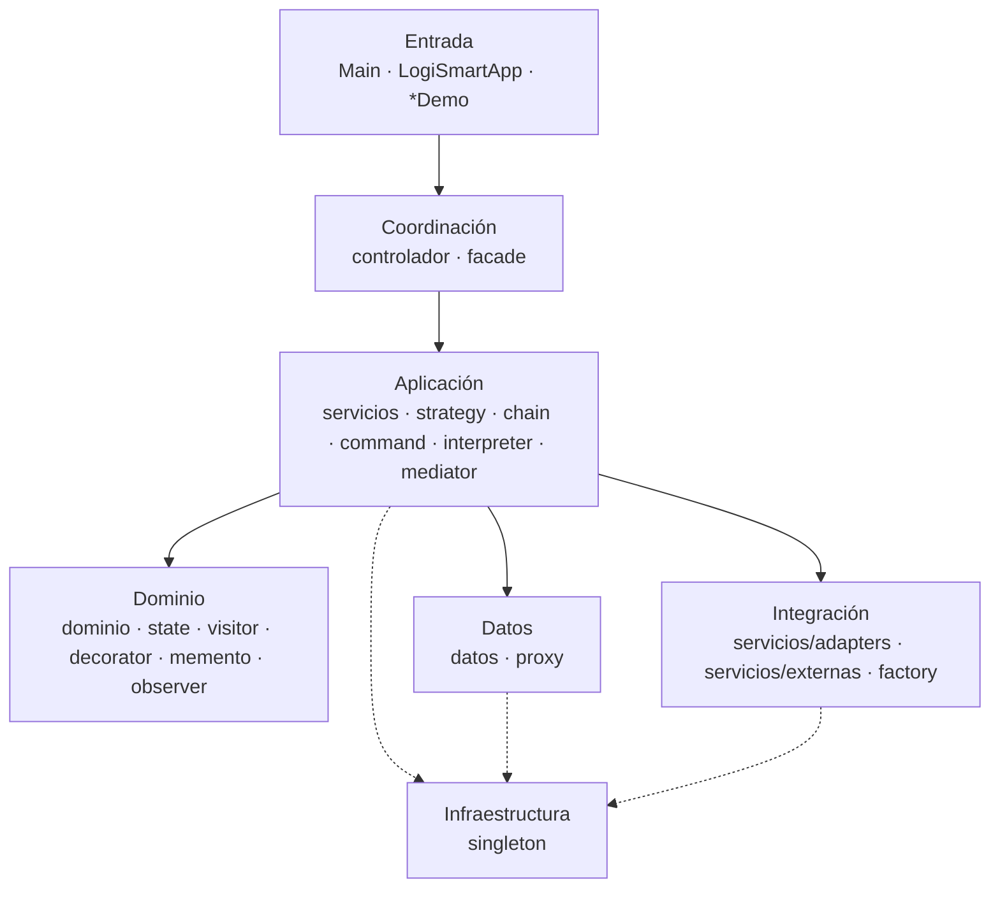

---

## 2. Diagrama de clases del dominio

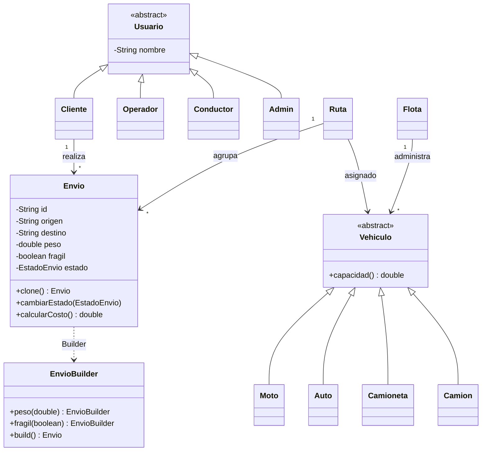

---

## 3. Patrones creacionales

### Abstract Factory (familias por región)

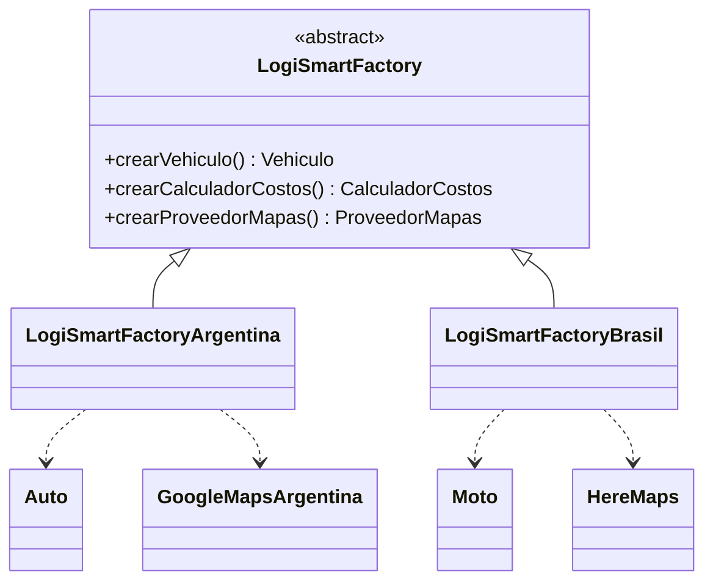

### Singleton (infraestructura)

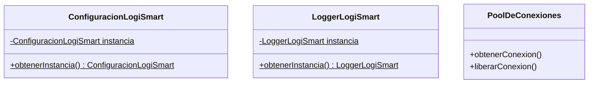

---

## 4. Patrones estructurales

### Decorator (servicios opcionales del envío)

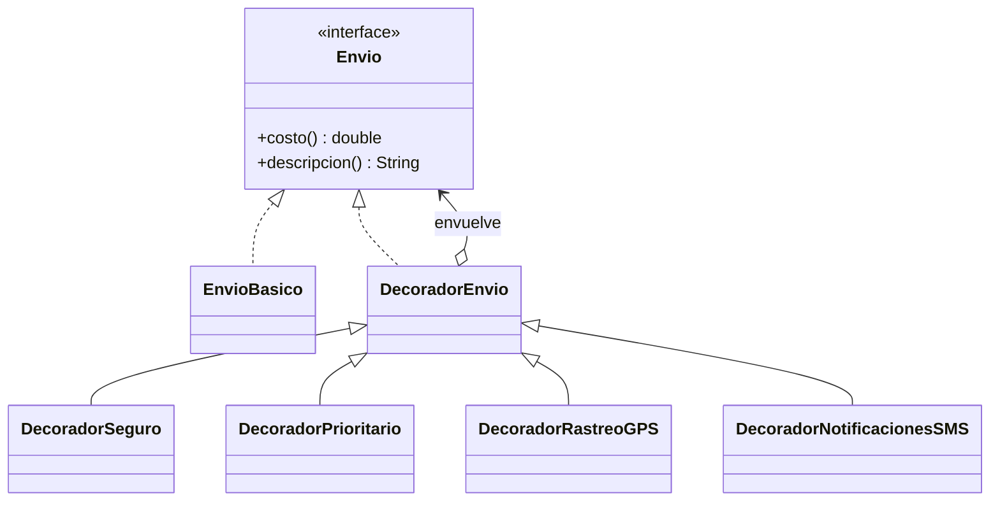

### Composite + Visitor (red de centros)

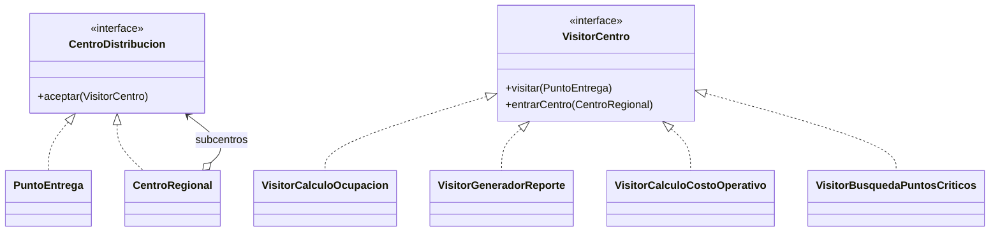

### Bridge (reporte × formato)

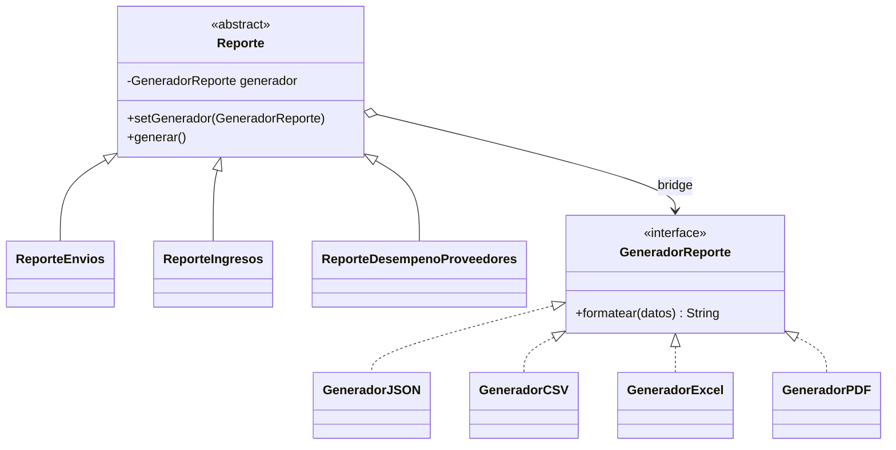

### Adapter (proveedores externos)

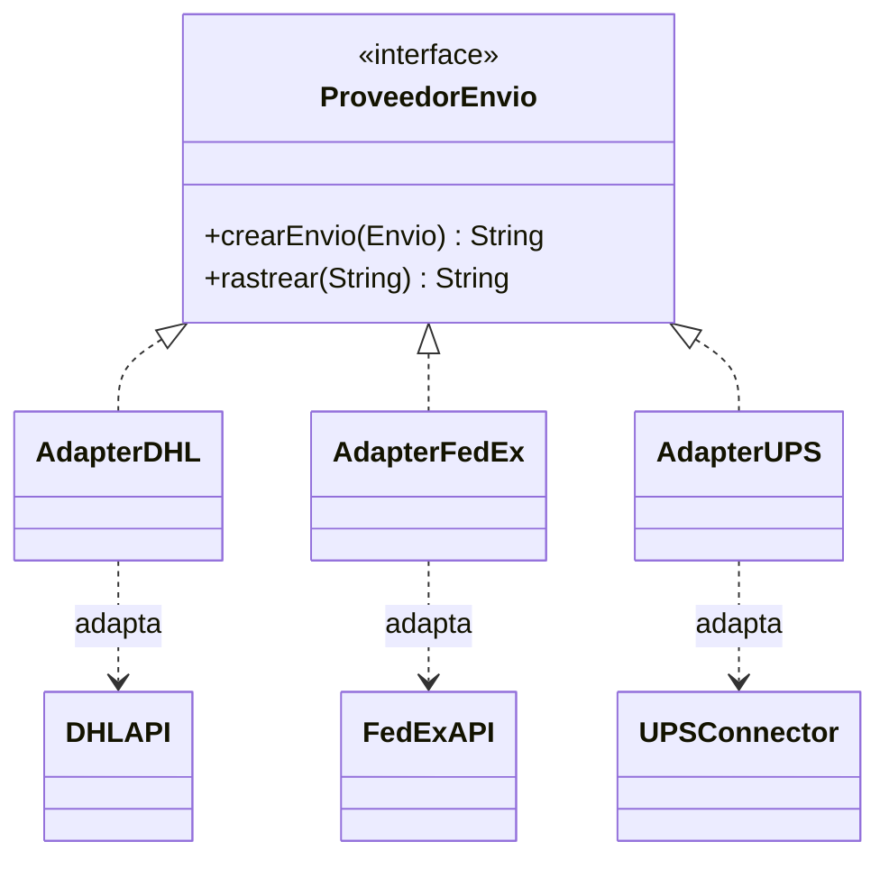

---

## 5. Patrones de comportamiento

### Chain of Responsibility (validación de envíos)

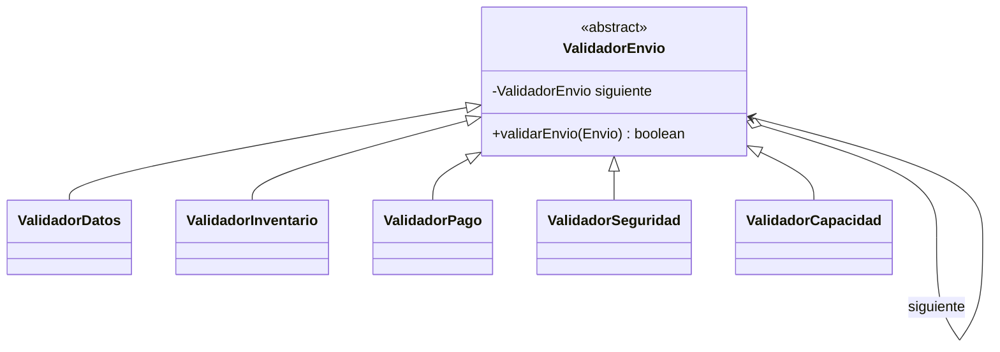

### Strategy (cálculo de costo)

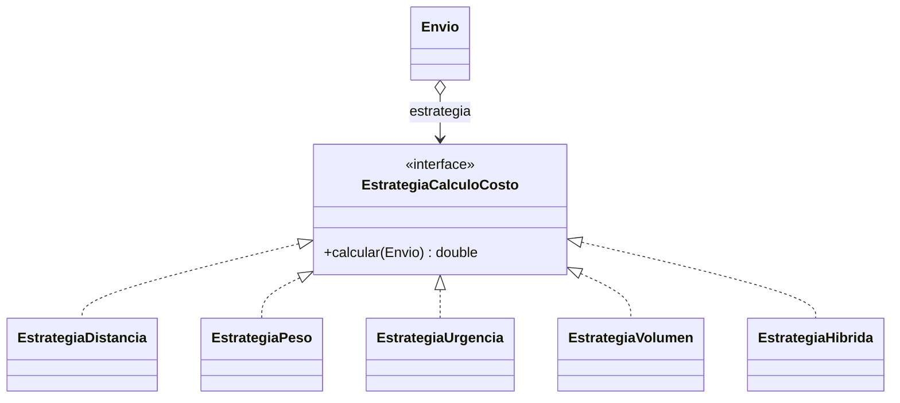

### Observer (notificación de cambios)

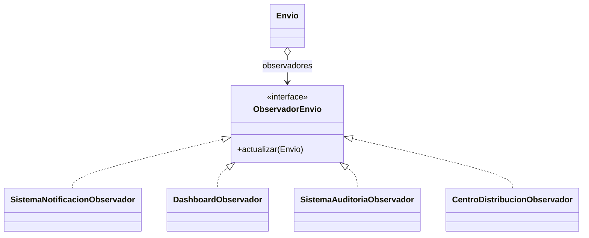

---

## 6. Ciclo de vida del envío (State)

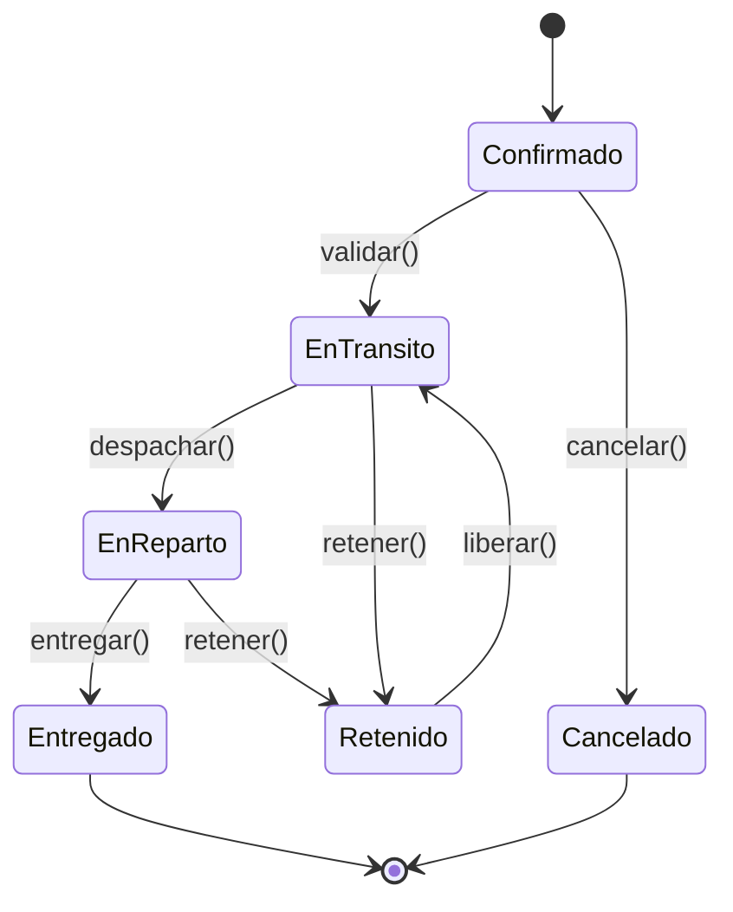
