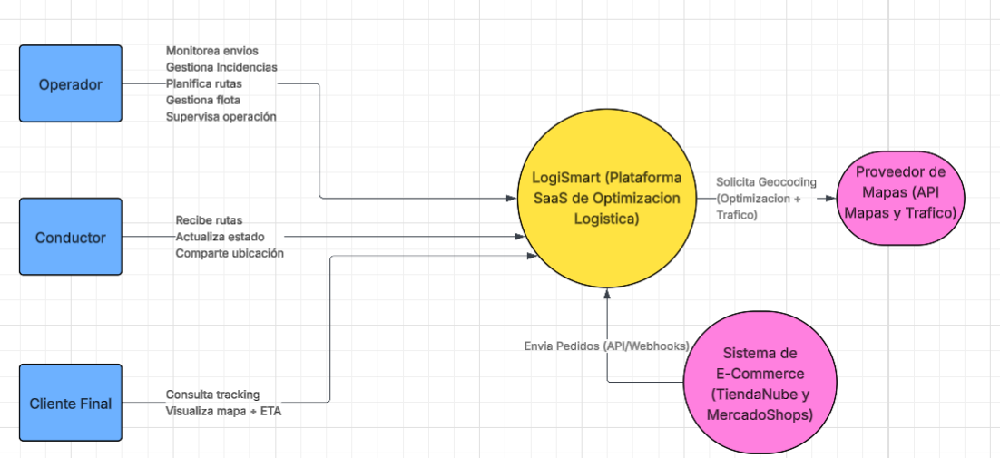

# Hito 1 - Fundamentos y Modelado del Dominio

Práctica de Clase 1 (Hito 1 del TPO) - Análisis de Dominio y Casos de Uso

Análisis de Dominio:

Lista de Actores:

- Operador

- Conductor

- Cliente final

- Sistema de E-commerce

- Proveedor de mapas

Lista de Stakeholders:

- Dueños de la PyME

- Consultora

- Equipo de desarrollo

- Clientes finales

- Proveedores de infraestructura en la nube

- Entidades regulatorias (protección de datos)

Catálogo de Casos de Uso (MVP):

- Registrar PyME en la plataforma

- Integrar tienda e-commerce

- Importar pedidos automáticamente

- Planificar rutas de entrega

- Asignar envíos a conductor

- Visualizar mapa en tiempo real

- Actualizar estado de entrega

- Consultar estado del envío (cliente final)

- Gestionar flota de vehículos

- Generar reporte básico de entregas

Casos de uso clave

Caso de Uso 1: Planificar Rutas de Entrega

Actor Principal: Operador

Resumen:

El operador selecciona los pedidos pendientes de entrega y ejecuta el módulo de optimización. El sistema calcula automáticamente la mejor distribución de rutas considerando tráfico en tiempo real, capacidad de vehículos y ventanas horarias. El sistema propone rutas optimizadas que pueden ser aceptadas o ajustadas manualmente.

Valor estratégico:

Es el núcleo diferencial del sistema (optimización → reducción de costos).

Caso de Uso 2: Importar Pedidos desde E-commerce

Actor Principal: Sistema de E-commerce

Resumen:

Cuando se genera un nuevo pedido en TiendaNube o MercadoShops, el sistema envía automáticamente la información a LogiSmart mediante API. LogiSmart valida los datos, los almacena y los marca como “Pendiente de planificación”.

Valor estratégico:

Reduce carga operativa y elimina errores manuales.

Caso de Uso 3: Consultar Estado del Envío

Actor Principal:

Cliente Final

Resumen:

El cliente accede a un enlace único de seguimiento. Puede visualizar en un mapa la ubicación del vehículo, el estado del pedido y el tiempo estimado de llegada. El sistema actualiza la información en tiempo real.

Valor estratégico:

Impacta directamente en la experiencia del cliente y la percepción de profesionalismo

Tabla de atributos de Calidad

| Atributo | Importancia | Impacto |
| --- | --- | --- |
| Disponibilidad | Si el sistema cae, se detiene la operación logística del cliente. | Arquitectura en cloud ,balanceadores de carga , réplicas de base de datos, SLA > 99.5% |
| Seguridad | Se manejan datos personales (direcciones, teléfonos) y datos comerciales. | Encriptación en tránsito (HTTPS), encriptación en reposo, control de acceso por roles (RBAC), logs de auditoría |
| Performance | Cálculo de rutas no puede demorar demasiado. Tracking debe actualizarse en tiempo real. | Cache, WebSockets o polling optimizado, Motor de optimización eficiente. |
| Usabilidad | El usuario objetivo no es técnico. Si es complejo, no lo adoptan. | UI simple, flujos guiados, onboarding automatizado |
| Escalabilidad | Se prevee un crecimiento del negocio y del volumen de envíos. | Arquitectura en microservicios. Codigo extensible, clean architecture, event-driven y escalado de infraestructura. |

Tabla de restricciones y riesgos

| Riesgos | Restricciones |
| --- | --- |
| Resistencia al cambio en PyMEs | Presupuesto limitado (PyMEs), arquitectura eficiente en costos |
| Competencia contra empresas grandes (Ej: Andreani) | Dependencia de APIs externas (Mapas, trafico, e-commerce) |
| Costos variables de APIs de mapas | Infraestructura cloud obligatoria (disponibilidad y escalabilidad) |

Declaración de Visión

"Convertirnos en la plataforma logística líder para PyMEs en Argentina, democratizando el acceso a herramientas de optimización avanzada y trazabilidad en tiempo real, permitiendo que las pequeñas y medianas empresas compitan con eficiencia, profesionalismo y control operativo al nivel de las grandes corporaciones."

Diagrama de contexto:

