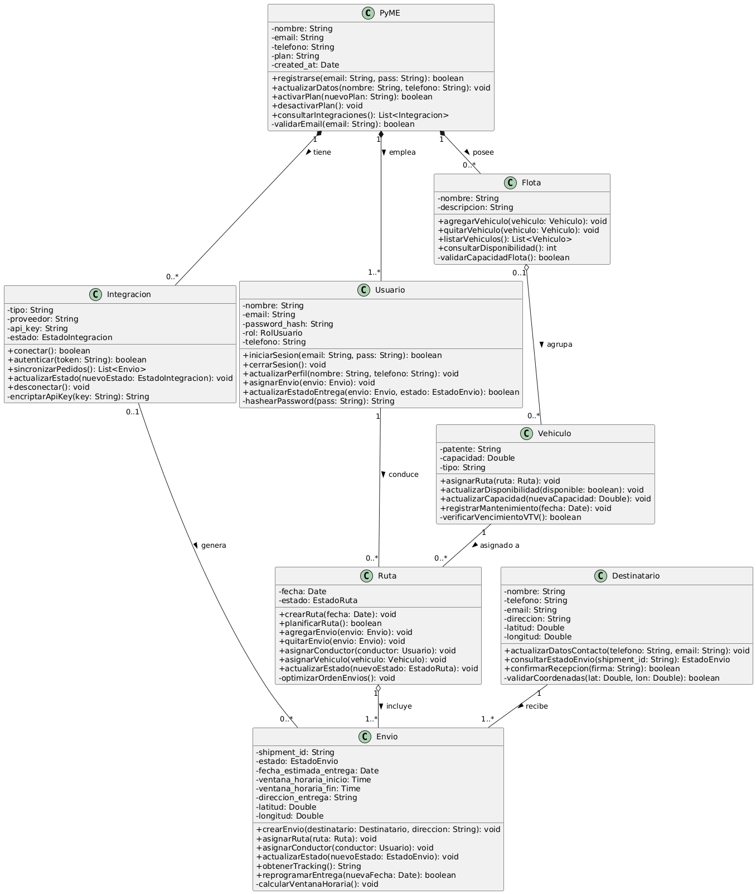

# Hito 2 - Diseno OO: Clases, Relaciones, Cohesion y Acoplamiento

Práctica de Clase 2 (Hito 2 del TPO) - Modelo de Dominio - Diagrama de Clases UML

## Actividad 1: Identificación de Clases Candidatas

Objetivo: Extraer del análisis del Hito 1 las entidades principales que se convertirán en clases.

- Revisar los Casos de Uso del Hito 1:

- La PyME se registra en la plataforma → Candidatos: PyME, Plataforma

- El sistema integra la tienda e-commerce → Candidatos: Sistema, Tienda, Integración

- El sistema importa pedidos automáticamente → Candidatos: Sistema, Pedido

- El operador logístico planifica rutas de entrega → Candidatos: Operador, Ruta, Entrega

- El operador asigna envíos a un conductor → Candidatos: Operador, Envío, Conductor

- El usuario visualiza el mapa en tiempo real → Candidatos: Usuario, Mapa

- El conductor actualiza el estado de la entrega → Candidatos: Conductor, EstadoEntrega, Entrega

- El cliente consulta el estado del envío → Candidatos: Cliente, Envío, EstadoEntrega

- El operador gestiona la flota de vehículos → Candidatos: Operador, Flota, Vehículo

- El sistema genera reportes básicos de entregas → Candidatos: Sistema, Reporte, Entrega

- Filtrar Candidatos:

- PyMe (cliente)

- Integración (relación con Cliente)

- Usuario (operador o conductor)

- Destinatario

- Ruta

- Envío

- Vehiculo

- Flota

- Documentar Candidatos:

PyME

- Empresa cliente que utiliza la plataforma para gestionar sus envíos y operaciones logísticas.

Integración

- Conexión entre la PyME y plataformas externas de e-commerce para importar pedidos automáticamente.

Usuario

- Persona que utiliza el sistema, pudiendo ser operador logístico o conductor encargado de las entregas.

Destinatario

- Cliente final que recibe el envío en una dirección específica.

Ruta

- Planificación de un conjunto de envíos organizados para ser entregados en un recorrido determinado.

Envío

- Unidad logística a entregar, asociada a un destinatario, una ruta y un conductor, con su estado y seguimiento.

Vehiculo

- Medio de transporte utilizado para realizar las entregas dentro de una ruta.

Flota

- Conjunto de vehículos pertenecientes a una PyME que se gestionan de forma agrupada.

## Actividad 2: Definición de Atributos y Métodos

Objetivo: Para cada clase, definir su estado (atributos) y su comportamiento (métodos).

- Atributos: Para cada clase, identifiquen qué datos necesita conocer.

PyME

Atributos: nombre (String), email (String), telefono (String), plan (String), created_at (Date)

Integración

Atributos: tipo (String), proveedor (String), api_key (String), estado: EstadoIntegracion (Enum)

Usuario

Atributos: nombre (String), email (String), password_hash (String), rol: RolUsuario (Enum), telefono (String)

Destinatario

Atributos: nombre (String), telefono (String), email (String), direccion (String), latitud (Double), longitud (Double)

Ruta

Atributos: fecha (Date), estado: EstadoRuta (Enum)

Envío

Atributos: shipment_id (String), estado: EstadoEnvio (Enum), fecha_estimada_entrega (Date), ventana_horaria_inicio (Time), ventana_horaria_fin (Time), direccion_entrega (String), latitud (Double), longitud (Double)

Vehiculo

Atributos: patente (String), capacidad (Double), tipo (String)

Flota

Atributos: nombre (String), descripcion (String)

- Métodos: Identifiquen qué comportamiento debe tener cada clase.

PyME

Métodos: registrarse(email: String, pass: String): boolean, actualizarDatos(nombre: String, telefono: String): void, activarPlan(nuevoPlan: String): boolean, desactivarPlan(): void, consultarIntegraciones(): List<Integracion>

Integración

Métodos: conectar(): boolean, autenticar(token: String): boolean, sincronizarPedidos(): List<Envio>, actualizarEstado(nuevoEstado: EstadoIntegracion): void, desconectar(): void

Usuario

Métodos: iniciarSesion(email: String, pass: String): boolean, cerrarSesion(): void, actualizarPerfil(nombre: String, telefono: String): void, asignarEnvio(envio: Envio): void, actualizarEstadoEntrega(envio: Envio, estado: EstadoEnvio): boolean

Destinatario

Métodos: actualizarDatosContacto(telefono: String, email: String): void, consultarEstadoEnvio(shipment_id: String): EstadoEnvio, confirmarRecepcion(firma: String): boolean

Ruta

Métodos: crearRuta(fecha: Date): void, planificarRuta(): boolean, agregarEnvio(envio: Envio): void, quitarEnvio(envio: Envio): void, asignarConductor(conductor: Usuario): void, asignarVehiculo(vehiculo: Vehiculo): void, actualizarEstado(nuevoEstado: EstadoRuta): void

Envío

Métodos: crearEnvio(destinatario: Destinatario, direccion: String): void, asignarRuta(ruta: Ruta): void, asignarConductor(conductor: Usuario): void, actualizarEstado(nuevoEstado: EstadoEnvio): void, obtenerTracking(): String, reprogramarEntrega(nuevaFecha: Date): boolean

Vehiculo

Métodos: asignarRuta(ruta: Ruta): void, actualizarDisponibilidad(disponible: boolean): void, actualizarCapacidad(nuevaCapacidad: Double): void, registrarMantenimiento(fecha: Date): void

Flota

Métodos: agregarVehiculo(vehiculo: Vehiculo): void, quitarVehiculo(vehiculo: Vehiculo): void, listarVehiculos(): List<Vehiculo>, consultarDisponibilidad(): int

- Visibilidad: Apliquen correctamente los modificadores:

- PyME (-) nombre: String 
(-) email: String 
(-) telefono: String 
(-) plan: String 
(-) created_at: Date 
(+) registrarse(email: String, pass: String): boolean 
(+) actualizarDatos(nombre: String, telefono: String): void 
(+) activarPlan(nuevoPlan: String): boolean 
(+) desactivarPlan(): void 
(+) consultarIntegraciones(): List<Integracion> 
(-) validarEmail(email: String): boolean (Lógica interna que se usa dentro de registrarse() para verificar formatos).

- Integración 
(-) tipo: String 
(-) proveedor: String 
(-) api_key: String 
(-) estado: EstadoIntegracion 
(+) conectar(): boolean 
(+) autenticar(token: String): boolean 
(+) sincronizarPedidos(): List<Envio> 
(+) actualizarEstado(nuevoEstado: EstadoIntegracion): void 
(+) desconectar(): void

- Usuario 
(-) nombre: String 
(-) email: String 
(-) password_hash: String 
(-) rol: RolUsuario 
(-) telefono: String 
(+) iniciarSesion(email: String, pass: String): boolean 
(+) cerrarSesion(): void 
(+) actualizarPerfil(nombre: String, telefono: String): void 
(+) asignarEnvio(envio: Envio): void 
(+) actualizarEstadoEntrega(envio: Envio, estado: EstadoEnvio): boolean 
(-) hashearPassword(pass: String): String (Lógica interna que se llama automáticamente para no guardar la contraseña en texto plano).

- Destinatario 
(-) nombre: String 
(-) telefono: String 
(-) email: String 
(-) direccion: String 
(-) latitud: Double 
(-) longitud: Double 
(+) actualizarDatosContacto(telefono: String, email: String): void 
(+) consultarEstadoEnvio(shipment_id: String): EstadoEnvio 
(+) confirmarRecepcion(firma: String): boolean 
(-) validarCoordenadas(lat: Double, lon: Double): boolean (Lógica interna que verifica que el punto exista en el mapa).

- Ruta 
(-) fecha: Date 
(-) estado: EstadoRuta 
(+) crearRuta(fecha: Date): void 
(+) planificarRuta(): boolean 
(+) agregarEnvio(envio: Envio): void 
(+) quitarEnvio(envio: Envio): void 
(+) asignarConductor(conductor: Usuario): void 
(+) asignarVehiculo(vehiculo: Vehiculo): void 
(+) actualizarEstado(nuevoEstado: EstadoRuta): void 
(-) optimizarOrdenEnvios(): void (el método público planificarRuta() llama a este método oculto que ejecuta un algoritmo matemático para ordenar las paradas).

- Envío 
(-) shipment_id: String 
(-) estado: EstadoEnvio 
(-) fecha_estimada_entrega: Date 
(-) ventana_horaria_inicio: Time 
(-) ventana_horaria_fin: Time 
(-) direccion_entrega: String 
(-) latitud: Double 
(-) longitud: Double 
(+) crearEnvio(destinatario: Destinatario, direccion: String): void 
(+) asignarRuta(ruta: Ruta): void 
(+) asignarConductor(conductor: Usuario): void 
(+) actualizarEstado(nuevoEstado: EstadoEnvio): void 
(+) obtenerTracking(): String 
(+) reprogramarEntrega(nuevaFecha: Date): boolean 
(-) calcularVentanaHoraria(): void (Lógica interna que estima automáticamente la hora de llegada en base a la distancia).

- Vehiculo 
(-) patente: String 
(-) capacidad: Double 
(-) tipo: String 
(+) asignarRuta(ruta: Ruta): void 
(+) actualizarDisponibilidad(disponible: boolean): void 
(+) actualizarCapacidad(nuevaCapacidad: Double): void 
(+) registrarMantenimiento(fecha: Date): void 
(-) verificarVencimientoVTV(): boolean (Lógica interna que valida si el vehículo está aprobado antes de dejar que se le asigne una ruta).

- Flota 
(-) nombre: String 
(-) descripcion: String 
(+) agregarVehiculo(vehiculo: Vehiculo): void 
(+) quitarVehiculo(vehiculo: Vehiculo): void 
(+) listarVehiculos(): List<Vehiculo> 
(+) consultarDisponibilidad(): int 
(-) validarCapacidadFlota(): boolean (Lógica interna que se asegura de que haya espacio en la flota antes de agregar un nuevo vehículo).

## Actividad 3: Establecimiento de Relaciones

Objetivo: Dibujar las relaciones entre clases y justificar el tipo de relación.

- Identificar Relaciones:

- Determinar Tipo de Relación:

- Multiplicidades:

1. PyME – Integración

- Multiplicidad: 1 a 0..*

- Tipo de Relación: Composición

2. PyME – Usuario

- Multiplicidad: 1 a 1..*

- Tipo de Relación: Composición

3. PyME – Flota

- Multiplicidad: 1 a 0..*

- Tipo de Relación: Composición

4. Flota – Vehículo

- Multiplicidad: 0..1 a 0..*

- Tipo de Relación: Agregación

5. Ruta – Envío

- Multiplicidad: 1 a 1..*

- Tipo de Relación: Agregación

6. Usuario (Conductor) – Ruta

- Multiplicidad: 1 a 0..*

- Tipo de Relación: Asociación simple

7. Vehículo – Ruta

- Multiplicidad: 1 a 0..*

- Tipo de Relación: Asociación simple

8. Destinatario – Envío

- Multiplicidad: 1 a 1..*

- Tipo de Relación: Asociación simple

9. Integración – Envío

- Multiplicidad: 0..1 a 0..*

- Tipo de Relación: Asociación simple

- Dibujar en Draw.io:

## Actividad 4: Análisis de Cohesión y Acoplamiento

- 1. Análisis de Cohesión Evaluando el modelo de dominio diseñado, podemos afirmar que el sistema presenta una alta cohesión. Se ha respetado el principio de responsabilidad única, asegurando que cada clase se encargue exclusivamente de gestionar su propio estado y las operaciones intrínsecas a su naturaleza. Por ejemplo, clases como Vehiculo o Destinatario son altamente cohesivas porque sus métodos se limitan a actualizar sus atributos internos (como disponibilidad o datos de contacto). Asimismo, se ha evitado el anti-patrón de incluir lógica de infraestructura (como conexiones a bases de datos, cálculos financieros externos o envío de correos electrónicos) dentro de estas clases de dominio, preservando su pureza funcional.

- 2. Análisis de Acoplamiento El rediseño del modelo, pasando de un enfoque relacional (uso de claves foráneas) a un enfoque puramente orientado a objetos, ha permitido reducir y minimizar las dependencias, logrando un bajo acoplamiento. Las interacciones entre clases se modelaron mediante referencias directas a objetos o colecciones (por ejemplo, pasando un objeto Vehiculo entero por parámetro en lugar de un ID), lo que evita dependencias ocultas. Además, se eliminaron relaciones transitivas innecesarias; por ejemplo, la clase Envio ya no está fuertemente acoplada a la PyME de forma directa, sino que el flujo se maneja ordenadamente a través de entidades intermedias como la Ruta. Esto asegura que futuros cambios en módulos externos (como el sistema de persistencia o el proveedor de emails) no generen un efecto cascada que obligue a modificar estas clases centrales.

- 3. Propuestas de Refactoring y Mejoras Aunque el modelo actual es sólido para esta etapa temprana, un análisis profundo revela oportunidades de mejora para mantener la mantenibilidad a medida que el sistema escale:

- Delegación de Lógica Compleja (Servicios): Para prevenir que clases como Ruta o Envío se sobrecarguen de responsabilidades en el futuro (por ejemplo, si se requiere calcular el costo monetario del recorrido o interactuar con el mapa GPS), se propone la futura implementación de clases tipo "Servicio" (ej. CalculadoraDeCostos o OptimizadorDeRutas). Las entidades del dominio solo aportarían sus datos a estos servicios, manteniendo sus propias responsabilidades al mínimo.

## 

Actividad 5: Documentación y Justificación

1. Documentación de Clases

PyME

- Es la entidad central del negocio, el cliente que contrata la plataforma.

- Responsabilidad principal: Gestionar el perfil de la empresa, su suscripción (plan) y servir como raíz organizativa para sus recursos (usuarios, integraciones, flotas).

- Atributos y métodos: Sus atributos reflejan su estado comercial (plan, nombre, telefono). Sus métodos (activarPlan(), registrarse()) le permiten gestionar su propio ciclo de vida. Incluye el método privado validarEmail() para proteger su estado interno garantizando datos válidos.

Integración

-  Representa un concepto clave del dominio: el canal por el cual ingresan los pedidos externos (ej. Tiendanube, MercadoLibre).

- Responsabilidad principal: Administrar las credenciales de conexión y sincronizar la importación de pedidos.

- Atributos y métodos: Posee atributos como api_key y proveedor. Sus métodos como autenticar() y sincronizarPedidos() centralizan la interacción con APIs externas. El método privado encriptarApiKey() asegura que esta clase encripte información sensible internamente sin depender de otras.

Usuario

- Representa a los actores físicos que interactúan con el sistema.

- Responsabilidad principal: Autenticar el acceso y ejecutar acciones operativas según su rol.

- Atributos y métodos: Centraliza los datos de sesión (email, password_hash, rol). El método privado hashearPassword() demuestra un fuerte encapsulamiento, encargándose de la seguridad interna antes de procesar un inicio de sesión.

Flota

- En la logística real, los vehículos no se manejan aislados; se agrupan.

- Responsabilidad principal: Agrupar y administrar lógicamente un conjunto de vehículos.

- Atributos y métodos: Sus métodos agregarVehiculo() y listarVehiculos() actúan como administradores de colecciones. El método privado validarCapacidadFlota() encapsula la regla de negocio que verifica el cupo antes de aceptar un nuevo vehículo.

Vehiculo

- Es el recurso físico principal necesario para la operación.

- Responsabilidad principal: Controlar su disponibilidad, capacidad de carga y estado físico.

- Atributos y métodos: Contiene atributos físicos (capacidad, patente). Sus métodos gestionan su estado operativo (registrarMantenimiento()), y el método privado verificarVencimientoVTV() es una regla interna exclusiva del vehículo que no debe exponerse a otras clases.

Ruta

- Representa el concepto abstracto de la planificación de un recorrido.

- Responsabilidad principal: Organizar una secuencia óptima de entregas y vincular los recursos (conductor y vehículo) necesarios.

- Atributos y métodos: Se rige por el principio de Experto en Información (GRASP), agrupando envíos y asignando recursos. El método privado optimizarOrdenEnvios() encapsula algoritmos matemáticos de ruteo complejos, manteniendo la interfaz pública limpia.

Envío

- Es la unidad atómica de valor del sistema; la razón de ser de la plataforma.

- Responsabilidad principal: Trazar el ciclo de vida logístico de un paquete desde que se crea hasta que se entrega.

- Atributos y métodos: Contiene coordenadas y fechas. Según el principio de Experto en Información, cuenta con un método privado calcularVentanaHoraria() que actualiza su estado interno automáticamente según las distancias.

Destinatario

- Representa al cliente final en el mundo real, quien espera el paquete.

- Responsabilidad principal: Proveer las coordenadas de entrega y los medios de contacto.

- Atributos y métodos: Encapsula datos de ubicación. Posee un método privado validarCoordenadas() para verificar la integridad geográfica de su dirección internamente.

#### 2. Documentación de Relaciones

- PyME (1) -- (0..) Integración / Usuario / Flota (Composición): * Razón y Tipo: Existe para indicar pertenencia estricta. Es Composición (rombo relleno) porque el ciclo de vida de estas entidades depende totalmente de la PyME. Si la empresa se da de baja, sus configuraciones, empleados y flotas registradas deben desaparecer del sistema.

- Flota (0..1) o-- (0..*) Vehiculo (Agregación): * Razón y Tipo: Agrupa vehículos operativamente. Es Agregación (rombo vacío) porque si una flota se disuelve (ej. cierre de una sucursal), los vehículos físicos (camiones) no desaparecen; pueden reasignarse a otra flota.

- Ruta (1) o-- (1..*) Envío (Agregación): * Razón y Tipo: La ruta organiza los paquetes. Es Agregación porque si un camión se rompe y la ruta se cancela temporalmente, los paquetes físicos (Envíos) siguen existiendo y vuelven a estar "Pendientes".

- Usuario (1) -- (0..) Ruta / Vehiculo (1) -- (0..) Ruta (Asociación Simple): * Razón y Tipo: Representa una asignación temporal. Es Asociación Simple porque refleja que un Conductor y un Vehículo son necesarios para ejecutar el recorrido, pero todos mantienen ciclos de vida totalmente independientes.

#### 3. Decisiones de Diseño No Obvias y Trade-offs

- ¿Por qué ciertos métodos son privados? Se decidió utilizar modificadores de visibilidad estrictos para garantizar la Encapsulación. Los métodos públicos funcionan como una interfaz limpia y controlada, mientras que los métodos privados (-) alojan lógicas de validación, cálculos algorítmicos o seguridad (ej. hashearPassword() u optimizarOrdenEnvios()). Esto evita que clases externas modifiquen el estado de un objeto saltándose las reglas del negocio.

- Trade-off: Modelo Inicial Simple vs. Herencia en la clase Usuario Para este hito, se tomó la decisión consciente de mantener una única clase Usuario con un atributo rol (Operador/Conductor) para no sobre-diseñar tempranamente el sistema (trade-off a favor de la simplicidad). Sin embargo, reconocemos que esto podría afectar la cohesión futura. Como mejora evolutiva, se documenta la necesidad de aplicar Herencia: transformando Usuario en una clase abstracta padre y creando las subclases hijas Operador y Conductor para segregar mejor los comportamientos.

- Exclusión de Lógica de Infraestructura (Base de Datos) Una decisión de diseño crucial fue omitir métodos como guardarEnBD() o enviarNotificacionMail() de las clases del dominio. Se decidió priorizar un Bajo Acoplamiento, asegurando que el Modelo de Dominio represente únicamente la realidad del negocio logístico. La persistencia de datos se delegará a patrones arquitectónicos externos en futuras etapas, para que un cambio de base de datos no obligue a modificar la clase Envio
