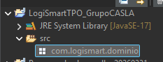

# Hito 3 - Implementacion Inicial del Dominio


Actividad 1:

Entregable Parcial: Una captura de pantalla de su Eclipse mostrando la estructura del proyecto con el paquete creado.



Actividad 2 y 3:

Entregable Parcial: El código de al menos 3 de sus clases principales con todos sus atributos definidos.

Entregable Parcial: El código completo de una de sus clases mostrando el constructor, los getters y los setters

```java
package com.logismart.dominio;
```

```java
public class Destinatario {
private String nombre;
private String telefono;
private String email;
private String direccion;
private Double latitud;
private Double longitud;
```

```java
public Destinatario(String nombre, String telefono, String email, String direccion, Double latitud, Double longitud) {
this.nombre = nombre;
this.telefono = telefono;
this.email = email;
this.direccion = direccion;
this.latitud = latitud;
this.longitud = longitud;
}
```

```java
public String getNombre() { return nombre; }
public void setNombre(String nombre) { this.nombre = nombre; }
```

```java
public String getTelefono() { return telefono; }
public void setTelefono(String telefono) { this.telefono = telefono; }
```

```java
public String getEmail() { return email; }
public void setEmail(String email) { this.email = email; }
```

```java
public String getDireccion() { return direccion; }
public void setDireccion(String direccion) { this.direccion = direccion; }
```

```java
public Double getLatitud() { return latitud; }
public void setLatitud(Double latitud) { this.latitud = latitud; }
```

```java
public Double getLongitud() { return longitud; }
public void setLongitud(Double longitud) { this.longitud = longitud; }
}
```

```java
package com.logismart.dominio;
```

```java
import java.time.LocalDate;
```

```java
public class Pyme {
private String nombre;
private String email;
private String telefono;
private String plan;
private LocalDate created_at;
```

```java
public Pyme(String nombre, String email, String telefono, String plan, LocalDate created_at) {
this.nombre = nombre;
this.email = email;
this.telefono = telefono;
this.plan = plan;
this.created_at = created_at;
}
```

```java
public String getNombre() { return nombre; }
public void setNombre(String nombre) { this.nombre = nombre; }
```

```java
public String getEmail() { return email; }
public void setEmail(String email) { this.email = email; }
```

```java
public String getTelefono() { return telefono; }
public void setTelefono(String telefono) { this.telefono = telefono; }
```

```java
public String getPlan() { return plan; }
public void setPlan(String plan) { this.plan = plan; }
```

```java
public LocalDate getCreated_at() { return created_at; }
public void setCreated_at(LocalDate created_at) { this.created_at = created_at; }
}
```

```java
package com.logismart.dominio;
```

```java
public class Vehiculo {
// Atributos privados (Encapsulación)
private String patente;
private Double capacidad;
private String tipo;
```

```java
// Constructor
public Vehiculo(String patente, Double capacidad, String tipo) {
this.patente = patente;
this.capacidad = capacidad;
this.tipo = tipo;
}
```

```java
// Getters y Setters
public String getPatente() {
return patente;
}
```

```java
public void setPatente(String patente) {
this.patente = patente;
}
```

```java
public Double getCapacidad() {
return capacidad;
}
```

```java
public void setCapacidad(Double capacidad) {
this.capacidad = capacidad;
}
```

```java
public String getTipo() {
return tipo;
}
```

```java
public void setTipo(String tipo) {
this.tipo = tipo;
}
}
```

Actividad 4:

Entregable Parcial: El código de dos clases que demuestren una relación de composición/asociación y el código de una jerarquía de herencia.

Ejemplo de Composición (1 a N):

```java
package com.logismart.dominio;
```

```java
import java.time.LocalDate;
import java.util.ArrayList;
import java.util.List;
```

```java
public class PyME {
private String nombre;
private String email;
private String telefono;
private String plan;
private LocalDate createdAt;
```

```java
// Relaciones de Composición (1 a Muchos)
private List<Integracion> integraciones;
private List<Usuario> usuarios;
private List<Flota> flotas;
```

```java
public PyME(String nombre, String email, String telefono, String plan, LocalDate createdAt) {
this.nombre = nombre;
this.email = email;
this.telefono = telefono;
this.plan = plan;
this.createdAt = createdAt;
// Inicialización de las composiciones
this.integraciones = new ArrayList<>();
this.usuarios = new ArrayList<>();
this.flotas = new ArrayList<>();
}
```

```java
// --- Getters y Setters ---
public String getNombre() { return nombre; }
public void setNombre(String nombre) { this.nombre = nombre; }
```

```java
public String getEmail() { return email; }
public void setEmail(String email) { this.email = email; }
```

```java
public String getTelefono() { return telefono; }
public void setTelefono(String telefono) { this.telefono = telefono; }
```

```java
public String getPlan() { return plan; }
public void setPlan(String plan) { this.plan = plan; }
```

```java
public LocalDate getCreatedAt() { return createdAt; }
public void setCreatedAt(LocalDate createdAt) { this.createdAt = createdAt; }
```

```java
public List<Integracion> getIntegraciones() { return integraciones; }
public void setIntegraciones(List<Integracion> integraciones) { this.integraciones = integraciones; }
```

```java
public List<Usuario> getUsuarios() { return usuarios; }
public void setUsuarios(List<Usuario> usuarios) { this.usuarios = usuarios; }
```

```java
public List<Flota> getFlotas() { return flotas; }
public void setFlotas(List<Flota> flotas) { this.flotas = flotas; }
}
```

```java
package com.logismart.dominio;
```

```java
import java.util.ArrayList;
import java.util.List;
```

```java
public class Flota {
private String nombre;
private String descripcion;
// Relación 1 a Muchos (Agregación): Una flota tiene muchos vehículos
private List<Vehiculo> vehiculos;
```

```java
public Flota(String nombre, String descripcion) {
this.nombre = nombre;
this.descripcion = descripcion;
// Inicializamos la lista vacía
this.vehiculos = new ArrayList<>();
}
```

```java
public void agregarVehiculo(Vehiculo vehiculo) {
this.vehiculos.add(vehiculo);
}
```

```java
public void quitarVehiculo(Vehiculo vehiculo) {
this.vehiculos.remove(vehiculo);
}
```

```java
// --- Getters y Setters ---
public String getNombre() { return nombre; }
public void setNombre(String nombre) { this.nombre = nombre; }
```

```java
public String getDescripcion() { return descripcion; }
public void setDescripcion(String descripcion) { this.descripcion = descripcion; }
```

```java
public List<Vehiculo> getVehiculos() { return vehiculos; }
public void setVehiculos(List<Vehiculo> vehiculos) { this.vehiculos = vehiculos; }
}
```

Ejemplo de Herencia:

```java
package com.logismart.dominio;
```

```java
public class Usuario {
private String nombre;
private String email;
private String passwordHash;
private String telefono;
```

```java
public Usuario(String nombre, String email, String passwordHash, String telefono) {
this.nombre = nombre;
this.email = email;
this.passwordHash = passwordHash;
this.telefono = telefono;
}
```

```java
// Getters y Setters...
public String getNombre() { return nombre; }
public void setNombre(String nombre) { this.nombre = nombre; }
}
```

```java
package com.logismart.dominio;
```

```java
// La palabra "extends" crea la herencia
public class Conductor extends Usuario {
// Atributo propio y exclusivo de la clase hija
private String numeroLicencia;
```

```java
// Constructor del Hijo
public Conductor(String nombre, String email, String passwordHash, String telefono, String numeroLicencia) {
// 1. Llamamos obligatoriamente al constructor de la clase Padre (Usuario)
super(nombre, email, passwordHash, telefono);
// 2. Inicializamos los atributos propios de esta clase
this.numeroLicencia = numeroLicencia;
}
```

```java
// Getters y setters de la clase hija
public String getNumeroLicencia() { return numeroLicencia; }
public void setNumeroLicencia(String numeroLicencia) { this.numeroLicencia = numeroLicencia; }
}
```
