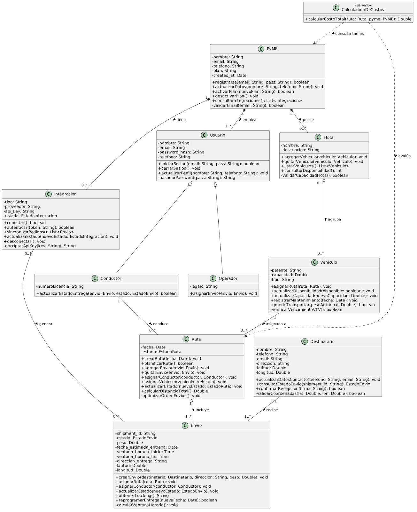
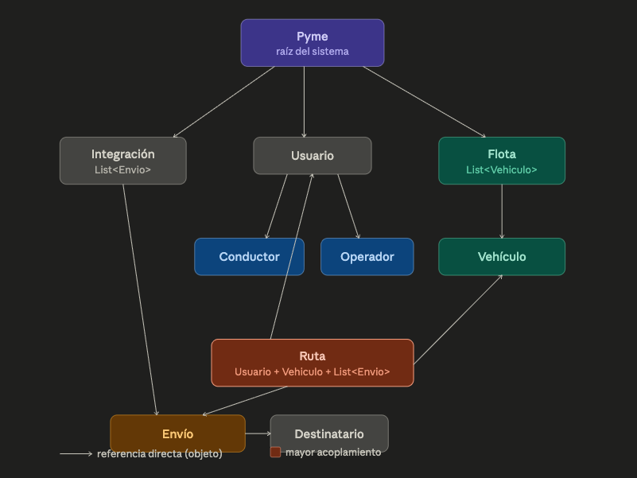
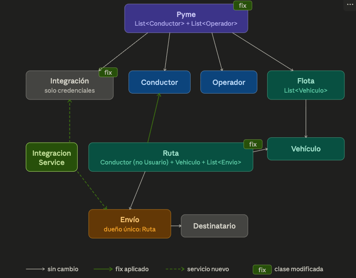
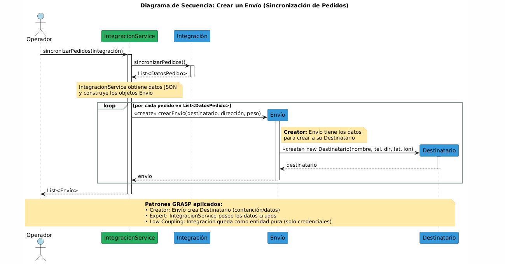
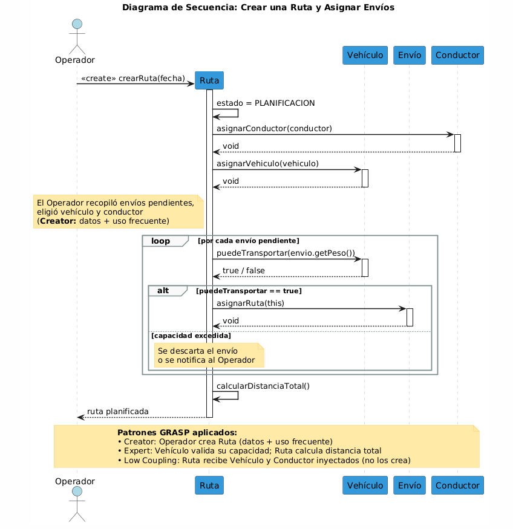
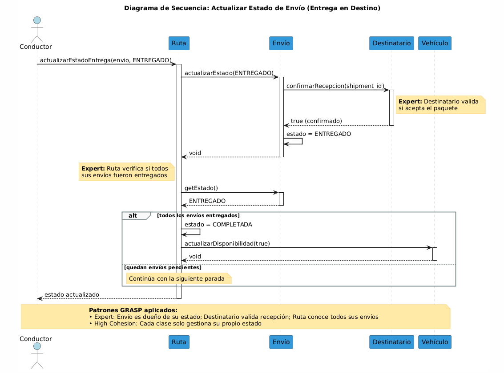

# Hito 4 - Diagramas de Secuencia

Actividad 1: Análisis de Responsabilidades Objetivo: Revisar cada clase y verificar que tiene responsabilidades claras y bien definidas

Entregable: Tabla de análisis + Párrafo de hallazgos

Tabla de analisis

| Clase | Responsabilidades Principales | ¿Tiene sentido? | Observaciones |
| --- | --- | --- | --- |
| PyME | Gestionar perfil comercial, suscripción y agrupar recursos propios (flotas, usuarios). | Sí | Es la entidad raíz. Mantiene alta cohesión al delegar operaciones logísticas a otras clases. |
| Integración | Administrar credenciales (API keys) y sincronizar pedidos externos. | Sí | Responsabilidad única y bien definida. Aísla la complejidad de comunicarse con terceros. |
| Usuario | Autenticar, almacenar datos de sesión y datos básicos personales. Clase abstracta que encapsula funcionalidad común de todos los tipos de usuarios | Sí | Tener cuidado de no incluir referencias, atributos o comportamientos específicos de un rol particular |
| Operador | Extiende de Usuario. Contiene lógica y atributos propios del rol operador. | Si | Cumple bien con el patrón de extensión de clases. |
| Conductor | Extiende de Usuario. Contiene lógica y atributos propios del rol conductor. | Si | Cumple bien con el patrón de extensión de clases. |
| Flota | Agrupar y administrar lógicamente un conjunto de vehículos. | Sí | Cumple perfectamente con el patrón Expert sobre la colección de sus vehículos. |
| Vehiculo | Controlar capacidad física, mantenimiento y disponibilidad. | Sí | Alta cohesión. Solo se preocupa por su propio estado físico y legal. |
| Ruta | Organizar envíos (paradas) y asignar recursos físicos (vehículo/conductor). | Sí | Es el "Expert" natural para calcular distancias totales o reordenar envíos dentro de un viaje. |
| Envío | Trazar el estado del paquete, manejar coordenadas y ventanas horarias. | Sí | Responsabilidad exclusiva de dominio logístico. (Debe evitarse estrictamente agregarle lógica de persistencia). |
| Destinatario | Proveer ubicación exacta y datos de contacto del cliente final. | Sí | Entidad de datos simple y altamente cohesiva. |

Párrafo de hallazgos

Tras auditar el modelo de dominio inicial bajo el modelo de los patrones GRASP, se concluye que el diseño general mantiene un fuerte principio de Alta Cohesión, habiendo evitado proactivamente el anti-patrón de mezclar lógica de negocio con infraestructura (ninguna entidad posee responsabilidades de base de datos o envío de emails). Sin embargo, se identificó un problema crítico de responsabilidad en la clase Usuario. Actualmente, esta clase centraliza tanto los datos de autenticación como las operaciones de distintos perfiles (Operador Logístico y Conductor). Esto significa que la clase está haciendo "demasiadas cosas no relacionadas", lo que la condena a tener una baja cohesión a medida que el sistema evolucione.

Actividad 2: Aplicación del Patrón Expert Objetivo: Verificar que cada responsabilidad está asignada a la clase que tiene la información necesaria.

Entregable: Análisis de 4-5 responsabilidades clave + Justificaciones + Diagrama actualizado (si hay cambios)

#### 1 y 2. Análisis de Responsabilidades Clave en LogiSmart

Caso A: Calcular el costo total de una ruta

- ¿Quién es el experto actual? Falsamente, podríamos pensar que es Ruta.

- Justificación: Ruta conoce todos los envíos y el vehículo asignado, pero no posee la información tarifaria, el costo del combustible ni el sueldo del conductor.

- Análisis Expert / Delegación: Si le damos esta responsabilidad a Ruta, violaríamos el patrón de Alta Cohesión (mezclando logística con contabilidad). La Ruta debe delegar esto a una clase externa (ej. un servicio CalculadoraDeCostos que consulte las tarifas de la PyME y reciba la Ruta por parámetro).

Caso B: Calcular la distancia total de una ruta

- ¿Quién es el experto? La clase Ruta.

- Justificación: La clase Ruta es la única que tiene la colección completa de todos los objetos Envio asignados a ese viaje, y cada Envio conoce a su Destinatario (que tiene las coordenadas de latitud y longitud).

- Delegación: Ruta itera sobre su lista de envíos, pero delega el cálculo matemático exacto entre dos puntos geográficos (para mantener su propia cohesión).

Caso C: Validar si un vehículo puede transportar un envío

- ¿Quién es el experto? La clase Vehiculo.

- Justificación: El Vehiculo es el único que conoce su atributo capacidad. Sin embargo, para cumplir esta responsabilidad, necesita que la clase Envio le informe su propio peso o volumen.

- Hallazgo (¡Falta un atributo!): En nuestro modelo actual, Envio no tiene un atributo peso. Debemos agregarlo para que el patrón Expert funcione correctamente. La Ruta le preguntará al Vehiculo: vehiculo.puedeTransportar(envio.getPeso()).

Caso D: Determinar/Actualizar el estado de un envío

- ¿Quién es el experto? La clase Envio.

- Justificación: Envio es el dueño de su propio estado (encapsula el atributo estado: EstadoEnvio). Cualquier otra clase que necesite saber si fue entregado (como el Conductor al usar la app), debe pedírselo a Envio mediante sus métodos públicos (getEstado() o actualizarEstado()).

#### 3 y 4. Cambios Propuestos y Refactoring (Diagrama Actualizado)

Al aplicar el patrón Expert de manera estricta, detectamos que faltaba información para que los expertos pudieran hacer su trabajo. Se proponen los siguientes cambios al diseño:

- Atributo peso en Envio: Se añade peso: Double a la clase Envio para que el vehículo sepa qué tamaño tiene el paquete.

- Método puedeTransportar() en Vehiculo: Se le otorga la responsabilidad al Vehículo de validar su propia capacidad mediante el método puedeTransportar(pesoAdicional: Double): boolean.

- Método calcularDistanciaTotal() en Ruta: Se oficializa que la Ruta es el experto en conocer su propio recorrido total.

- Clase CalculadoraDeCostos: un servicio que consulte las tarifas de la PyME y reciba la Ruta por parámetro

Diagrama actualizado:

Actividad 3: Aplicación del Patrón Creator Objetivo: Verificar que está claro quién crea qué en el sistema.

Entregable: Tabla de creadores + Identificación de problemas + Pseudocódigo de creación

Tabla de creadores:

| Clase a Crear | Creador | Regla de Creator | Justificación |
| --- | --- | --- | --- |
| Flota | PyME | Contención | La PyME es dueña y contiene estrictamente a sus flotas (Relación de Composición). |
| Integración | PyME | Contención | La PyME configura y contiene sus propias conexiones con e-commerce. |
| Envío | Integración | Datos | Al sincronizar pedidos desde una tienda externa (ej. MercadoLibre), la Integración posee todos los datos crudos (JSON) necesarios para inicializar el objeto Envío. |
| Destinatario | Envío | Datos / Contención | El destinatario no existe en el sistema sin un paquete que recibir. Al instanciarse el Envío, se tienen los datos del cliente, por lo que el Envío crea a su Destinatario. |
| Ruta | Operador | Uso Frecuente / Datos | El Operador Logístico es el actor que recopila los envíos pendientes, elige el vehículo y conductor, por ende tiene los datos y hace un uso frecuente de las rutas al planificarlas. |
| Vehiculo | Flota | Agregación | La Flota agrupa a los vehículos. Si se registra un vehículo para pertenecer a una flota, esta es la candidata ideal para instanciarlo. |

Identificación de problemas:

Al revisar el modelo, detectamos un posible problema de diseño relacionado con la creación:

- Ciclo de vida del Vehiculo: Si Flota crea al Vehiculo (por agregación), nos enfrentamos a una limitación: ¿Qué pasa si la PyME compra un camión nuevo pero aún no decidió a qué flota asignarlo? O que pasa si el vehiculo no esta apto para conducirse? En la vida real, el vehículo existe de forma independiente. Que la Flota lo cree es un diseño rígido.

Solución: Mover la responsabilidad de creación del Vehiculo a la clase PyME. Por regla de Contención, la PyME es la entidad financiera y legal dueña de los activos, por lo que tiene sentido que sea ella quien los registre en el sistema. Luego, la PyME simplemente pasará ese vehículo ya creado a la Flota correspondiente mediante el método agregarVehiculo(vehiculo).

public class PyME {

    private List<Vehiculo> vehiculosTotales = new ArrayList<>();

    // La PyME instancia el vehículo porque es la dueña del activo

    public Vehiculo registrarNuevoVehiculo(String patente, Double capacidad, String tipo) {

        Vehiculo nuevoVehiculo = new Vehiculo(patente, capacidad, tipo); // Creator

        this.vehiculosTotales.add(nuevoVehiculo);

        return nuevoVehiculo;

    }

}

public class Flota {

    private List<Vehiculo> vehiculos = new ArrayList<>();

    // La flota YA NO crea el vehículo, solo lo recibe (Bajo Acoplamiento)

    public void agregarVehiculo(Vehiculo vehiculo) {

        // Validamos capacidad antes de agregarlo

        if(this.validarCapacidadFlota()) {

            this.vehiculos.add(vehiculo);

        }

    }

}

Actividad 4: Análisis de Coupling y Cohesion Objetivo: Identificar y reducir acoplamiento innecesario, aumentar cohesión.

Entregable: Análisis de dependencias + Diagrama de coupling + Propuestas de mejora + Diagrama mejorado

Análisis de dependencias

- Pyme → Integracion, Usuario, Flota (composición, lista de cada una)

- Integracion → Envio (lista de envíos generados)

- Flota → Vehiculo (lista de vehículos)

- Ruta → Usuario (conductorAsignado), Vehiculo (vehiculoAsignado), Envio (lista)

- Envio → Destinatario (referencia directa 1 a 1)

- Conductor → Usuario (herencia)

- Operador → Usuario (herencia)

En cuanto a dependencias circulares: Integracion crea Envio, y Ruta también contiene Envio. Un Envio no referencia de vuelta ni a Integracion ni a Ruta, así que no hay ciclos bidireccionales en este modelo.

Algunos puntos de mayor acoplamiento:

- Ruta depende de 3 clases distintas (Usuario, Vehiculo, Envio) — es el punto de mayor acoplamiento del sistema, aunque justificado por su rol de coordinador logístico.

- Pyme depende de 3 clases (Integracion, Usuario, Flota) — acoplamiento alto pero también justificado como entidad raíz.

Diagrama actual:

Identificación de problemas

- ¿Quien es el dueño de clase Envio?: Integracion mantiene los envíos que generó, creando una dependencia directa fuerte hacia Envio. El problema es que Envio también vive dentro de Ruta, con lo cual un mismo objeto Envio podría estar referenciado desde dos lados distintos. Esto no genera un ciclo de clases, pero sí una ambigüedad de propiedad: quién es el dueño real del envío, Integracion o Ruta

- Uso de Usuario directamente Pyme tiene List<Usuario> pero debería tener List<Conductor> y List<Operador> por separado, trabajando con las clases hijas.

Cambios propuestos

- IntegracionService resuelve la ambigüedad sacando la List<Envio> de Integracion: el servicio consume la API externa, construye los objetos Envio y los entrega directamente a Ruta a través del Operador, sin que Integracion los almacene nunca. De esta forma Integracion queda como una entidad de datos pura (credenciales, tipo, estado) y Ruta es el único dueño de sus envíos — un Envio existe en un solo lugar del modelo y su ciclo de vida está completamente bajo control de la Ruta a la que pertenece.

- Ruta.conductorAsignado hacia Conductor en lugar de Usuario directamente.

Pyme pasa de List<Usuario> a listas separadas por subtipo, Integracion pierde su List<Envio> y queda como entidad de datos pura, e IntegracionService toma el rol de crear los Envio y entregarlos a Ruta. La flecha verde entre Ruta y Conductor refleja la corrección de tipo.

# Actividad 5: Diagramas de Secuencia

# Objetivo: Crear diagramas de secuencia para visualizar cómo colaboran los objetos.

## Caso de Uso 1: Crear un Envío (Sincronización de Pedidos)

### Descripción del flujo

Este caso de uso modela cómo se crean los envíos en el sistema LogiSmart a partir de la sincronización con una plataforma de e-commerce externa. El flujo comienza cuando el Operador solicita la sincronización de pedidos a través del IntegracionService (servicio introducido en la Actividad 4 para resolver la ambigüedad de propiedad del Envío).

Objetos participantes: Operador (actor), IntegracionService, Integración, Envío, Destinatario.

Flujo principal:

- El Operador invoca sincronizarPedidos(integración) sobre el IntegracionService.

- IntegracionService delega a la entidad Integración para obtener los datos crudos de la API externa mediante sincronizarPedidos().

- Integración retorna una lista de datos de pedidos (JSON parseado).

- Por cada pedido (fragmento loop), IntegracionService invoca <<create>> crearEnvio(destinatario, dirección, peso) sobre la clase Envío.

- El Envío, al ser instanciado, crea a su Destinatario mediante <<create>> new Destinatario(nombre, tel, dir, lat, lon), ya que posee todos los datos necesarios.

- El Envío creado se retorna al IntegracionService.

- Al finalizar el loop, IntegracionService retorna la lista completa de envíos al Operador.

### Diagrama

### Análisis de validación

¿Los objetos se comunican en el orden correcto? Sí. El flujo sigue una cadena lógica: el Operador dispara la acción → IntegracionService orquesta → Integración provee datos crudos → Envío se construye con sus dependencias. No hay mensajes fuera de secuencia temporal.

¿Hay acoplamiento excesivo? No. IntegracionService actúa como intermediario, evitando que el Operador conozca directamente a Integración o a Envío. Integración queda como entidad de datos pura (solo credenciales), sin mantener una List<Envío>, lo cual resuelve el problema de ambigüedad de propiedad detectado en la Actividad 4.

¿Las responsabilidades están bien asignadas? Sí. Se aplican correctamente los siguientes patrones GRASP:

- Creator: Envío crea a Destinatario por regla de contención y datos (el destinatario no existe sin su envío, y Envío posee los datos para inicializarlo).

- Expert: IntegracionService es el experto en transformar datos crudos en objetos de dominio, ya que es quien posee la información JSON.

- Low Coupling: Integración no almacena envíos; solo provee datos. Esto reduce las dependencias cruzadas.

¿Hay oportunidades para mejorar el diseño? Una mejora posible sería agregar validación de datos duplicados dentro del loop (verificar si un shipment_id ya existe antes de crear el Envío).

## Caso de Uso 2: Crear una Ruta y Asignar Envíos

### Descripción del flujo

Este caso de uso modela el proceso de planificación logística donde el Operador crea una nueva ruta, le asigna un conductor y un vehículo, y luego agrega envíos pendientes validando la capacidad del vehículo.

Objetos participantes: Operador (actor), Ruta, Vehículo, Envío, Conductor.

Flujo principal:

- El Operador invoca <<create>> crearRuta(fecha), instanciando una nueva Ruta con estado PLANIFICACIÓN.

- La Ruta se auto-asigna el estado inicial (estado = PLANIFICACION).

- Se asigna el Conductor a la Ruta mediante asignarConductor(conductor), recibiendo el objeto ya creado (inyección de dependencias).

- Se asigna el Vehículo a la Ruta mediante asignarVehiculo(vehiculo), también inyectado.

- Por cada envío pendiente (fragmento loop): a. La Ruta consulta al Vehículo: puedeTransportar(envio.getPeso()). b. Si el Vehículo puede transportar el envío (fragmento alt, rama true): la Ruta invoca asignarRuta(this) sobre el Envío. c. Si no puede (rama else): se descarta o notifica al Operador.

- Al finalizar el loop, la Ruta ejecuta calcularDistanciaTotal() sobre sí misma (self-call).

- Se retorna la ruta planificada al Operador.

### Diagrama

### Análisis de validación

¿Los objetos se comunican en el orden correcto? Sí. El flujo respeta la secuencia lógica de planificación: primero se crea la ruta, luego se asignan los recursos (conductor y vehículo), y finalmente se agregan los envíos con validación. El cálculo de distancia total se realiza al final, cuando ya se conocen todas las paradas.

¿Hay acoplamiento excesivo? La Ruta depende de Conductor, Vehículo y Envío (3 clases), lo cual fue identificado en la Actividad 4 como el punto de mayor acoplamiento del sistema. Sin embargo, este acoplamiento está justificado porque la Ruta es el coordinador logístico natural del dominio. Además, se aplica inyección de dependencias: la Ruta recibe Conductor y Vehículo como objetos ya creados, no los instancia ella misma, lo cual mantiene el acoplamiento en un nivel aceptable.

¿Las responsabilidades están bien asignadas? Sí. Se aplican correctamente los siguientes patrones GRASP:

- Creator: El Operador crea la Ruta porque posee los datos necesarios (fecha, selección de envíos) y hace uso frecuente de las rutas al planificarlas.

- Expert: El Vehículo es el experto en validar su propia capacidad (puedeTransportar), y la Ruta es el experto en calcular la distancia total (posee la colección de envíos).

- Low Coupling: Conductor y Vehículo se inyectan como dependencias. La Ruta tipifica correctamente conductorAsignado como Conductor (no como Usuario), según la corrección de la Actividad 4.

¿Hay oportunidades para mejorar el diseño? Podría considerarse que el método puedeTransportar acumule el peso total de los envíos ya asignados a la ruta (no solo el peso individual del nuevo envío), para validar la capacidad restante del vehículo de forma más realista. Esto implicaría que la Ruta lleve un contador de peso acumulado.

## Caso de Uso 3: Actualizar Estado de Envío (Entrega en Destino)

### Descripción del flujo

Este caso de uso modela el momento en que el Conductor llega al destino y registra la entrega de un paquete. Es un caso de uso central del sistema ya que involucra la actualización de estado del envío (patrón Expert), la confirmación del destinatario, y la verificación de completitud de la ruta.

Objetos participantes: Conductor (actor), Ruta, Envío, Destinatario, Vehículo.

Flujo principal:

- El Conductor invoca actualizarEstadoEntrega(envio, ENTREGADO) sobre la Ruta.

- La Ruta delega al Envío correspondiente: actualizarEstado(ENTREGADO).

- El Envío consulta al Destinatario para confirmar la recepción: confirmarRecepcion(shipment_id).

- El Destinatario valida y retorna true (confirmado).

- El Envío actualiza su propio estado interno (estado = ENTREGADO) mediante un self-call.

- El Envío retorna void a la Ruta.

- La Ruta verifica si todos sus envíos fueron entregados consultando getEstado() a cada Envío.

- Si todos los envíos están entregados (fragmento alt, rama true): a. La Ruta actualiza su propio estado a COMPLETADA. b. La Ruta notifica al Vehículo que está disponible: actualizarDisponibilidad(true).

- Si quedan envíos pendientes (rama else): la Ruta continúa con la siguiente parada.

- Se retorna el estado actualizado al Conductor.

### Diagrama

### Análisis de validación

¿Los objetos se comunican en el orden correcto? Sí. El flujo sigue la cadena natural de una entrega: el Conductor reporta → la Ruta coordina → el Envío gestiona su estado → el Destinatario confirma → la Ruta evalúa si debe completarse. No hay saltos temporales ni mensajes invertidos.

¿Hay acoplamiento excesivo? No. Cada objeto se comunica solo con quienes necesita: la Ruta coordina pero delega la lógica de estado al Envío, el Envío delega la confirmación al Destinatario, y el Vehículo solo es contactado al final para liberar disponibilidad. La comunicación sigue una cadena lineal sin dependencias cruzadas innecesarias.

¿Las responsabilidades están bien asignadas? Sí. Este diagrama es el que mejor demuestra la aplicación del patrón Expert:

- Expert (Envío): Es el dueño exclusivo de su atributo estado. Ninguna otra clase modifica el estado del envío directamente; siempre se hace a través de los métodos públicos del Envío (actualizarEstado, getEstado). Esto fue identificado como Caso D en la Actividad 2.

- Expert (Destinatario): Es el experto en confirmar si el paquete fue recibido, ya que posee los datos de contacto y la ubicación exacta.

- Expert (Ruta): Es el experto en determinar si todos sus envíos fueron completados, ya que posee la colección completa de envíos asignados.

- High Cohesion: Cada clase gestiona exclusivamente su propio estado (Envío su estado de entrega, Ruta su estado de completitud, Vehículo su disponibilidad). No hay mezcla de responsabilidades.

¿Hay oportunidades para mejorar el diseño? Se podría agregar un mecanismo de notificación (patrón Observer) para que cuando el Envío cambie de estado, se notifique automáticamente a las partes interesadas (Ruta, posiblemente la PyME para estadísticas) sin que cada una tenga que consultar activamente. Esto mejoraría la extensibilidad sin aumentar el acoplamiento.
