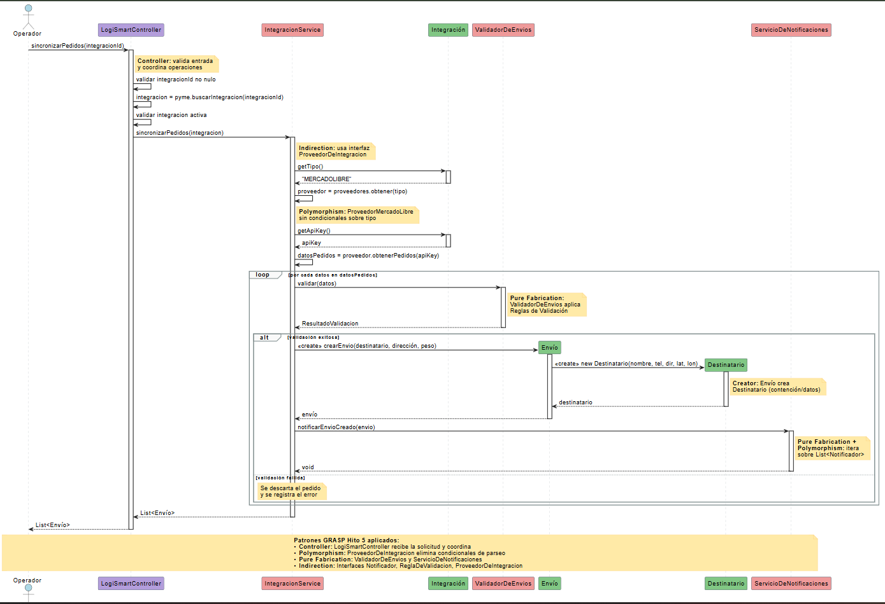
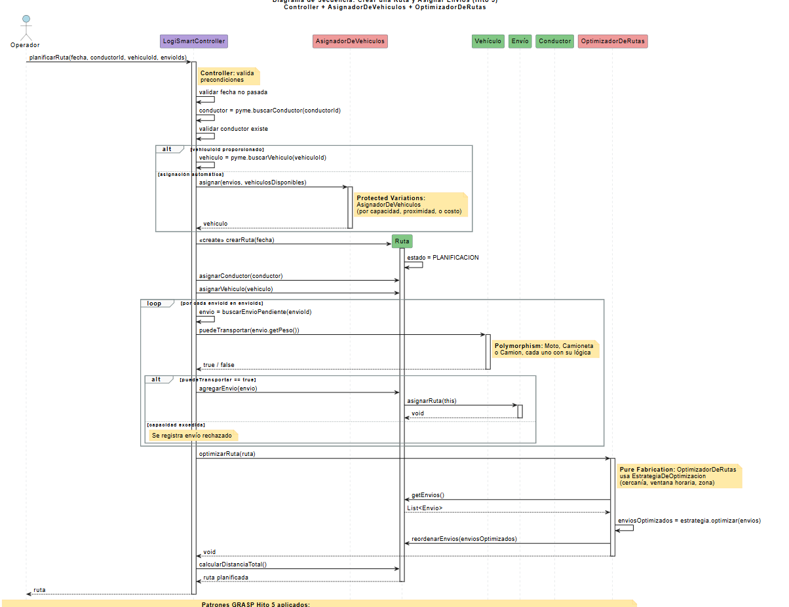
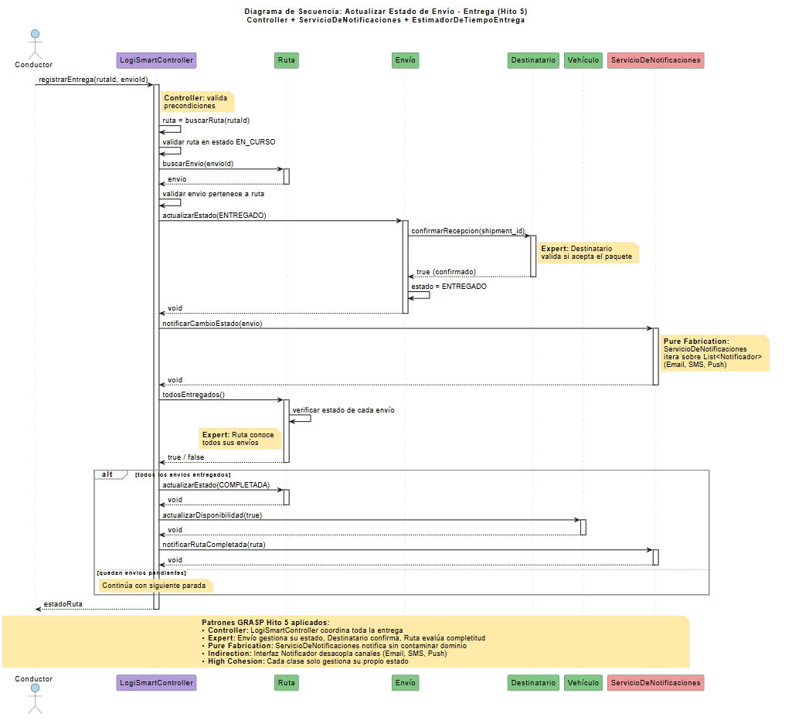

# Hito 5 - Asignacion de Responsabilidades (GRASP)


# Hito 5 del TPO: Asignación de Responsabilidades GRASP

# Parte II

## Actividad 1: Análisis de Diseño Actual

Entregable: Una lista de 5-10 problemas identificados en tu diseño actual.

- No existe un Controller. El Operador y el Conductor interactúan directamente con las clases de dominio (Ruta, IntegracionService, Envío). Si se implementa una interfaz gráfica, quedaría acoplada a la lógica interna del sistema.

- Tipo de vehículo resuelto con atributo String en vez de polimorfismo. Vehículo tiene tipo: String (moto, camioneta, camión), pero el comportamiento de puedeTransportar y las restricciones de circulación deberían variar por tipo. Hoy se necesitarían condicionales if (tipo.equals("MOTO")) para diferenciar el comportamiento.

- CalculadoraDeCostos no tiene interfaz. Es una clase concreta acoplada a un único algoritmo de cálculo. Si la PyME quiere cambiar su política tarifaria (por km, por peso, por zona), hay que modificar la clase existente en lugar de intercambiar estrategias.

- IntegracionService acoplado a un solo formato de datos. El servicio transforma datos crudos en objetos Envío, pero cada plataforma de e-commerce tiene un formato JSON distinto. No hay abstracción que permita agregar nuevos proveedores sin modificar el código existente.

- No hay mecanismo de notificaciones. Cuando un envío cambia de estado (ENTREGADO, CANCELADO), no hay ninguna clase que se encargue de notificar al destinatario o a la PyME. Si se le agrega esa lógica a Envío o Ruta, se viola la Alta Cohesión.

- EstadoEnvio y EstadoRuta son atributos simples sin comportamiento. Las transiciones de estado (PENDIENTE → EN_CAMINO → ENTREGADO) probablemente requieren validaciones (no podés pasar de PENDIENTE a ENTREGADO sin pasar por EN_CAMINO). Hoy eso se resolvería con condicionales en actualizarEstado().

- Ruta concentra demasiada coordinación. Ruta crea la planificación, valida capacidad del vehículo, asigna envíos, calcula distancia, y gestiona el estado de la ruta. Es el punto de mayor acoplamiento del sistema y un candidato a delegar coordinación a un Controller o servicio.

- No hay abstracción para el cálculo de distancias.

 calcularDistanciaTotal() en Ruta delega el cálculo matemático, pero no hay interfaz definida. Si mañana se quiere usar Google Maps API en vez de cálculo euclidiano, hay que modificar la implementación directamente.

- La lógica de sincronización de pedidos no es extensible. Si se agrega un nuevo canal de ingreso de envíos (carga manual, importación CSV, otra API), no hay una abstracción común. Cada canal nuevo requiere un servicio nuevo sin un contrato compartido.

- No hay separación entre la lógica de asignación de envíos a ruta y la validación. En el diagrama de secuencia 2, la Ruta consulta al Vehículo, valida, y asigna todo en el mismo flujo. Si la política de asignación cambia (prioridad por ventana horaria, por zona geográfica), hay que modificar la Ruta directamente.

## Actividad 2: Aplicar Controller

Entregable: Código del Controller (pseudocódigo o Java) con 5-7 métodos principales

CLASE LogiSmartController

    ATRIBUTOS:

        pyme: PyME

        integracionService: IntegracionService

        calculadoraDeCostos: CalculadoraDeCostos

    CONSTRUCTOR(pyme, integracionService, calculadoraDeCostos)

        this.pyme = pyme

        this.integracionService = integracionService

        this.calculadoraDeCostos = calculadoraDeCostos

    FIN CONSTRUCTOR

    // ---------------------------------------------------------------

    // 1. Sincronizar pedidos externos y crear envíos

    // ---------------------------------------------------------------

    MÉTODO sincronizarPedidos(integracionId) → Lista<Envio>

        VALIDAR que integracionId no sea nulo

        integracion = pyme.buscarIntegracion(integracionId)

        VALIDAR que integracion exista

        VALIDAR que integracion esté en estado ACTIVA

        enviosCreados = integracionService.sincronizarPedidos(integracion)

        RETORNAR enviosCreados

    FIN MÉTODO

    // ---------------------------------------------------------------

    // 2. Planificar una nueva ruta completa

    // ---------------------------------------------------------------

    MÉTODO planificarRuta(fecha, conductorId, vehiculoId, listaEnvioIds) → Ruta

        VALIDAR que fecha no sea pasada

        conductor = pyme.buscarConductor(conductorId)

        VALIDAR que conductor exista

        vehiculo = pyme.buscarVehiculo(vehiculoId)

        VALIDAR que vehiculo exista

        VALIDAR que vehiculo esté disponible

        // Creator: el Operador crea la Ruta (Controller actúa en su nombre)

        ruta = NUEVA Ruta(fecha)

        ruta.asignarConductor(conductor)

        ruta.asignarVehiculo(vehiculo)

        // Asignar cada envío validando capacidad (Expert: Vehículo)

        rechazados = NUEVA Lista

        PARA CADA envioId EN listaEnvioIds HACER

            envio = buscarEnvioPendiente(envioId)

            SI vehiculo.puedeTransportar(envio.getPeso()) ENTONCES

                ruta.agregarEnvio(envio)

            SINO

                rechazados.agregar(envioId)

            FIN SI

        FIN PARA

        // Expert: Ruta calcula su propia distancia

        ruta.calcularDistanciaTotal()

        RETORNAR ruta

    FIN MÉTODO

    // ---------------------------------------------------------------

    // 3. Asignar un envío individual a una ruta existente

    // ---------------------------------------------------------------

    MÉTODO asignarEnvioARuta(envioId, rutaId) → Booleano

        envio = buscarEnvioPendiente(envioId)

        ruta = buscarRuta(rutaId)

        VALIDAR que ruta esté en estado PLANIFICACION

        // Expert: el Vehículo valida su capacidad

        vehiculo = ruta.getVehiculoAsignado()

        SI NO vehiculo.puedeTransportar(envio.getPeso()) ENTONCES

            RETORNAR falso

        FIN SI

        ruta.agregarEnvio(envio)

        ruta.calcularDistanciaTotal()

        RETORNAR verdadero

    FIN MÉTODO

    // ---------------------------------------------------------------

    // 4. Registrar la entrega de un envío (usado por el Conductor)

    // ---------------------------------------------------------------

    MÉTODO registrarEntrega(rutaId, envioId) → EstadoRuta

        ruta = buscarRuta(rutaId)

        envio = ruta.buscarEnvio(envioId)

        VALIDAR que envio pertenezca a la ruta

        VALIDAR que ruta esté en estado EN_CURSO

        // Expert: Envío actualiza su propio estado

        envio.actualizarEstado(ENTREGADO)

        // Expert: Ruta evalúa si todos sus envíos fueron entregados

        SI ruta.todosEntregados() ENTONCES

            ruta.actualizarEstado(COMPLETADA)

            ruta.getVehiculoAsignado().actualizarDisponibilidad(verdadero)

        FIN SI

        RETORNAR ruta.getEstado()

    FIN MÉTODO

    // ---------------------------------------------------------------

    // 5. Registrar un vehículo nuevo en el sistema

    // ---------------------------------------------------------------

    MÉTODO registrarVehiculo(patente, capacidad, tipo, flotaId) → Vehiculo

        VALIDAR que capacidad sea mayor a 0

        // Creator: PyME crea Vehículo (dueña legal del activo)

        vehiculo = pyme.registrarNuevoVehiculo(patente, capacidad, tipo)

        // Si se especificó flota, asignar (Low Coupling: Flota recibe, no crea)

        SI flotaId NO es nulo ENTONCES

            flota = pyme.buscarFlota(flotaId)

            SI flota existe ENTONCES

                flota.agregarVehiculo(vehiculo)

            FIN SI

        FIN SI

        RETORNAR vehiculo

    FIN MÉTODO

    // ---------------------------------------------------------------

    // 6. Consultar tracking de un envío

    // ---------------------------------------------------------------

    MÉTODO obtenerTrackingEnvio(shipmentId) → EstadoEnvio

        VALIDAR que shipmentId no sea nulo

        // Expert: Envío es dueño de su estado

        envio = buscarEnvio(shipmentId)

        RETORNAR envio.getEstado()

    FIN MÉTODO

    // ---------------------------------------------------------------

    // 7. Cancelar un envío

    // ---------------------------------------------------------------

    MÉTODO cancelarEnvio(envioId) → Booleano

        envio = buscarEnvio(envioId)

        VALIDAR que envio esté en estado PENDIENTE

        envio.actualizarEstado(CANCELADO)

        RETORNAR verdadero

    FIN MÉTODO

    // ---------------------------------------------------------------

    // Métodos privados auxiliares

    // ---------------------------------------------------------------

    MÉTODO PRIVADO buscarEnvio(envioId) → Envio

        envio = pyme.buscarEnvio(envioId)

        VALIDAR que envio exista

        RETORNAR envio

    FIN MÉTODO

    MÉTODO PRIVADO buscarEnvioPendiente(envioId) → Envio

        envio = buscarEnvio(envioId)

        VALIDAR que envio esté en estado PENDIENTE

        RETORNAR envio

    FIN MÉTODO

    MÉTODO PRIVADO buscarRuta(rutaId) → Ruta

        ruta = pyme.buscarRuta(rutaId)

        VALIDAR que ruta exista

        RETORNAR ruta

    FIN MÉTODO

FIN CLASE

## Actividad 3: Aplicar Polymorphism

Entregable: 3-4 interfaces con sus implementaciones (pseudocódigo o Java).

// Polimorfismo con clase abstracta

CLASE ABSTRACTA Vehiculo

    ATRIBUTOS:

        patente: String

        capacidad: Double

        disponible: Booleano

        rutaAsignada: Ruta

    MÉTODO ABSTRACTO puedeTransportar(pesoAdicional) → Booleano

    MÉTODO ABSTRACTO getVelocidadPromedio() → Double

    MÉTODO ABSTRACTO requiereLicenciaEspecial() → Booleano

    // Métodos comunes (no cambian por tipo)

    MÉTODO estaDisponible() → Booleano

        RETORNAR this.disponible Y this.rutaAsignada == nulo

    FIN MÉTODO

    MÉTODO actualizarDisponibilidad(disponible)

        this.disponible = disponible

    FIN MÉTODO

FIN CLASE

CLASE Moto EXTIENDE Vehiculo

    ATRIBUTOS:

        pesoMaximoPaquete: Double = 20

    MÉTODO puedeTransportar(pesoAdicional) → Booleano

        // La moto tiene restricción individual por paquete además de capacidad total

        RETORNAR pesoAdicional <= this.pesoMaximoPaquete

               Y pesoAdicional <= this.capacidad

    FIN MÉTODO

    MÉTODO getVelocidadPromedio() → Double

        RETORNAR 35.0  // km/h en zona urbana

    FIN MÉTODO

    MÉTODO requiereLicenciaEspecial() → Booleano

        RETORNAR falso

    FIN MÉTODO

FIN CLASE

CLASE Camioneta EXTIENDE Vehiculo

    MÉTODO puedeTransportar(pesoAdicional) → Booleano

        RETORNAR pesoAdicional <= this.capacidad

    FIN MÉTODO

    MÉTODO getVelocidadPromedio() → Double

        RETORNAR 45.0

    FIN MÉTODO

    MÉTODO requiereLicenciaEspecial() → Booleano

        RETORNAR falso

    FIN MÉTODO

FIN CLASE

CLASE Camion EXTIENDE Vehiculo

    ATRIBUTOS:

        tieneRefrigeracion: Booleano

    MÉTODO puedeTransportar(pesoAdicional) → Booleano

        RETORNAR pesoAdicional <= this.capacidad

    FIN MÉTODO

    MÉTODO getVelocidadPromedio() → Double

        RETORNAR 30.0

    FIN MÉTODO

    MÉTODO requiereLicenciaEspecial() → Booleano

        RETORNAR verdadero  // Requiere licencia profesional

    FIN MÉTODO

FIN CLASE

//  Polimorfismo con interfaz Strategy

INTERFAZ EstrategiaDeCostos

    MÉTODO calcular(ruta: Ruta) → Double

FIN INTERFAZ

CLASE CostoPorKilometro IMPLEMENTA EstrategiaDeCostos

    ATRIBUTOS:

        tarifaPorKm: Double

    CONSTRUCTOR(tarifaPorKm)

        this.tarifaPorKm = tarifaPorKm

    FIN CONSTRUCTOR

    MÉTODO calcular(ruta) → Double

        distancia = ruta.calcularDistanciaTotal()

        RETORNAR distancia * this.tarifaPorKm

    FIN MÉTODO

FIN CLASE

CLASE CostoPorPeso IMPLEMENTA EstrategiaDeCostos

    ATRIBUTOS:

        tarifaPorKg: Double

    CONSTRUCTOR(tarifaPorKg)

        this.tarifaPorKg = tarifaPorKg

    FIN CONSTRUCTOR

    MÉTODO calcular(ruta) → Double

        pesoTotal = 0

        PARA CADA envio EN ruta.getEnvios() HACER

            pesoTotal = pesoTotal + envio.getPeso()

        FIN PARA

        RETORNAR pesoTotal * this.tarifaPorKg

    FIN MÉTODO

FIN CLASE

CLASE CostoTarifaFija IMPLEMENTA EstrategiaDeCostos

    ATRIBUTOS:

        tarifaPorEnvio: Double

    CONSTRUCTOR(tarifaPorEnvio)

        this.tarifaPorEnvio = tarifaPorEnvio

    FIN CONSTRUCTOR

    MÉTODO calcular(ruta) → Double

        cantidadEnvios = ruta.getEnvios().tamaño()

        RETORNAR cantidadEnvios * this.tarifaPorEnvio

    FIN MÉTODO

FIN CLASE

// CalculadoraDeCostos ahora recibe la estrategia (ya no tiene condicionales)

CLASE CalculadoraDeCostos

    ATRIBUTOS:

        estrategia: EstrategiaDeCostos

    CONSTRUCTOR(estrategia)

        this.estrategia = estrategia

    FIN CONSTRUCTOR

    MÉTODO calcularCostoTotalRuta(ruta) → Double

        RETORNAR this.estrategia.calcular(ruta)

    FIN MÉTODO

    MÉTODO cambiarEstrategia(nuevaEstrategia)

        this.estrategia = nuevaEstrategia

    FIN MÉTODO

FIN CLASE

//  Polimorfismo con interfaz

INTERFAZ ProveedorDeIntegracion

    MÉTODO obtenerPedidos(apiKey: String) → Lista<DatosPedido>

    MÉTODO getNombre() → String

FIN INTERFAZ

CLASE ProveedorMercadoLibre IMPLEMENTA ProveedorDeIntegracion

    MÉTODO obtenerPedidos(apiKey) → Lista<DatosPedido>

        respuesta = llamarAPI("https://api.mercadolibre.com/orders", apiKey)

        pedidos = NUEVA Lista

        PARA CADA orden EN respuesta.getOrdenes() HACER

            pedido = NUEVO DatosPedido(

                orden.getShipmentId(),

                orden.getBuyer().getNombre(),

                orden.getShipping().getDireccion(),

                orden.getShipping().getPeso()

            )

            pedidos.agregar(pedido)

        FIN PARA

        RETORNAR pedidos

    FIN MÉTODO

    MÉTODO getNombre() → String

        RETORNAR "MercadoLibre"

    FIN MÉTODO

FIN CLASE

CLASE ProveedorTiendanube IMPLEMENTA ProveedorDeIntegracion

    MÉTODO obtenerPedidos(apiKey) → Lista<DatosPedido>

        respuesta = llamarAPI("https://api.tiendanube.com/orders", apiKey)

        pedidos = NUEVA Lista

        PARA CADA order EN respuesta.getResults() HACER

            pedido = NUEVO DatosPedido(

                order.getId(),

                order.getCustomer().getName(),

                order.getShippingAddress().getFullAddress(),

                order.getTotalWeight()

            )

            pedidos.agregar(pedido)

        FIN PARA

        RETORNAR pedidos

    FIN MÉTODO

    MÉTODO getNombre() → String

        RETORNAR "Tiendanube"

    FIN MÉTODO

FIN CLASE

CLASE ProveedorManual IMPLEMENTA ProveedorDeIntegracion

    MÉTODO obtenerPedidos(apiKey) → Lista<DatosPedido>

        // Lee datos de una planilla o carga manual

        RETORNAR leerDatosManuales()

    FIN MÉTODO

    MÉTODO getNombre() → String

        RETORNAR "Carga Manual"

    FIN MÉTODO

FIN CLASE

// IntegracionService ahora trabaja con la interfaz

CLASE IntegracionService

    ATRIBUTOS:

        proveedores: Mapa<String, ProveedorDeIntegracion>

    MÉTODO sincronizarPedidos(integracion) → Lista<Envio>

        // Obtener el proveedor correcto por polimorfismo (sin condicionales)

        proveedor = this.proveedores.obtener(integracion.getTipo())

        datosPedidos = proveedor.obtenerPedidos(integracion.getApiKey())

        envios = NUEVA Lista

        PARA CADA datos EN datosPedidos HACER

            envio = NUEVO Envio(datos.destinatario, datos.direccion, datos.peso)

            envios.agregar(envio)

        FIN PARA

        RETORNAR envios

    FIN MÉTODO

FIN CLASE

## Actividad 4: Pure Fabrication e Indirection

Entregable: 3-4 clases de Pure Fabrication + interfaces de Indirection (pseudocódigo o Java).

¿Qué responsabilidades no encajan naturalmente en tus clases?

Hay 4 responsabilidades que no pertenecen naturalmente a ninguna clase del dominio: enviar notificaciones (no es responsabilidad de Envío ni de Ruta), optimizar el orden de paradas dentro de una ruta (no es responsabilidad de Ruta, que solo organiza envíos), calcular distancias geográficas reales (no es responsabilidad de Envío ni de Destinatario, que solo tienen coordenadas), y validar reglas complejas de negocio sobre envíos antes de crearlos (no es responsabilidad del Envío en sí mismo).

¿Qué clases artificiales necesitas crear?

Cuatro Pure Fabrications: ServicioDeNotificaciones (coordina múltiples notificadores), OptimizadorDeRutas (reordena paradas para minimizar distancia o tiempo), ValidadorDeEnvios (centraliza reglas de validación antes de crear envíos), y CalculadorDeDistancia como abstracción del cálculo geográfico.

¿Qué interfaces necesitas para desacoplar componentes?

Cuatro interfaces de Indirection: Notificador (desacopla el canal de envío), EstrategiaDeOptimizacion (desacopla el algoritmo de ordenamiento de paradas), ReglaDeValidacion (desacopla cada regla de validación individual) y CalculadorDeDistancia (desacopla el algoritmo de cálculo geográfico).

Pure Fabrication 1: ServicioDeNotificaciones + Interfaz Notificador (Indirection)

No existe "notificador" en el dominio logístico real, pero es esencial en el software. Ninguna clase de dominio debería saber cómo enviar emails o SMS. El ServicioDeNotificaciones trabaja contra la interfaz Notificador (definida en Actividad 3), no contra implementaciones concretas.

```java
INTERFAZ Notificador
    MÉTODO notificar(destinatario: Destinatario, mensaje: String) → Booleano
    MÉTODO soportaDestinatario(destinatario: Destinatario) → Booleano
FIN INTERFAZ

CLASE NotificadorEmail IMPLEMENTA Notificador
    MÉTODO notificar(destinatario, mensaje) → Booleano
        email = destinatario.getEmail()
        SI email == nulo ENTONCES
            RETORNAR falso
        FIN SI
	enviarEmail(email, "LogiSmart - Actualización de envío", mensaje)
        RETORNAR verdadero
    FIN MÉTODO

    MÉTODO soportaDestinatario(destinatario) → Booleano
        RETORNAR destinatario.getEmail() NO es nulo
    FIN MÉTODO
FIN CLASE

CLASE NotificadorSMS IMPLEMENTA Notificador
    MÉTODO notificar(destinatario, mensaje) → Booleano
        telefono = destinatario.getTelefono()
        SI telefono == nulo ENTONCES
            RETORNAR falso
        FIN SI
        enviarSMS(telefono, mensaje)
        RETORNAR verdadero
    FIN MÉTODO

    MÉTODO soportaDestinatario(destinatario) → Booleano
        RETORNAR destinatario.getTelefono() NO es nulo
    FIN MÉTODO
FIN CLASE

CLASE NotificadorPush IMPLEMENTA Notificador
    MÉTODO notificar(destinatario, mensaje) → Booleano
        enviarPushNotification(destinatario.getTelefono(), mensaje)
        RETORNAR verdadero
    FIN MÉTODO

    MÉTODO soportaDestinatario(destinatario) → Booleano
        RETORNAR verdadero
    FIN MÉTODO
FIN CLASE

CLASE ServicioDeNotificaciones
    ATRIBUTOS:
        notificadores: Lista<Notificador>

    CONSTRUCTOR(notificadores)
        this.notificadores = notificadores
    FIN CONSTRUCTOR

    MÉTODO notificarCambioEstado(envio: Envio)
        destinatario = envio.getDestinatario()
        mensaje = "Su envío " + envio.getShipmentId()
                + " cambió a estado: " + envio.getEstado()
        enviarATodos(destinatario, mensaje)
    FIN MÉTODO

    MÉTODO notificarEnvioCreado(envio: Envio)
        destinatario = envio.getDestinatario()
        mensaje = "Se registró su envío " + envio.getShipmentId()
                + " con entrega estimada: " + envio.getFechaEstimadaEntrega()
        enviarATodos(destinatario, mensaje)
    FIN MÉTODO

    MÉTODO notificarRutaCompletada(ruta: Ruta)
        PARA CADA envio EN ruta.getEnvios() HACER
            notificarCambioEstado(envio)
        FIN PARA
    FIN MÉTODO

    MÉTODO notificarCancelacion(envio: Envio)
        destinatario = envio.getDestinatario()
        mensaje = "Su envío " + envio.getShipmentId() + " fue cancelado"
        enviarATodos(destinatario, mensaje)
    FIN MÉTODO

    MÉTODO PRIVADO enviarATodos(destinatario, mensaje)
        PARA CADA notificador EN this.notificadores HACER
            SI notificador.soportaDestinatario(destinatario) ENTONCES
                notificador.notificar(destinatario, mensaje)
            FIN SI
        FIN PARA
    FIN MÉTODO
FIN CLASE
```

¿Por qué Pure Fabrication? Si le asignáramos la responsabilidad de notificar a Envío (el experto en su estado), le estaríamos metiendo lógica de infraestructura (SMTP, APIs de SMS) y violaríamos Alta Cohesión. Si se la diéramos a Ruta, el problema sería peor porque Ruta ya es el punto de mayor acoplamiento del sistema.

¿Por qué Indirection? El ServicioDeNotificaciones depende de la interfaz Notificador, no de NotificadorEmail directamente. Si mañana se agrega WhatsApp como canal, se crea NotificadorWhatsApp y se agrega a la lista, sin modificar ni el servicio ni el Controller.

Pure Fabrication 2: OptimizadorDeRutas + Interfaz EstrategiaDeOptimizacion (Indirection)

Optimizar el orden de paradas no es responsabilidad de la Ruta. La Ruta es experta en conocer sus envíos y calcular distancia total, pero el algoritmo de optimización es un problema computacional que no pertenece al dominio logístico. Se define una interfaz para el algoritmo de optimización, permitiendo intercambiar estrategias sin modificar la Ruta.

```java
INTERFAZ EstrategiaDeOptimizacion
    MÉTODO optimizar(envios: Lista<Envio>) → Lista<Envio>
    MÉTODO getNombre() → String
FIN INTERFAZ

CLASE OptimizacionPorCercania IMPLEMENTA EstrategiaDeOptimizacion
    MÉTODO optimizar(envios) → Lista<Envio>
        ordenados = NUEVA Lista
        pendientes = NUEVA Lista(envios)
        actual = obtenerPuntoDePartida()

        MIENTRAS pendientes NO esté vacía HACER        masCercano = encontrarMasCercano(actual, pendientes)
            ordenados.agregar(masCercano)
            pendientes.remover(masCercano)
            actual = masCercano.getDestinatario().getCoordenadas()
        FIN MIENTRAS

        RETORNAR ordenados
    FIN MÉTODO

    MÉTODO getNombre() → String
        RETORNAR "Cercanía (Nearest Neighbor)"
    FIN MÉTODO
FIN CLASE

CLASE OptimizacionPorVentanaHoraria IMPLEMENTA EstrategiaDeOptimizacion
    MÉTODO optimizar(envios) → Lista<Envio>
        ordenados = ordenarPorVentanaHorariaFin(envios)
        RETORNAR ordenados
    FIN MÉTODO

    MÉTODO getNombre() → String
        RETORNAR "Ventana Horaria"
    FIN MÉTODO
FIN CLASE

CLASE OptimizacionPorZona IMPLEMENTA EstrategiaDeOptimizacion
    MÉTODO optimizar(envios) → Lista<Envio>
        zonas = agruparPorZonaGeografica(envios)
        ordenados = NUEVA Lista
        PARA CADA zona EN zonas HACER
            ordenados.agregarTodos(zona)
        FIN PARA
        RETORNAR ordenados
    FIN MÉTODO

    MÉTODO getNombre() → String
        RETORNAR "Agrupamiento por Zona"
    FIN MÉTODO
FIN CLASE

CLASE OptimizadorDeRutas
    ATRIBUTOS:
        estrategia: EstrategiaDeOptimizacion

    CONSTRUCTOR(estrategia)
        this.estrategia = estrategia
    FIN CONSTRUCTOR

    MÉTODO optimizarRuta(ruta: Ruta)
        enviosActuales = ruta.getEnvios()

        SI enviosActuales.tamaño() <= 1 ENTONCES
            RETORNAR
        FIN SI

        enviosOptimizados = this.estrategia.optimizar(enviosActuales)
        ruta.reordenarEnvios(enviosOptimizados)
        ruta.calcularDistanciaTotal()
    FIN MÉTODO

    MÉTODO cambiarEstrategia(nuevaEstrategia)
        this.estrategia = nuevaEstrategia
    FIN MÉTODO
FIN CLASE
```

¿Por qué Pure Fabrication? En el Hito 4, la Ruta tenía el método optimizarOrdenEnvios(), pero un algoritmo de optimización de recorrido (nearest neighbor, ventana horaria, clustering por zona) es un problema computacional que baja la cohesión de Ruta si se le asigna directamente.

¿Por qué Indirection? OptimizadorDeRutas depende de la interfaz EstrategiaDeOptimizacion, no de un algoritmo concreto. La PyME podría elegir distintas estrategias según el contexto (urbano → por cercanía, e-commerce → por ventana horaria).

Pure Fabrication 3: ValidadorDeEnvios + Interfaz ReglaDeValidacion (Indirection)

Las reglas de validación complejas no pertenecen al Envío (que solo debería gestionar su estado y datos), ni al IntegracionService (que solo transforma datos crudos en objetos). Son reglas de negocio transversales que cambian con frecuencia.

```java
INTERFAZ ReglaDeValidacion
    MÉTODO cumple(datos: DatosPedido) → Booleano
    MÉTODO getMensajeError() → String
FIN INTERFAZ

CLASE ReglaPesoMaximo IMPLEMENTA ReglaDeValidacion
    ATRIBUTOS:        pesoMaximo: Double = 5000

    MÉTODO cumple(datos) → Booleano
        RETORNAR datos.getPeso() > 0 Y datos.getPeso() <= this.pesoMaximo
    FIN MÉTODO
    MÉTODO getMensajeError() → String
        RETORNAR "El peso debe estar entre 0 y " + this.pesoMaximo + " kg"
    FIN MÉTODO
FIN CLASE

CLASE ReglaDireccionCompleta IMPLEMENTA ReglaDeValidacion
    MÉTODO cumple(datos) → Booleano
        RETORNAR datos.getDireccion() NO es nulo
               Y datos.getLatitud() NO es nulo
               Y datos.getLongitud() NO es nulo
    FIN MÉTODO

    MÉTODO getMensajeError() → String
        RETORNAR "La dirección y coordenadas son obligatorias"
    FIN MÉTODO
FIN CLASE

CLASE ReglaDestinatarioValido IMPLEMENTA ReglaDeValidacion
    MÉTODO cumple(datos) → Booleano
        RETORNAR datos.getNombreDestinatario() NO es nulo
               Y (datos.getTelefono() NO es nulo O datos.getEmail() NO es nulo)
    FIN MÉTODO

    MÉTODO getMensajeError() → String
        RETORNAR "El destinatario debe tener nombre y al menos un dato de contacto"
    FIN MÉTODO
FIN CLASE

CLASE ReglaEnvioDuplicado IMPLEMENTA ReglaDeValidacion
    ATRIBUTOS:
        enviosExistentes: Lista<String>

    MÉTODO cumple(datos) → Booleano
        RETORNAR NO enviosExistentes.contiene(datos.getShipmentId())
    FIN MÉTODO

    MÉTODO getMensajeError() → String
        RETORNAR "Ya existe un envío con ese shipment_id"
    FIN MÉTODO
FIN CLASE

CLASE ValidadorDeEnvios
    ATRIBUTOS:
        reglas: Lista<ReglaDeValidacion>

    CONSTRUCTOR(reglas)
        this.reglas = reglas
    FIN CONSTRUCTOR

    MÉTODO validar(datos: DatosPedido) → ResultadoValidacion
        errores = NUEVA Lista

        PARA CADA regla EN this.reglas HACER
            SI NO regla.cumple(datos) ENTONCES
                errores.agregar(regla.getMensajeError())
            FIN SI
        FIN PARA

        SI errores está vacía ENTONCES
            RETORNAR ResultadoValidacion.valido()
        SINO
            RETORNAR ResultadoValidacion.invalido(errores)
        FIN SI
    FIN MÉTODO

    MÉTODO agregarRegla(regla: ReglaDeValidacion)
        this.reglas.agregar(regla)
    FIN MÉTODO
FIN CLASE
```

¿Por qué Pure Fabrication? En el análisis de la Actividad 5 del Hito 4 identificamos como mejora posible "agregar validación de datos duplicados". Esa lógica no pertenece al Envío (que no conoce a los demás envíos), ni al IntegracionService (que transformaría datos y además validaría, bajando su cohesión).

¿Por qué Indirection? La interfaz ReglaDeValidacion permite agregar, quitar o modificar reglas sin tocar el validador ni el servicio. Si la PyME cambia sus políticas (peso máximo, zonas de cobertura), se modifica o reemplaza una regla individual.

Pure Fabrication 4: CalculadorDeDistancia (Indirection)

El cálculo de distancia entre dos puntos geográficos no pertenece a Destinatario (que solo almacena coordenadas), ni a Ruta (que es el experto en distancia TOTAL pero no en el cálculo matemático punto a punto). En el Hito 4 ya se mencionó que "Ruta delega el cálculo matemático exacto entre dos puntos geográficos"; ahora formalizamos esa delegación con una interfaz.

```java
INTERFAZ CalculadorDeDistancia
    MÉTODO calcularDistancia(latOrigen, lonOrigen, latDestino, lonDestino) → Double
FIN INTERFAZ

CLASE CalculadorDistanciaEuclidiana IMPLEMENTA CalculadorDeDistancia
    MÉTODO calcularDistancia(latOrigen, lonOrigen, latDestino,lonDestino) → Double
        difLat = valorAbsoluto(latOrigen - latDestino)
        difLon = valorAbsoluto(lonOrigen - lonDestino)
        RETORNAR raizCuadrada(difLat * difLat + difLon * difLon) * 111
    FIN MÉTODO
FIN CLASE

CLASE CalculadorDistanciaHaversine IMPLEMENTA CalculadorDeDistancia
    MÉTODO calcularDistancia(latOrigen, lonOrigen, latDestino, lonDestino) → Double
        R = 6371
        dLat = aRadianes(latDestino - latOrigen)
        dLon = aRadianes(lonDestino - lonOrigen)
        a = seno(dLat/2)² + coseno(aRadianes(latOrigen))
            * coseno(aRadianes(latDestino)) * seno(dLon/2)²
        c = 2 * arcTangente2(raizCuadrada(a), raizCuadrada(1-a))
        RETORNAR R * c
    FIN MÉTODO
FIN CLASE

CLASE CalculadorDistanciaAPI IMPLEMENTA CalculadorDeDistancia
    ATRIBUTOS:
        apiKey: String

    MÉTODO calcularDistancia(latOrigen, lonOrigen, latDestino, lonDestino) → Double
        respuesta = llamarAPI(
            "",
            latOrigen, lonOrigen, latDestino, lonDestino, this.apiKey
        )
        RETORNAR respuesta.getDistanciaEnKm()
    FIN MÉTODO
FIN CLASE
```

¿Por qué Pure Fabrication? En el Hito 4, el cálculo de distancia vivía implícitamente dentro de Ruta. Pero ese cálculo matemático/geográfico es una clase puramente técnica que no existe en el dominio logístico real.

¿Por qué Indirection? Hoy se puede arrancar con la fórmula euclidiana (gratis, rápida), mañana pasar a Haversine (más precisa), y eventualmente usar una API real de mapas. La Ruta no se entera del cambio porque trabaja contra la interfaz.

Integración con el Controller (actualización):

Con las Pure Fabrications creadas, el Controller ahora inyecta estos servicios:

```java
CLASE LogiSmartController
    ATRIBUTOS:
        pyme: PyME
        integracionService: IntegracionService
        calculadoraDeCostos: CalculadoraDeCostos
        optimizadorDeRutas: OptimizadorDeRutas
        servicioDeNotificaciones: ServicioDeNotificaciones
        validadorDeEnvios: ValidadorDeEnvios

    // Ejemplo: planificarRuta ahora optimiza
    MÉTODO planificarRuta(fecha, conductorId, vehiculoId, listaEnvioIds) → Ruta
        // ... (validaciones y creación como en Actividad 2) ...
        optimizadorDeRutas.optimizarRuta(ruta)
        RETORNAR ruta
    FIN MÉTODO

    // Ejemplo: registrarEntrega ahora notifica
    MÉTODO registrarEntrega(rutaId, envioId) → EstadoRuta
        // ... (lógica como en Actividad 2) ...
        envio.actualizarEstado(ENTREGADO)
        servicioDeNotificaciones.notificarCambioEstado(envio)
        // ... (verificar si ruta completada) ...
    FIN MÉTODO
FIN CLASE
```

## Actividad 5: Protected Variations

Entregable: 3-4 interfaces de Protected Variations con al menos 2 implementaciones cada una (pseudocódigo o Java).

Actividad 5: Protected Variations

Protected Variation 1: Cálculo de Costo de Envío (EstrategiaDeCostos)

Punto de variación: La política tarifaria de la PyME. Hoy podría cobrar por kilómetro, mañana por peso, pasado por una combinación de ambos.

Nota: Esta interfaz y sus implementaciones ya fueron definidas en la Actividad 3 (Polymorphism). Se referencia aquí porque es el ejemplo más claro de Protected Variations en el sistema: la interfaz EstrategiaDeCostos protege a CalculadoraDeCostos y al LogiSmartController de cualquier cambio en la política tarifaria. Si la PyME decide cobrar de forma distinta, se crea una nueva implementación sin modificar ninguna clase existente.

```java
INTERFAZ EstrategiaDeCostos
    MÉTODO calcular(ruta: Ruta) → Double
FIN INTERFAZ

// Implementaciones ya definidas en Actividad 3:
// - CostoPorKilometro
// - CostoPorPeso
// - CostoTarifaFija
```

Protected Variation 2: Asignación de Vehículos

Punto de variación: El criterio para elegir qué vehículo asignar a una ruta. Hoy se valida solo la capacidad, pero en el futuro la PyME podría querer asignar por proximidad al primer punto de entrega, por menor costo operativo, o por tipo de carga (refrigerada, frágil).

¿Qué se protege? Se protege al LogiSmartController y al Operador de depender de un criterio fijo de asignación. Si la estrategia de asignación cambia, solo se intercambia la implementación.

```java
INTERFAZ AsignadorDeVehiculos
    MÉTODO asignar(envios: Lista<Envio>, vehiculosDisponibles: Lista<Vehiculo>) → Vehiculo
    MÉTODO getNombre() → String
FIN INTERFAZ

CLASE AsignacionPorCapacidad IMPLEMENTA AsignadorDeVehiculos
    // Elige el vehículo más chico que pueda con toda la carga
    // (minimiza desperdicio de espacio)

    MÉTODO asignar(envios, vehiculosDisponibles) → Vehiculo
      pesoTotal = 0
        PARA CADA envio EN envios HACER
            pesoTotal = pesoTotal + envio.getPeso()
        FIN PARA

        mejorVehiculo = nulo
        menorCapacidadSuficiente = infinito

        PARA CADA vehiculo EN vehiculosDisponibles HACER
            SI vehiculo.getCapacidad() >= pesoTotal
               Y vehiculo.getCapacidad() < menorCapacidadSuficiente ENTONCES
                mejorVehiculo = vehiculo
                menorCapacidadSuficiente = vehiculo.getCapacidad()
            FIN SI
        FIN PARA

        RETORNAR mejorVehiculo
    FIN MÉTODO

    MÉTODO getNombre() → String
        RETORNAR "Asignación por capacidad óptima"
    FIN MÉTODO
FIN CLASE

CLASE AsignacionPorProximidad IMPLEMENTA AsignadorDeVehiculos
    // Elige el vehículo disponible más cercano al primer punto de entrega

    ATRIBUTOS:
        calculadorDistancia: CalculadorDeDistancia

    CONSTRUCTOR(calculadorDistancia)
        this.calculadorDistancia = calculadorDistancia
    FIN CONSTRUCTOR

    MÉTODO asignar(envios, vehiculosDisponibles) → Vehiculo
        primerEnvio = envios.obtener(0)
        latDestino = primerEnvio.getDestinatario().getLatitud()
        lonDestino = primerEnvio.getDestinatario().getLongitud()

        vehiculoMasCercano = nulo
        menorDistancia = infinito

        PARA CADA vehiculo EN vehiculosDisponibles HACER
            // Verificar que pueda con el peso total
            SI NO vehiculo.puedeTransportar(calcularPesoTotal(envios)) ENTONCES
                CONTINUAR
            FIN SI

            distancia = calculadorDistancia.calcularDistancia(
                vehiculo.getLatitudActual(), vehiculo.getLongitudActual(),
                latDestino, lonDestino
            )
            SI distancia < menorDistancia ENTONCES
                vehiculoMasCercano = vehiculo
                menorDistancia = distancia
            FIN SI
        FIN PARA

        RETORNAR vehiculoMasCercano
    FIN MÉTODO

    MÉTODO getNombre() → String
        RETORNAR "Asignación por proximidad"
    FIN MÉTODO
FIN CLASE

CLASE AsignacionPorMenorCosto IMPLEMENTA AsignadorDeVehiculos
    // Elige el vehículo que genere menor costo operativo para la ruta

    ATRIBUTOS:
        costosPorKmPorTipo: Mapa<String, Double>
        // Ejemplo: {"MOTO": 15.0, "CAMIONETA": 45.0, "CAMION": 80.0}

    MÉTODO asignar(envios, vehiculosDisponibles) → Vehiculo
        pesoTotal = calcularPesoTotal(envios)
        vehiculoEconomico = nulo
        menorCosto = infinito

        PARA CADA vehiculo EN vehiculosDisponibles HACER
            SI NO vehiculo.puedeTransportar(pesoTotal) ENTONCES
                CONTINUAR
            FIN SI

            costoPorKm = costosPorKmPorTipo.obtener(vehiculo.getTipo())
            SI costoPorKm < menorCosto ENTONCES
                vehiculoEconomico = vehiculo
                menorCosto = costoPorKm
            FIN SI
        FIN PARA

        RETORNAR vehiculoEconomico
    FIN MÉTODO

    MÉTODO getNombre() → String
        RETORNAR "Asignación por menor costo"
    FIN MÉTODO
FIN CLASE
```

¿Cómo se protege el sistema? El Controller usa la interfaz sin saber qué criterio hay detrás:

```java
CLASE LogiSmartController
    ATRIBUTOS:
        asignadorDeVehiculos: AsignadorDeVehiculos  // Indirection

    MÉTODO planificarRuta(fecha, conductorId, listaEnvioIds) → Ruta
        // ... validaciones ...
        envios = obtenerEnviosPendientes(listaEnvioIds)
        vehiculosDisponibles = pyme.obtenerVehiculosDisponibles()

        // Protected Variations: el Controller no sabe qué criterio se usa
        vehiculo = asignadorDeVehiculos.asignar(envios, vehiculosDisponibles)

        SI vehiculo == nulo ENTONCES
            LANZAR EXCEPCIÓN "No hay vehículo disponible que cumpla el criterio"
        FIN SI

        ruta = NUEVA Ruta(fecha)
        ruta.asignarVehiculo(vehiculo)
        // ... resto de la planificación ...
    FIN MÉTODO
FIN CLASE
```

Protected Variation 3: Estimación de Tiempo de Entrega

Punto de variación: El algoritmo para calcular cuánto tardará un envío en llegar. Hoy podría ser un cálculo simple (distancia / velocidad promedio), pero en el futuro podría incorporar datos de tráfico en tiempo real, horarios pico, o históricos de entregas previas.

¿Qué se protege? Se protege a la Ruta y al Envío de depender de un algoritmo fijo. El tracking del envío muestra un tiempo estimado que podría refinarse progresivamente sin modificar las clases de dominio.

```java
INTERFAZ EstimadorDeTiempoEntrega
    MÉTODO estimar(origen: Coordenadas, destino: Coordenadas, vehiculo: Vehiculo) → Double
    // Retorna tiempo estimado en minutos
FIN INTERFAZ

CLASE EstimacionSimple IMPLEMENTA EstimadorDeTiempoEntrega
    // Cálculo básico: distancia / velocidad promedio del vehículo

    ATRIBUTOS:
calculadorDistancia: CalculadorDeDistancia
    CONSTRUCTOR(calculadorDistancia)
        this.calculadorDistancia = calculadorDistancia
    FIN CONSTRUCTOR

    MÉTODO estimar(origen, destino, vehiculo) → Double
        distanciaKm = calculadorDistancia.calcularDistancia(
            origen.getLatitud(), origen.getLongitud(),
            destino.getLatitud(), destino.getLongitud()
        )
        velocidad = vehiculo.getVelocidadPromedio()  // Polymorphism: cada tipo sabe su velocidad
        tiempoHoras = distanciaKm / velocidad
        RETORNAR tiempoHoras * 60  // convertir a minutos
    FIN MÉTODO
FIN CLASE

CLASE EstimacionConTrafico IMPLEMENTA EstimadorDeTiempoEntrega
    // Usa datos de tráfico en tiempo real para ajustar la estimación

    ATRIBUTOS:
        calculadorDistancia: CalculadorDeDistancia
        apiTrafico: ServicioDeTrafico

    CONSTRUCTOR(calculadorDistancia, apiTrafico)
        this.calculadorDistancia = calculadorDistancia
        this.apiTrafico = apiTrafico
    FIN CONSTRUCTOR

    MÉTODO estimar(origen, destino, vehiculo) → Double
        distanciaKm = calculadorDistancia.calcularDistancia(
            origen.getLatitud(), origen.getLongitud(),
            destino.getLatitud(), destino.getLongitud()
        )
        velocidad = vehiculo.getVelocidadPromedio()
        tiempoBaseMinutos = (distanciaKm / velocidad) * 60

        // Consultar factor de tráfico (1.0 = sin tráfico, 2.0 = el doble de tiempo)
        factorTrafico = apiTrafico.obtenerFactor(origen, destino)
        RETORNAR tiempoBaseMinutos * factorTrafico
    FIN MÉTODO
FIN CLASE

CLASE EstimacionPorHistorico IMPLEMENTA EstimadorDeTiempoEntrega
    // Usa datos históricos de entregas previas en la misma zona

    ATRIBUTOS:
        historialEntregas: Lista<RegistroEntrega>

    MÉTODO estimar(origen, destino, vehiculo) → Double
        zona = determinarZona(destino)
        tipoVehiculo = vehiculo.getTipo()

        entregasSimilares = filtrarPorZonaYTipo(
            historialEntregas, zona, tipoVehiculo
        )

        SI entregasSimilares está vacía ENTONCES
            // Fallback: estimación simple
            velocidad = vehiculo.getVelocidadPromedio()
            RETORNAR (calcularDistanciaAprox(origen, destino) / velocidad) * 60
        FIN SI

        // Promedio de tiempos reales de entregas previas similares
        sumaMinutos = 0
        PARA CADA registro EN entregasSimilares HACER
            sumaMinutos = sumaMinutos + registro.getTiempoRealMinutos()
        FIN PARA
        RETORNAR sumaMinutos / entregasSimilares.tamaño()
    FIN MÉTODO
FIN CLASE
```

¿Cómo se usa? La Ruta delega la estimación sin saber qué algoritmo hay detrás:

```java
CLASE Ruta
    ATRIBUTOS:
        estimador: EstimadorDeTiempoEntrega  // Indirection

    MÉTODO calcularTiempoEstimadoTotal() → Double
        tiempoTotal = 0
        puntoActual = obtenerPuntoDePartida()

        PARA CADA envio EN this.envios HACER
            destino = envio.getDestinatario().getCoordenadas()
            tiempo = estimador.estimar(puntoActual, destino, this.vehiculoAsignado)
            tiempoTotal = tiempoTotal + tiempo
            puntoActual = destino
        FIN PARA

        RETORNAR tiempoTotal
    FIN MÉTODO
FIN CLASE
```

Protected Variation 4: Generación de Reportes

Punto de variación: El formato y contenido de los reportes operativos. La PyME puede necesitar un PDF para presentar a un cliente, un Excel para análisis interno, o un JSON para integrar con otro sistema. Además, el contenido del reporte podría variar (resumen diario, detalle por ruta, rendimiento por conductor).

¿Qué se protege? Se protege al Controller y a la PyME de depender de un formato fijo. Si mañana se necesita exportar a un formato nuevo, se crea una implementación sin modificar el sistema.

```java
INTERFAZ GeneradorDeReportes
    MÉTODO generar(datos: DatosReporte) → Archivo
    MÉTODO getFormato() → String
FIN INTERFAZ

CLASE GeneradorPDF IMPLEMENTA GeneradorDeReportes
    MÉTODO generar(datos) → Archivo
        documento = NUEVO DocumentoPDF()
      documento.agregarTitulo(datos.getTitulo())        documento.agregarFecha(datos.getFecha())

        PARA CADA seccion EN datos.getSecciones() HACER
            documento.agregarSubtitulo(seccion.getNombre())
            documento.agregarTabla(seccion.getFilas(), seccion.getColumnas())
        FIN PARA

        SI datos.tieneGraficos() ENTONCES
            PARA CADA grafico EN datos.getGraficos() HACER
                documento.agregarGrafico(grafico)
            FIN PARA
        FIN SI

        RETORNAR documento.exportar()
    FIN MÉTODO

    MÉTODO getFormato() → String
        RETORNAR "PDF"
    FIN MÉTODO
FIN CLASE

CLASE GeneradorExcel IMPLEMENTA GeneradorDeReportes
    MÉTODO generar(datos) → Archivo
        libro = NUEVO LibroExcel()
        hoja = libro.crearHoja(datos.getTitulo())

        fila = 1
        PARA CADA seccion EN datos.getSecciones() HACER
            hoja.escribirEncabezados(fila, seccion.getColumnas())
            fila = fila + 1
            PARA CADA filaData EN seccion.getFilas() HACER
                hoja.escribirFila(fila, filaData)
                fila = fila + 1
            FIN PARA
            fila = fila + 1  // separador entre secciones
        FIN PARA

        RETORNAR libro.exportar()
    FIN MÉTODO

    MÉTODO getFormato() → String
        RETORNAR "XLSX"
    FIN MÉTODO
FIN CLASE

CLASE GeneradorJSON IMPLEMENTA GeneradorDeReportes
    MÉTODO generar(datos) → Archivo
        json = NUEVO ObjetoJSON()
        json.agregar("titulo", datos.getTitulo())
        json.agregar("fecha", datos.getFecha())
        json.agregar("generadoPor", "LogiSmart")

        secciones = NUEVO ArregloJSON()
        PARA CADA seccion EN datos.getSecciones() HACER
            seccionJson = NUEVO ObjetoJSON()
            seccionJson.agregar("nombre", seccion.getNombre())
            seccionJson.agregar("columnas", seccion.getColumnas())
            seccionJson.agregar("datos", seccion.getFilas())
            secciones.agregar(seccionJson)
        FIN PARA
        json.agregar("secciones", secciones)

        RETORNAR json.exportarAArchivo()
    FIN MÉTODO

    MÉTODO getFormato() → String
        RETORNAR "JSON"
    FIN MÉTODO
FIN CLASE

// Pure Fabrication que usa la interfaz
CLASE ServicioDeReportes
    ATRIBUTOS:
        generadores: Mapa<String, GeneradorDeReportes>

    CONSTRUCTOR()
        this.generadores = NUEVO Mapa
    FIN CONSTRUCTOR

    MÉTODO registrarGenerador(formato: String, generador: GeneradorDeReportes)
        this.generadores.agregar(formato, generador)
    FIN MÉTODO

    MÉTODO generarReporteDeRuta(ruta: Ruta, formato: String) → Archivo
        generador = this.generadores.obtener(formato)
        SI generador == nulo ENTONCES
            LANZAR EXCEPCIÓN "Formato no soportado: " + formato
        FIN SI

        datos = NUEVO DatosReporte()
        datos.setTitulo("Reporte de Ruta - " + ruta.getFecha())

        seccionEnvios = NUEVA SeccionReporte("Envíos")
        seccionEnvios.setColumnas(["ID", "Destinatario", "Dirección", "Peso", "Estado"])
        PARA CADA envio EN ruta.getEnvios() HACER
            seccionEnvios.agregarFila([
                envio.getShipmentId(),
                envio.getDestinatario().getNombre(),
                envio.getDestinatario().getDireccion(),
                envio.getPeso(),
                envio.getEstado()
            ])
        FIN PARA
        datos.agregarSeccion(seccionEnvios)

        RETORNAR generador.generar(datos)
    FIN MÉTODO

    MÉTODO generarReporteDiario(pyme: PyME, fecha: Date, formato:
```

## Actividad 6: Documentación

Documenta las decisiones de diseño que tomaste al aplicar los 5 patrones.

Actividad 6: Documentación de Decisiones de Diseño

El patrón Controller se aplicó creando la clase LogiSmartController, que actúa como Facade Controller entre la UI y el dominio. Antes, los actores (Operador, Conductor) interactuaban directamente con las clases de dominio, lo que significaba que cualquier interfaz gráfica quedaría acoplada a la lógica interna del sistema. El Controller resuelve esto centralizando 7 operaciones principales (sincronizarPedidos, planificarRuta, asignarEnvioARuta, registrarEntrega, registrarVehiculo, obtenerTrackingEnvio, cancelarEnvio) que reciben datos primitivos y coordinan las llamadas al dominio, validando precondiciones y manejando errores sin tomar decisiones de negocio. Polymorphism se aplicó en 4 puntos donde existían o existirían condicionales: Vehiculo pasó de tener tipo: String a ser una clase abstracta con subclases Moto, Camioneta y Camion (cada una encapsula sus restricciones de transporte y velocidad); EstrategiaDeCostos reemplaza el switch sobre tipo de tarifa en CalculadoraDeCostos con implementaciones intercambiables (CostoPorKilometro, CostoPorPeso, CostoTarifaFija); ProveedorDeIntegracion elimina los condicionales de parseo por plataforma en IntegracionService con implementaciones por marketplace (ProveedorMercadoLibre, ProveedorTiendanube, ProveedorManual); y Notificador permite combinar canales de notificación (Email, SMS, Push) sin condicionales sobre el tipo de canal.

Las Pure Fabrications resolvieron responsabilidades que no encajaban naturalmente en ninguna clase del dominio: ServicioDeNotificaciones evita que Envío o Ruta se contaminen con lógica de infraestructura (SMTP, APIs de SMS); OptimizadorDeRutas extrae de Ruta la responsabilidad algorítmica de reordenar paradas, manteniendo su cohesión; ValidadorDeEnvios centraliza reglas de validación transversales que no pertenecen ni al Envío ni al IntegracionService; y CalculadorDeDistancia formaliza la delegación del cálculo matemático punto a punto que en el Hito 4 solo estaba mencionada. Cada Pure Fabrication usa Indirection mediante interfaces que desacoplan al consumidor de la implementación concreta: Notificador, EstrategiaDeOptimizacion, ReglaDeValidacion y CalculadorDeDistancia respectivamente. Esto permite que el Controller y las clases de dominio trabajen contra abstracciones, de modo que agregar un nuevo canal de notificación, un nuevo algoritmo de optimización o una nueva regla de validación solo requiere crear una clase nueva sin modificar las existentes.

Protected Variations se aplicó identificando 4 puntos de variación donde anticipamos cambios futuros y protegiéndolos con interfaces: la política tarifaria (protegida por EstrategiaDeCostos), el criterio de asignación de vehículos (protegido por AsignadorDeVehiculos con implementaciones por capacidad, proximidad y menor costo), la estimación de tiempo de entrega (protegida por EstimadorDeTiempoEntrega con implementaciones simple, con tráfico e histórica), y el formato de reportes (protegido por GeneradorDeReportes con implementaciones PDF, Excel y JSON, coordinadas por un ServicioDeReportes). En conjunto, los 5 patrones transforman el diseño del Hito 4 de un modelo estático con responsabilidades concentradas en clases de dominio, a una arquitectura flexible donde cada punto de cambio probable está aislado detrás de una abstracción, las clases de dominio mantienen alta cohesión, y el Controller orquesta todo sin que ninguna capa conozca los detalles de implementación de las demás.

DIAGRAMAS






