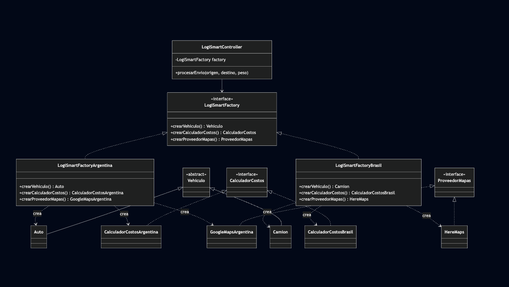
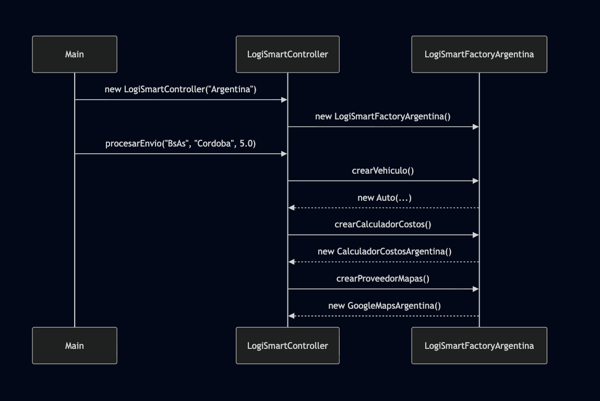
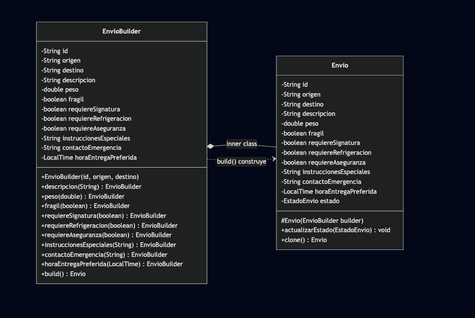
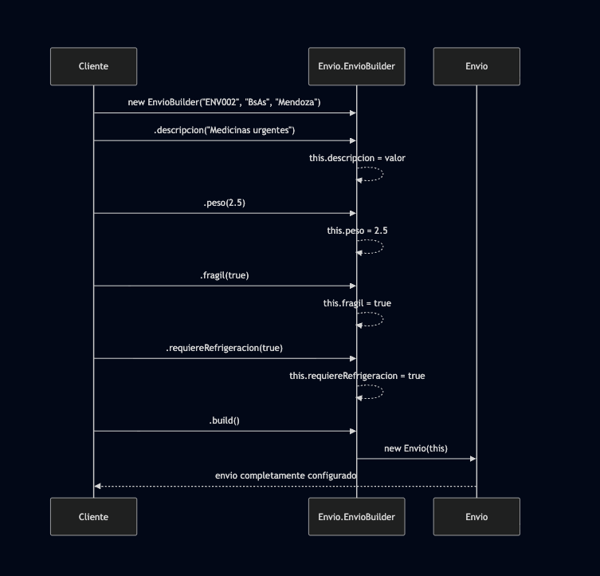
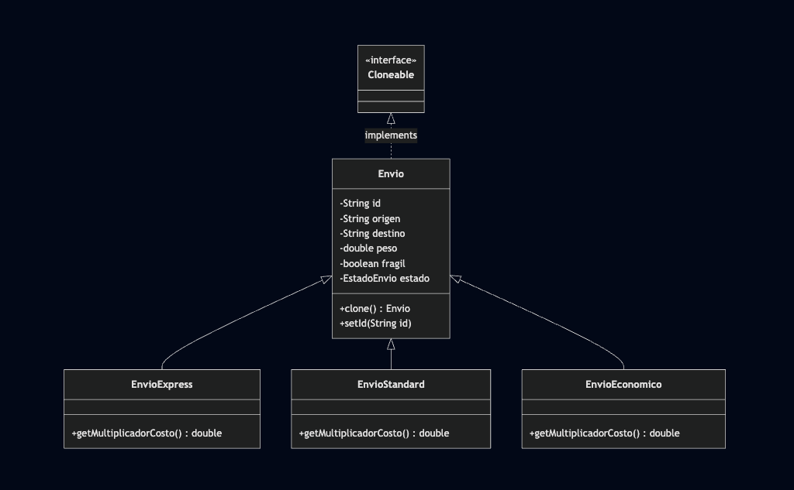
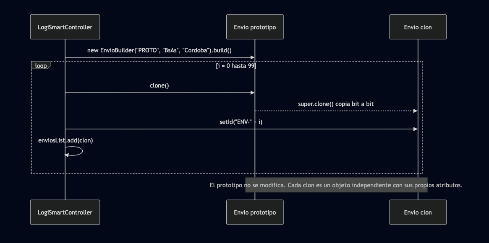

# Hito 7 - Patrones Creacionales II (Abstract Factory, Builder, Prototype)

TP – Hito 7: Patrones Creacionales II

Grupo CASLA

Diagramas

-  (Ver en enlace)

- Diagrama Abstract Factory

- Flujo de uso de Abstract Factory

- Diagrama Patrón Builder

- Flujo de uso de patrón Builder

- Diagrama patrón prototype

- Flujo de uso de patrón prototype

