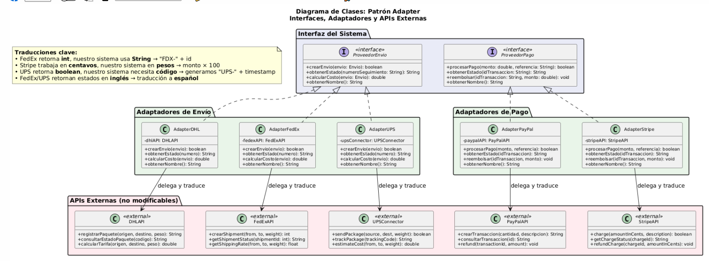
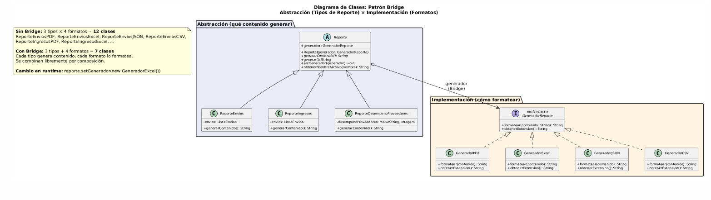
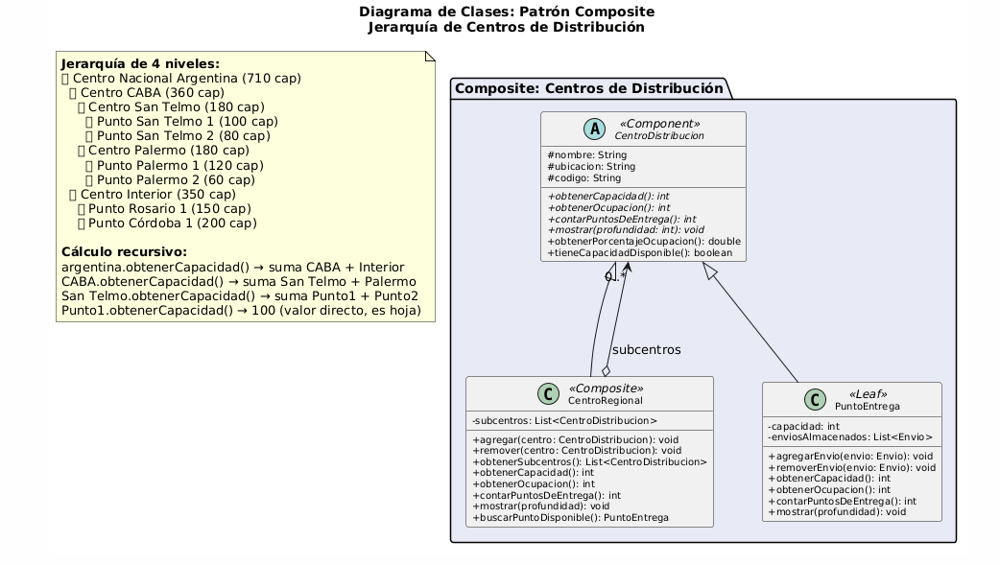
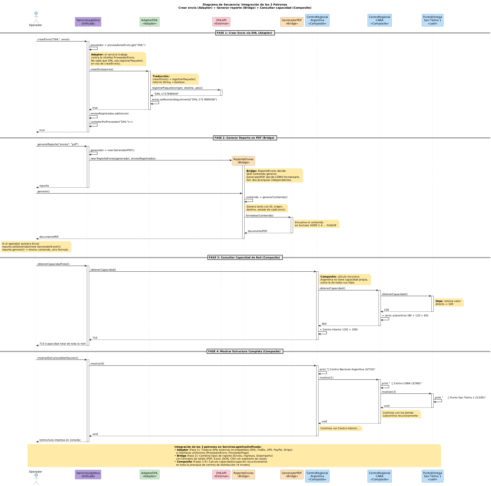

# Hito 8 - Patrones Estructurales (Adapter, Decorator, Facade, Proxy, Flyweight)


TP – Hito 8: Patrones Estructurales I

Grupo CASLA

Actividad 1: Identificar Candidatos a Adapter Revisa tu diseño actual e identifica dónde necesitas integrar componentes externos con interfaces incompatibles.

Entregable: Lista de 2-3 candidatos a Adapter con justificación.

Actividad 1: Identificar Candidatos a Adapter

Entregable: Lista de candidatos a Adapter con justificación

Candidato 1: Proveedores de Envío Externos (DHL, FedEx, UPS)

LogiSmart necesita despachar paquetes físicos a través de proveedores logísticos externos, pero cada uno expone una API completamente distinta: DHL usa registrarPaquete() que retorna un String, FedEx usa crearShipment() que retorna un int, y UPS usa sendPackage() que retorna un boolean. Nuestro sistema no puede (ni debe) modificar esas APIs porque son de terceros. Un Adapter por cada proveedor traduce su interfaz particular a una interfaz común ProveedorEnvio con métodos uniformes (crearEnvio, obtenerEstado, calcularCosto). Así el ServicioLogisticaUnificado trabaja contra una sola interfaz sin importar qué proveedor hay detrás, y agregar un nuevo proveedor (por ejemplo Andreani) solo requiere crear un nuevo Adapter sin tocar el resto del sistema.

Candidato 2: Proveedores de Pago (PayPal, Stripe)

Cuando la PyME cobra el envío al cliente final, necesita procesar pagos a través de plataformas externas. PayPal trabaja con crearTransaccion() que retorna un ID de transacción como String, mientras que Stripe trabaja con charge() que recibe el monto en centavos (no en pesos) y retorna un boolean. Además, los estados de transacción tienen nombres distintos: PayPal retorna "COMPLETADA" y Stripe retorna "succeeded". Un Adapter por cada proveedor normaliza estas diferencias a una interfaz ProveedorPago con métodos procesarPago, obtenerEstado y reembolsar, incluyendo la conversión de moneda (pesos a centavos para Stripe) y la traducción de estados.

Candidato 3: Proveedores de Mapas (Google Maps, HERE Maps)

Este candidato ya existe parcialmente en el Hito 7 con la interfaz ProveedorMapas y las implementaciones GoogleMapsArgentina y HereMaps. Sin embargo, en un escenario real, estas serían APIs externas con interfaces incompatibles: Google Maps usa DirectionsService.route() con objetos LatLng, mientras que HERE Maps usa calculateRoute() con Waypoint. El Adapter que ya tenemos traduce ambas a la interfaz ProveedorMapas con calcularDistancia(lat1, lon1, lat2, lon2) y obtenerRuta(origen, destino). La justificación para formalizarlo como Adapter es que si mañana se agrega OpenStreetMap (gratuito, API REST distinta), solo se crea un nuevo Adapter.

Actividad 2: Implementar Adapter Implementa al menos 2 Adapters en tu sistema.

Entregable: Código Java de 2-3 Adapters implementados.

```java
// ============================================================
// Interfaz que nuestro sistema espera
// ============================================================
package com.logismart.servicios;

import com.logismart.dominio.Envio;

public interface ProveedorEnvio {
    boolean crearEnvio(Envio envio);
    String obtenerEstado(String numeroSeguimiento);
    double calcularCosto(Envio envio);
    String obtenerNombre();
}
// ============================================================
// APIs externas (simuladas — no podemos modificarlas)
// ============================================================
package com.logismart.servicios.externas;

public class DHLAPI {
    public String registrarPaquete(String origen, String destino, double peso) {
        System.out.println("[DHL API] Registrando paquete: " + origen + " → " + destino);
        return "DHL-" + System.currentTimeMillis();
    }

    public String consultarEstadoPaquete(String codigo) {
        return "En tránsito";
    }

    public double calcularTarifa(String origen, String destino, double peso) {
        return peso * 15.0;
    }
}
package com.logismart.servicios.externas;

public class FedExAPI {
    public int crearShipment(String from, String to, double weight) {
        System.out.println("[FedEx API] Creating shipment: " + from + " → " + to);
        return (int) (System.currentTimeMillis() % 1000000);
    }

    public String getShipmentStatus(int shipmentId) {
        return "DELIVERED";
    }

    public float getShippingRate(String from, String to, double weight) {
        return (float) (weight * 12.0);
    }
}
package com.logismart.servicios.externas;

public class UPSConnector {
    public boolean sendPackage(String sourceLocation, String destinationLocation,
                               double packageWeight) {
        System.out.println("[UPS API] Sending package: " +
                           sourceLocation + " → " + destinationLocation);
        return true;
    }

    public String trackPackage(String trackingCode) {
        return "Out for delivery";
    }

    public double estimateCost(String from, String to, double weight) {
        return weight * 10.0;
    }
}
// ============================================================
// Adapters — traducen cada API externa a ProveedorEnvio
// ============================================================
package com.logismart.servicios.adapters;

import com.logismart.dominio.Envio;
import com.logismart.servicios.ProveedorEnvio;
import com.logismart.servicios.externas.DHLAPI;
import com.logismart.singleton.LoggerLogiSmart;
public class AdapterDHL implements ProveedorEnvio {
    private final DHLAPI dhlAPI;
    private final LoggerLogiSmart logger = LoggerLogiSmart.obtenerInstancia();

    public AdapterDHL() {
        this.dhlAPI = new DHLAPI();
    }

    @Override
    public boolean crearEnvio(Envio envio) {
        // DHL usa registrarPaquete(String, String, double) → retorna String (código)
        String codigo = dhlAPI.registrarPaquete(
            envio.getOrigen(),
            envio.getDestino(),
            envio.getPeso()
        );
        envio.setNumeroSeguimiento(codigo);
        logger.info("AdapterDHL: envío creado con código " + codigo);
        return codigo != null;
    }

    @Override
    public String obtenerEstado(String numeroSeguimiento) {
        // DHL usa consultarEstadoPaquete(String) → retorna String en español
        return dhlAPI.consultarEstadoPaquete(numeroSeguimiento);
    }

    @Override
    public double calcularCosto(Envio envio) {
        // DHL usa calcularTarifa(String, String, double) → retorna double
        return dhlAPI.calcularTarifa(
            envio.getOrigen(),
            envio.getDestino(),
            envio.getPeso()
        );
    }

    @Override
    public String obtenerNombre() {
        return "DHL";
    }
}
package com.logismart.servicios.adapters;

import com.logismart.dominio.Envio;
import com.logismart.servicios.ProveedorEnvio;
import com.logismart.servicios.externas.FedExAPI;
import com.logismart.singleton.LoggerLogiSmart;
public class AdapterFedEx implements ProveedorEnvio {
  private final FedExAPI fedexAPI;
  private final LoggerLogiSmart logger = LoggerLogiSmart.obtenerInstancia();

    public AdapterFedEx() {
        this.fedexAPI = new FedExAPI();
    }

    @Override
    public boolean crearEnvio(Envio envio) {
        // FedEx usa crearShipment(String, String, double) → retorna int (no String)
        // Traducción: convertimos el int a String con prefijo "FDX-"
        int shipmentId = fedexAPI.crearShipment(
            envio.getOrigen(),
            envio.getDestino(),
            envio.getPeso()
        );
        envio.setNumeroSeguimiento("FDX-" + shipmentId);
        logger.info("AdapterFedEx: envío creado con ID " + shipmentId);
        return shipmentId > 0;
    }

    @Override
    public String obtenerEstado(String numeroSeguimiento) {
        // FedEx usa getShipmentStatus(int) → necesita int, no String
        // Traducción: extraemos el número después de "FDX-"
        int shipmentId = Integer.parseInt(numeroSeguimiento.replace("FDX-", ""));
        String estadoFedEx = fedexAPI.getShipmentStatus(shipmentId);

        // Traducción de estados: FedEx usa inglés, nuestro sistema usa español
        return switch (estadoFedEx) {
            case "DELIVERED"  -> "Entregado";
            case "IN_TRANSIT" -> "En tránsito";
            case "PENDING"    -> "Pendiente";
            default           -> estadoFedEx;
        };
    }

    @Override
    public double calcularCosto(Envio envio) {
        // FedEx usa getShippingRate() → retorna float, nuestro sistema usa double
        // Traducción: cast implícito de float a double
        return fedexAPI.getShippingRate(
            envio.getOrigen(),
            envio.getDestino(),
            envio.getPeso()
        );
    }

    @Override
    public String obtenerNombre() {
        return "FedEx";
    }
}
package com.logismart.servicios.adapters;

import com.logismart.dominio.Envio;
import com.logismart.servicios.ProveedorEnvio;
import com.logismart.servicios.externas.UPSConnector;
import com.logismart.singleton.LoggerLogiSmart;
public class AdapterUPS implements ProveedorEnvio {
    private final UPSConnector upsConnector;
    private final LoggerLogiSmart logger = LoggerLogiSmart.obtenerInstancia();

    public AdapterUPS() {
        this.upsConnector = new UPSConnector();
    }

    @Override
    public boolean crearEnvio(Envio envio) {
        // UPS usa sendPackage(String, String, double) → retorna boolean (no código)
        // Traducción: generamos nosotros el número de seguimiento si fue exitoso
        boolean resultado = upsConnector.sendPackage(
            envio.getOrigen(),
            envio.getDestino(),
            envio.getPeso()
        );
        if (resultado) {
            String codigo = "UPS-" + System.currentTimeMillis();
            envio.setNumeroSeguimiento(codigo);
            logger.info("AdapterUPS: envío creado con código " + codigo);
        } else {
            logger.error("AdapterUPS: falló la creación del envío");
        }
        return resultado;
    }

    @Override
    public String obtenerEstado(String numeroSeguimiento) {
        // UPS usa trackPackage(String) → retorna String en inglés
        String estadoUPS = upsConnector.trackPackage(numeroSeguimiento);

        // Traducción de estados
        return switch (estadoUPS) {
            case "Out for delivery" -> "En camino";
            case "Delivered"        -> "Entregado";
            case "In transit"       -> "En tránsito";
            default                 -> estadoUPS;
        };
    }

    @Override
    public double calcularCosto(Envio envio) {
        // UPS usa estimateCost(String, String, double) → interfaz compatible
        return upsConnector.estimateCost(
            envio.getOrigen(),
            envio.getDestino(),
            envio.getPeso()
        );
    }

    @Override
    public String obtenerNombre() {
        return "UPS";
    }
}
```

Adapter 2: Proveedores de Pago

```java
// ============================================================
// Interfaz que nuestro sistema espera
// ============================================================
package com.logismart.servicios;

public interface ProveedorPago {
    boolean procesarPago(double monto, String referencia);
    String obtenerEstado(String idTransaccion);
    void reembolsar(String idTransaccion, double monto);
    String obtenerNombre();
}
// ============================================================
// APIs externas (simuladas)
// ============================================================
package com.logismart.servicios.externas;

public class PayPalAPI {
    public String crearTransaccion(double cantidad, String descripcion) {
        System.out.println("[PayPal API] Creando transacción: $" + cantidad);
        return "PP-" + System.currentTimeMillis();
    }

    public String consultarTransaccion(String id) {
        return "COMPLETADA";
    }

    public void refund(String transactionId, double amount) {
        System.out.println("[PayPal API] Refund $" + amount + " para " + transactionId);
    }
}
package com.logismart.servicios.externas;

public class StripeAPI {
    // Stripe trabaja en CENTAVOS, no en pesos
    public boolean charge(double amountInCents, String description) {
        System.out.println("[Stripe API] Charge: " + amountInCents + " cents");
        return true;
    }

    public String getChargeStatus(String chargeId) {
        return "succeeded";
    }

    public void refundCharge(String chargeId, double amountInCents) {
        System.out.println("[Stripe API] Refund " + amountInCents + " cents for " + chargeId);
    }
}
// ============================================================
// Adapters
// ============================================================
package com.logismart.servicios.adapters;

import com.logismart.servicios.ProveedorPago;
import com.logismart.servicios.externas.PayPalAPI;
import com.logismart.singleton.LoggerLogiSmart;
public class AdapterPayPal implements ProveedorPago {
    private final PayPalAPI paypalAPI;
    private final LoggerLogiSmart logger = LoggerLogiSmart.obtenerInstancia();

    public AdapterPayPal() {
        this.paypalAPI = new PayPalAPI();
    }

    @Override
    public boolean procesarPago(double monto, String referencia) {
        // PayPal usa crearTransaccion(double, String) → retorna String (id)
        // Traducción: convertimos retorno String a boolean (éxito si no es null)
        String idTransaccion = paypalAPI.crearTransaccion(monto, referencia);
        boolean exito = idTransaccion != null;
        logger.info("AdapterPayPal: pago " + (exito ? "exitoso" : "fallido")
                   + " | monto=$" + monto + " | ref=" + referencia);
        return exito;
    }

    @Override
    public String obtenerEstado(String idTransaccion) {
        // PayPal retorna estados en español — compatible directo
        return paypalAPI.consultarTransaccion(idTransaccion);
    }

    @Override
    public void reembolsar(String idTransaccion, double monto) {
        // PayPal usa refund(String, double) — compatible directo
        paypalAPI.refund(idTransaccion, monto);
        logger.info("AdapterPayPal: reembolso $" + monto + " para " + idTransaccion);
    }

    @Override
    public String obtenerNombre() {
        return "PayPal";
    }
}
```

java

```java
package com.logismart.servicios.adapters;

import com.logismart.servicios.ProveedorPago;
import com.logismart.servicios.externas.StripeAPI;
import com.logismart.singleton.LoggerLogiSmart;

public class AdapterStripe implements ProveedorPago {
    private final StripeAPI stripeAPI;
    private final LoggerLogiSmart logger = LoggerLogiSmart.obtenerInstancia();

    public AdapterStripe() {
        this.stripeAPI = new StripeAPI();
    }

    @Override
    public boolean procesarPago(double monto, String referencia) {
        // TRADUCCIÓN CLAVE: Stripe trabaja en centavos, nuestro sistema en pesos
        // $150.50 → 15050 centavos
        double montoEnCentavos = monto * 100;
        boolean exito = stripeAPI.charge(montoEnCentavos, referencia);
        logger.info("AdapterStripe: pago " + (exito ? "exitoso" : "fallido")
                   + " | monto=$" + monto + " (" + montoEnCentavos + " cents)");
        return exito;
    }

    @Override
    public String obtenerEstado(String idTransaccion) {
        // TRADUCCIÓN: Stripe retorna estados en inglés, nuestro sistema espera español
        String estadoStripe = stripeAPI.getChargeStatus(idTransaccion);
        return switch (estadoStripe) {
            case "succeeded" -> "COMPLETADA";
            case "pending"   -> "PENDIENTE";
            case "failed"    -> "FALLIDA";
            default          -> estadoStripe;
        };
    }

    @Override
    public void reembolsar(String idTransaccion, double monto) {
        // TRADUCCIÓN: convertir pesos a centavos para Stripe
        double montoEnCentavos = monto * 100;
        stripeAPI.refundCharge(idTransaccion, montoEnCentavos);
        logger.info("AdapterStripe: reembolso $" + monto + " para " + idTransaccion);
    }

    @Override
    public String obtenerNombre() {
        return "Stripe";
    }
}
```

Actividad 3: Identificar Candidatos a Bridge Revisa tu diseño e identifica dónde hay dos dimensiones de variación que están acopladas.

Entregable: Lista de 2-3 candidatos a Bridge con justificación.

Candidato 1: Reportes × Formatos de salida

En LogiSmart hay varios tipos de reportes (envíos, ingresos, desempeño de proveedores) y varios formatos de salida (PDF, Excel, JSON, CSV). Sin Bridge, necesitaríamos una clase por cada combinación: ReporteEnviosPDF, ReporteEnviosExcel, ReporteEnviosJSON, ReporteEnviosCSV, ReporteIngresosPDF, ReporteIngresosExcel... eso son 3 tipos × 4 formatos = 12 clases. Si mañana se agrega un ReporteDesempeñoConductores, se necesitan 4 clases nuevas. Si se agrega formato XML, se necesitan 4 clases más. Bridge resuelve esto separando la abstracción (tipo de reporte) de la implementación (formato de salida) en dos jerarquías independientes que se combinan por composición. Así son 3 + 4 = 7 clases en vez de 12, y agregar un nuevo tipo o formato es una sola clase nueva.

Candidato 2: Notificaciones × Canales de envío

Hay distintos tipos de notificación según su urgencia y contenido (notificación de entrega, notificación de cancelación, notificación de marketing/promociones) y distintos canales para enviarlas (Email, SMS, Push). Sin Bridge, combinaríamos todo: NotificacionEntregaEmail, NotificacionEntregaSMS, NotificacionCancelacionPush, etc. Con 3 tipos × 3 canales = 9 clases, y cada tipo o canal nuevo agrega una fila o columna entera. Bridge permite que el tipo de notificación (qué contenido generar, qué prioridad tiene) sea independiente del canal (cómo enviarlo), conectándose por composición. La notificación genera su contenido y delega al canal el envío, pudiendo incluso cambiar de canal en tiempo de ejecución.

Candidato 3: Vehículos × Tipo de motor

En el sistema actual, Vehiculo tiene subclases por forma (Moto, Camioneta, Camion). Pero si se necesita diferenciar por tipo de motor (nafta, diésel, eléctrico), sin Bridge explotaría en combinaciones: MotoNafta, MotoElectrica, CamionetaNafta, CamionetaDiesel, CamionDiesel, CamionElectrico... son 3 formas × 3 motores = 9 clases. Bridge separaría la forma del vehículo (que define capacidad, velocidad, licencia) del motor (que define consumo por km, emisiones, autonomía), conectados por composición. Así Moto tiene un Motor inyectado, y si mañana aparece el motor a hidrógeno, es una sola clase nueva que funciona con todos los vehículos.

Actividad 4: Implementar Bridge Implementa al menos 1 Bridge en tu sistema.

Entregable: Código Java de 1-2 Bridges implementados.

```java
// ============================================================
// Interfaz del Implementor — define cómo formatear
// ============================================================
package com.logismart.servicios.reportes;

public interface GeneradorReporte {
    String formatear(String contenido);
    String obtenerExtension();
}
package com.logismart.servicios.reportes;

public class GeneradorPDF implements GeneradorReporte {

 @Override
    public String formatear(String contenido) {
        StringBuilder pdf = new StringBuilder();
        pdf.append("%PDF-1.4\n");
        pdf.append("% LogiSmart - Reporte Generado\n");
        pdf.append("% ================================\n\n");
        pdf.append(contenido);
        pdf.append("\n\n%%EOF");
        return pdf.toString();
    }

    @Override
    public String obtenerExtension() {
        return "pdf";
    }
}
package com.logismart.servicios.reportes;

public class GeneradorExcel implements GeneradorReporte {

 @Override
    public String formatear(String contenido) {
        StringBuilder excel = new StringBuilder();
        excel.append("<?xml version=\"1.0\" encoding=\"UTF-8\"?>\n");
        excel.append("<Workbook xmlns=\"urn:schemas-microsoft-com:office:spreadsheet\">\n");
        excel.append("  <Worksheet ss:Name=\"Reporte\">\n");
        excel.append("    <Table>\n");

        // Cada línea del contenido se convierte en una fila
        for (String linea : contenido.split("\n")) {
            if (!linea.isBlank()) {
                excel.append("      <Row><Cell><Data>")
                     .append(linea.trim())
                     .append("</Data></Cell></Row>\n");
            }
        }

        excel.append("    </Table>\n");
        excel.append("  </Worksheet>\n");
        excel.append("</Workbook>");
        return excel.toString();
    }

    @Override
    public String obtenerExtension() {
        return "xlsx";
    }
}
package com.logismart.servicios.reportes;

public class GeneradorJSON implements GeneradorReporte {

    @Override
    public String formatear(String contenido) {
        StringBuilder json = new StringBuilder();
        json.append("{\n");
        json.append("  \"sistema\": \"LogiSmart\",\n");
        json.append("  \"reporte\": \"")
            .append(contenido.replace("\n", "\\n").replace("\"", """))
            .append("\"\n");
        json.append("}");
        return json.toString();
    }

    @Override
    public String obtenerExtension() {
        return "json";
    }
}
package com.logismart.servicios.reportes;

public class GeneradorCSV implements GeneradorReporte {

 @Override
    public String formatear(String contenido) {
        StringBuilder csv = new StringBuilder();
        for (String linea : contenido.split("\n")) {
            if (!linea.isBlank() && !linea.startsWith("===")) {
                // Reemplazar separadores por comas para formato CSV
                String lineaCSV = linea.replace(": ", ",").replace("---", "");
                if (!lineaCSV.isBlank()) {
                    csv.append(lineaCSV).append("\r\n");
                }
            }
        }
        return csv.toString();
    }

    @Override
    public String obtenerExtension() {
        return "csv";
    }
}
```

Abstracción: Tipos de reporte

```java
// ============================================================
// Abstracción base — conecta con el Implementor por composición
// ============================================================
package com.logismart.servicios.reportes;

public abstract class Reporte {
    // Bridge: referencia a la implementación (formato)
    protected GeneradorReporte generador;

    public Reporte(GeneradorReporte generador) {
        this.generador = generador;
    }

    // Cada subclase define QUÉ contenido generar
    public abstract String generarContenido();

    // El método generar() combina ambas dimensiones:
    // la subclase genera contenido + el generador lo formatea
    public String generar() {
        String contenido = generarContenido();
        return generador.formatear(contenido);
    }

    // Cambiar formato en tiempo de ejecución
    public void setGenerador(GeneradorReporte generador) {
        this.generador = generador;
    }

    public String obtenerNombreArchivo(String nombre) {
        return nombre + "." + generador.obtenerExtension();
    }
}// ============================================================
// Reporte concreto 1: Envíos
// ============================================================
package com.logismart.servicios.reportes;

import com.logismart.dominio.Envio;
import java.util.List;

public class ReporteEnvios extends Reporte {
    private final List<Envio> envios;

    public ReporteEnvios(GeneradorReporte generador, List<Envio> envios) {
        super(generador);
        this.envios = envios;
    }

    @Override
    public String generarContenido() {
        StringBuilder sb = new StringBuilder();
        sb.append("=== REPORTE DE ENVIOS ===\n");
        sb.append("Total de envíos: ").append(envios.size()).append("\n\n");

        for (Envio envio : envios) {
            sb.append("ID: ").append(envio.getShipmentId()).append("\n");
            sb.append("Origen: ").append(envio.getOrigen()).append("\n");
            sb.append("Destino: ").append(envio.getDestino()).append("\n");
            sb.append("Estado: ").append(envio.getEstado()).append("\n");
            sb.append("Peso: ").append(envio.getPeso()).append(" kg\n");
            sb.append("---\n");
        }

        return sb.toString();
    }
}
```

Actividad 5: Identificar Candidatos a Composite Revisa tu diseño e identifica dónde hay jerarquías parte-todo.

Entregable: Lista de 2-3 candidatos a Composite con justificación.

Candidato 1: Centros de Distribución (Centro Nacional → Regional → Local → Punto de Entrega)

LogiSmart opera con una red logística jerárquica: un centro nacional contiene centros regionales, cada regional contiene centros locales, y cada local contiene puntos de entrega finales. La operación necesita calcular capacidad total, ocupación y porcentaje de uso en cualquier nivel de la jerarquía de forma transparente. Sin Composite, habría que escribir lógica distinta para preguntar la capacidad de un punto de entrega (que tiene un valor fijo) versus la de un centro regional (que debería sumar la de todos sus hijos recursivamente). Composite permite tratar ambos uniformemente: se llama obtenerCapacidad() en cualquier nodo y el resultado se calcula recursivamente si es un contenedor o se retorna directo si es una hoja. Además, mostrar() despliega toda la estructura con indentación automática por profundidad.

Candidato 2: Rutas con Subrutas (Ruta Principal → Tramos → Paradas)

Una ruta de larga distancia podría descomponerse en tramos (Buenos Aires → Rosario, Rosario → Córdoba), y cada tramo contiene paradas individuales. Hoy la Ruta tiene una lista plana de envíos, pero si se necesita calcular la distancia total, el tiempo estimado o el costo de un tramo específico versus la ruta completa, la estructura plana obliga a filtrar manualmente. Con Composite, tanto un tramo individual como la ruta completa implementan calcularDistancia() y calcularTiempoEstimado(). La ruta principal suma recursivamente los valores de sus tramos, y cada tramo suma los de sus paradas. Agregar un nivel intermedio (por ejemplo, "zona metropolitana" dentro de un tramo) no requiere cambiar la lógica de cálculo.

Candidato 3: Permisos de Usuarios (Grupo de Permisos → Permisos Individuales)

El sistema tiene distintos roles (Admin, Operador, Conductor, Cliente) con permisos diferentes. Un grupo de permisos como "Gestión de Rutas" podría contener permisos individuales ("crear ruta", "editar ruta", "eliminar ruta") y también subgrupos ("Gestión de Envíos dentro de Ruta" que a su vez tiene "agregar envío", "quitar envío"). Sin Composite, verificar si un usuario tiene un permiso requiere recorrer estructuras distintas según si es un permiso individual o un grupo. Con Composite, se llama tienePermiso("crear_ruta") sobre cualquier nodo: un permiso individual compara su nombre, un grupo busca recursivamente en todos sus hijos. Asignar un grupo entero a un rol es una sola operación, y agregar un permiso nuevo al grupo se propaga automáticamente a todos los roles que lo tengan.

Actividad 6: Implementar Composite Implementa al menos 1 Composite en tu sistema.

Entregable: Código Java de 1-2 Composites implementados.

```java
package com.logismart.dominio.distribucion;
public abstract class CentroDistribucion {
    protected String nombre;
    protected String ubicacion;
    protected String codigo;

    public CentroDistribucion(String nombre, String ubicacion, String codigo) {
        this.nombre = nombre;
        this.ubicacion = ubicacion;
        this.codigo = codigo;
    }

    // Operaciones comunes — tratamiento uniforme hoja/contenedor
    public abstract int obtenerCapacidad();
    public abstract int obtenerOcupacion();
    public abstract int contarPuntosDeEntrega();
    public abstract void mostrar(int profundidad);

    public double obtenerPorcentajeOcupacion() {
        int capacidad = obtenerCapacidad();
        if (capacidad == 0) return 0.0;
        return (double) obtenerOcupacion() / capacidad * 100;
    }

    public boolean tieneCapacidadDisponible() {
        return obtenerOcupacion() < obtenerCapacidad();
    }

    public String getNombre() { return nombre; }
    public String getUbicacion() { return ubicacion; }
    public String getCodigo() { return codigo; }

    @Override
    public String toString() {
        return nombre + " [" + codigo + "] (" +
               obtenerOcupacion() + "/" + obtenerCapacidad() + ")";
    }
}
```

Hoja: Punto de Entrega (no tiene hijos)

```java
package com.logismart.dominio.distribucion;

import com.logismart.dominio.Envio;
import java.util.ArrayList;
import java.util.List;

public class PuntoEntrega extends CentroDistribucion {
  private final int capacidad;
    private final List<Envio> enviosAlmacenados;

    public PuntoEntrega(String nombre, String ubicacion, String codigo, int capacidad) {
        super(nombre, ubicacion, codigo);
        this.capacidad = capacidad;
        this.enviosAlmacenados = new ArrayList<>();
    }

    public void agregarEnvio(Envio envio) {
        if (enviosAlmacenados.size() >= capacidad) {
            throw new IllegalStateException(
                "Capacidad excedida en " + nombre + " (" + codigo + "): "
                + enviosAlmacenados.size() + "/" + capacidad);
        }
        enviosAlmacenados.add(envio);
    }

    public void removerEnvio(Envio envio) {
        enviosAlmacenados.remove(envio);
    }

    public List<Envio> getEnviosAlmacenados() {
        return new ArrayList<>(enviosAlmacenados);
    }

    // --- Operaciones de la interfaz (valores directos, no recursivos) ---

    @Override
    public int obtenerCapacidad() {
        return capacidad;
    }

    @Override
    public int obtenerOcupacion() {
        return enviosAlmacenados.size();
    }

    @Override
    public int contarPuntosDeEntrega() {
        return 1; // una hoja es un punto de entrega
    }

    @Override
    public void mostrar(int profundidad) {
        String indent = "  ".repeat(profundidad);
        System.out.println(indent + "📍 " + nombre +
            " (" + obtenerOcupacion() + "/" + capacidad + ")" +
            " [" + codigo + "]");
    }
}
```

Composite: Centro Regional (tiene hijos que son otros CentroDistribucion)

```java
package com.logismart.dominio.distribucion;

import java.util.ArrayList;
import java.util.List;

public class CentroRegional extends CentroDistribucion {
   private final List<CentroDistribucion> subcentros;

    public CentroRegional(String nombre, String ubicacion, String codigo) {
        super(nombre, ubicacion, codigo);
        this.subcentros = new ArrayList<>();
    }

    // --- Gestión de hijos ---

    public void agregar(CentroDistribucion centro) {
        subcentros.add(centro);
    }

    public void remover(CentroDistribucion centro) {
        subcentros.remove(centro);
    }

    public List<CentroDistribucion> obtenerSubcentros() {
        return new ArrayList<>(subcentros);
    }

    // --- Operaciones recursivas (recorren todo el subárbol) ---

    @Override
    public int obtenerCapacidad() {
        int total = 0;
        for (CentroDistribucion centro : subcentros) {
            total += centro.obtenerCapacidad();
        }
        return total;
    }

    @Override
    public int obtenerOcupacion() {
        int total = 0;
        for (CentroDistribucion centro : subcentros) {
            total += centro.obtenerOcupacion();
        }
        return total;
    }

    @Override
    public int contarPuntosDeEntrega() {
        int total = 0;
        for (CentroDistribucion centro : subcentros) {
            total += centro.contarPuntosDeEntrega();
        }
        return total;
    }

    @Override
    public void mostrar(int profundidad) {
        String indent = "  ".repeat(profundidad);
        String icono = profundidad == 0 ? "🏭" : "🏢";
        System.out.println(indent + icono + " " + nombre +
            " (" + obtenerOcupacion() + "/" + obtenerCapacidad() + ")" +
            " [" + codigo + "]" +
            " — " + String.format("%.1f", obtenerPorcentajeOcupacion()) + "% ocupado");

        for (CentroDistribucion centro : subcentros) {
            centro.mostrar(profundidad + 1);
        }
    }

    // Buscar un punto de entrega con capacidad disponible en todo el subárbol
    public PuntoEntrega buscarPuntoDisponible() {
        for (CentroDistribucion centro : subcentros) {
            if (centro instanceof PuntoEntrega punto) {
                if (punto.tieneCapacidadDisponible()) {
                    return punto;
                }
            } else if (centro instanceof CentroRegional regional) {
                PuntoEntrega encontrado = regional.buscarPuntoDisponible();
                if (encontrado != null) {
                    return encontrado;
                }
            }
        }
        return null;
    }
}
```

Conclusiones

Cómo cambió el diseño

El diseño de LogiSmart pasó de un sistema que se comunicaba directamente con APIs externas (cada una con su formato particular) a una arquitectura donde toda integración externa está aislada detrás de interfaces uniformes mediante Adapter. Antes, si IntegracionService necesitaba enviar un paquete por DHL, tenía que conocer que DHL usa registrarPaquete() que retorna String, mientras que FedEx usa crearShipment() que retorna int. Ahora el ServicioLogisticaUnificado trabaja contra ProveedorEnvio y ProveedorPago sin saber qué proveedor hay detrás. Por otro lado, la generación de reportes pasó de ser un problema combinatorio (cada tipo de reporte × cada formato = clase nueva) a una estructura Bridge donde los 3 tipos de reporte y los 4 formatos de salida se combinan libremente por composición, reduciendo de 12 clases a 7. Finalmente, la red de distribución dejó de ser una estructura plana para convertirse en un árbol Composite de 4 niveles donde capacidad, ocupación y porcentaje de uso se calculan recursivamente desde cualquier nodo, tratando un punto de entrega individual con la misma interfaz que el centro nacional completo.

Beneficios de los patrones

Adapter resolvió el acoplamiento con terceros: agregar un nuevo proveedor de envío (Andreani), de pago (MercadoPago) o de mapas (OpenStreetMap) es crear una sola clase que traduce su API a la interfaz del sistema, sin modificar el Controller, el servicio unificado ni ningún otro componente existente. Bridge eliminó la explosión de clases en reportes y permite cambiar el formato de salida en tiempo de ejecución con setGenerador(), lo que habilita casos como que un operador pida el mismo reporte primero en pantalla (JSON) y después lo exporte a Excel sin regenerar el contenido. Composite simplificó la gestión de la red logística: operaciones como "¿cuánta capacidad disponible tiene toda la región CABA?" se resuelven con una sola llamada que recorre el árbol recursivamente, y agregar un nuevo nivel jerárquico (por ejemplo, "zona metropolitana") no requiere cambiar la lógica de cálculo. Los tres patrones refuerzan los principios de hitos anteriores: Open/Closed (agregar sin modificar), Low Coupling (depender de interfaces, no de implementaciones) y High Cohesion (cada clase tiene una responsabilidad clara).

Próximos pasos

Para continuar mejorando la arquitectura de LogiSmart, se podrían aplicar los patrones estructurales restantes: Decorator para agregar funcionalidades opcionales a los envíos (seguro, seguimiento premium, embalaje especial) sin crear subclases por cada combinación, Facade para simplificar la interfaz del ServicioLogisticaUnificado que actualmente expone demasiados métodos, y Proxy para implementar caché transparente en las llamadas a APIs externas de proveedores de envío y mapas, evitando consultas repetidas. También sería valioso integrar el Composite de centros de distribución con el Controller para que la planificación de rutas considere la ocupación real de cada punto de entrega al asignar envíos.

Diagramas:








