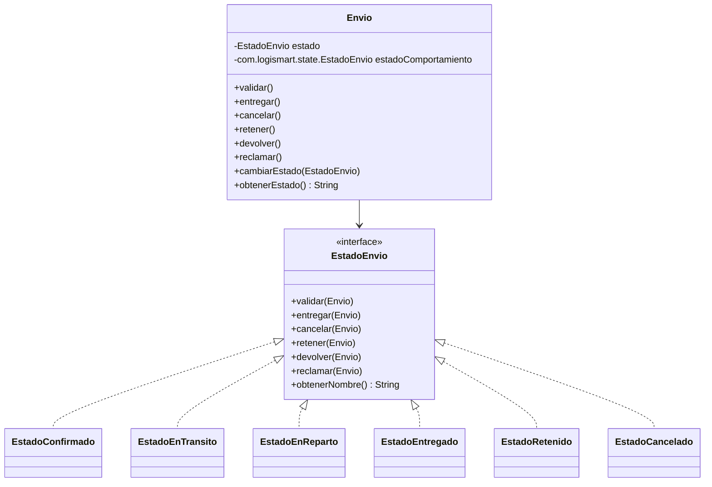

# Hito 12 - Actividad 1: State

**Proyecto:** LogiSmart - Sistema de Gestion de Logistica  
**Patron:** State  
**Paquete:** `com.logismart.state`  
**Contexto:** `com.logismart.dominio.Envio`

---

## Descripcion del Patron

El patron **State** permite que un objeto cambie su comportamiento cuando cambia su estado interno. Desde el punto de vista del cliente, el objeto parece cambiar de clase: las mismas operaciones (`validar`, `entregar`, `cancelar`, etc.) producen resultados distintos segun el estado actual.

En LogiSmart se aplica a la maquina de estados de un envio. En vez de concentrar todas las reglas en condicionales dentro de `Envio`, cada estado concreto encapsula que acciones permite, que acciones rechaza y a que estado transiciona.

---

## Problema en LogiSmart

Un envio no deberia aceptar cualquier accion en cualquier momento:

- Un envio `CONFIRMADO` puede validarse o cancelarse.
- Un envio `EN_TRANSITO` puede pasar a reparto o ser retenido.
- Un envio `EN_REPARTO` puede entregarse o devolverse a transito.
- Un envio `ENTREGADO` solo permite registrar reclamos.
- Un envio `CANCELADO` no permite nuevas operaciones.
- Un envio `RETENIDO` puede liberarse, cancelarse o devolverse.

Sin State, `Envio` terminaria con metodos llenos de `if` o `switch` sobre el estado actual.

---

## Diagrama de Clases



---

## Diagrama de Secuencia

Flujo normal: `CONFIRMADO -> EN_TRANSITO -> EN_REPARTO -> ENTREGADO`.

```text
Cliente        Envio        EstadoConfirmado    EstadoEnTransito    EstadoEnReparto
   |             |                  |                  |                  |
   | validar()   |                  |                  |                  |
   |------------>| validar(envio)   |                  |                  |
   |             |----------------->|                  |                  |
   |             | cambiarEstado(new EstadoEnTransito) |                  |
   |             |<-----------------|                  |                  |
   |             | estado = EN_TRANSITO                |                  |
   |             |                  |                  |                  |
   | entregar()  |                  |                  |                  |
   |------------>| entregar(envio)  |                  |                  |
   |             |------------------------------------>|                  |
   |             | cambiarEstado(new EstadoEnReparto)  |                  |
   |             |<------------------------------------|                  |
   |             | estado = EN_REPARTO                 |                  |
   |             |                  |                  |                  |
   | entregar()  |                  |                  |                  |
   |------------>| entregar(envio)  |                  |                  |
   |             |------------------------------------------------------>|
   |             | cambiarEstado(new EstadoEntregado)                   |
   |             |<------------------------------------------------------|
   |             | estado = ENTREGADO                                    |
```

---

## Implementacion

### `EstadoEnvio.java`

La interfaz define todas las acciones posibles sobre un envio. Cada estado decide cuales acepta y cuales rechaza.

```java
package com.logismart.state;

import com.logismart.dominio.Envio;

public interface EstadoEnvio {
    void validar(Envio envio);
    void entregar(Envio envio);
    void cancelar(Envio envio);
    void retener(Envio envio);
    void devolver(Envio envio);
    void reclamar(Envio envio);
    String obtenerNombre();
}
```

### `EstadoConfirmado.java`

Es el estado inicial. Permite validar el envio o cancelarlo.

```java
public class EstadoConfirmado implements EstadoEnvio {

    @Override
    public void validar(Envio envio) {
        System.out.println("[State] Envio validado");
        envio.cambiarEstado(new EstadoEnTransito());
    }

    @Override
    public void entregar(Envio envio) {
        System.out.println("[State] No se puede entregar: debe estar en transito");
    }

    @Override
    public void cancelar(Envio envio) {
        System.out.println("[State] Envio cancelado");
        envio.cambiarEstado(new EstadoCancelado());
    }

    @Override
    public void retener(Envio envio) {
        System.out.println("[State] No se puede retener: debe estar en transito");
    }

    @Override
    public void devolver(Envio envio) {
        System.out.println("[State] No se puede devolver: debe estar en reparto");
    }

    @Override
    public void reclamar(Envio envio) {
        System.out.println("[State] No se puede reclamar: debe estar entregado");
    }

    @Override
    public String obtenerNombre() {
        return "CONFIRMADO";
    }
}
```

### `EstadoEnTransito.java`

Representa un envio que ya fue validado. Puede pasar a reparto o quedar retenido.

```java
public class EstadoEnTransito implements EstadoEnvio {

    @Override
    public void validar(Envio envio) {
        System.out.println("[State] El envio ya esta validado");
    }

    @Override
    public void entregar(Envio envio) {
        System.out.println("[State] Envio en reparto");
        envio.cambiarEstado(new EstadoEnReparto());
    }

    @Override
    public void retener(Envio envio) {
        System.out.println("[State] Envio retenido");
        envio.cambiarEstado(new EstadoRetenido());
    }

    @Override
    public String obtenerNombre() {
        return "EN_TRANSITO";
    }
}
```

Los metodos omitidos en el fragmento (`cancelar`, `devolver`, `reclamar`) rechazan la operacion porque no corresponde al estado.

### `EstadoEnReparto.java`

Representa el tramo final de distribucion. Puede entregarse o devolverse a transito.

```java
public class EstadoEnReparto implements EstadoEnvio {

    @Override
    public void entregar(Envio envio) {
        System.out.println("[State] Envio entregado");
        envio.cambiarEstado(new EstadoEntregado());
    }

    @Override
    public void devolver(Envio envio) {
        System.out.println("[State] Envio devuelto a transito");
        envio.cambiarEstado(new EstadoEnTransito());
    }

    @Override
    public String obtenerNombre() {
        return "EN_REPARTO";
    }
}
```

### `EstadoEntregado.java`

Es un estado final operativo. No permite volver a entregar ni cancelar, pero permite registrar reclamos.

```java
public class EstadoEntregado implements EstadoEnvio {

    @Override
    public void reclamar(Envio envio) {
        System.out.println("[State] Reclamo registrado para " + envio.getId());
    }

    @Override
    public String obtenerNombre() {
        return "ENTREGADO";
    }
}
```

### `EstadoRetenido.java`

Permite liberar el envio hacia reparto, cancelar o devolver a transito.

```java
public class EstadoRetenido implements EstadoEnvio {

    @Override
    public void entregar(Envio envio) {
        System.out.println("[State] Envio liberado y enviado a reparto");
        envio.cambiarEstado(new EstadoEnReparto());
    }

    @Override
    public void cancelar(Envio envio) {
        System.out.println("[State] Envio cancelado");
        envio.cambiarEstado(new EstadoCancelado());
    }

    @Override
    public void devolver(Envio envio) {
        System.out.println("[State] Envio devuelto a transito");
        envio.cambiarEstado(new EstadoEnTransito());
    }

    @Override
    public String obtenerNombre() {
        return "RETENIDO";
    }
}
```

### `EstadoCancelado.java`

Es estado final. Todas las operaciones quedan rechazadas o informan que el envio ya fue cancelado.

```java
public class EstadoCancelado implements EstadoEnvio {

    @Override
    public void cancelar(Envio envio) {
        System.out.println("[State] El envio ya esta cancelado");
    }

    @Override
    public String obtenerNombre() {
        return "CANCELADO";
    }
}
```

### Modificaciones en `Envio`

`Envio` conserva el enum historico `com.logismart.dominio.EstadoEnvio` para no romper el resto del TP, pero agrega un objeto State real:

```java
private EstadoEnvio estado;
private com.logismart.state.EstadoEnvio estadoComportamiento;
```

El metodo sobrecargado actualiza ambos modelos:

```java
public void cambiarEstado(com.logismart.state.EstadoEnvio nuevoEstado) {
    EstadoEnvio estadoAnterior = this.estado;
    this.estadoComportamiento = nuevoEstado;
    this.estado = EstadoEnvio.valueOf(nuevoEstado.obtenerNombre());
    System.out.println("[Envio " + id + "] Estado: " + estadoAnterior + " -> " + this.estado);
    notificarObservadores(this.estado.name());
}
```

Las operaciones publicas delegan en el estado actual:

```java
public void validar()  { estadoComportamiento.validar(this); }
public void entregar() { estadoComportamiento.entregar(this); }
public void cancelar() { estadoComportamiento.cancelar(this); }
public void retener()  { estadoComportamiento.retener(this); }
public void devolver() { estadoComportamiento.devolver(this); }
public void reclamar() { estadoComportamiento.reclamar(this); }
```

Para restauraciones desde Memento o cambios por String, `Envio` reconstruye el State concreto:

```java
private static com.logismart.state.EstadoEnvio crearEstadoComportamiento(EstadoEnvio estado) {
    return switch (estado) {
        case EN_TRANSITO, EN_CAMINO -> new com.logismart.state.EstadoEnTransito();
        case EN_REPARTO -> new com.logismart.state.EstadoEnReparto();
        case ENTREGADO -> new com.logismart.state.EstadoEntregado();
        case RETENIDO -> new com.logismart.state.EstadoRetenido();
        case CANCELADO -> new com.logismart.state.EstadoCancelado();
        default -> new com.logismart.state.EstadoConfirmado();
    };
}
```

---

## Casos de Prueba

Demo ejecutable: `com.logismart.state.StateDemo`

```java
Envio envio1 = crearEnvio("ENV-001");
envio1.validar();   // CONFIRMADO -> EN_TRANSITO
envio1.entregar();  // EN_TRANSITO -> EN_REPARTO
envio1.entregar();  // EN_REPARTO -> ENTREGADO
```

| Caso | Flujo | Resultado esperado |
|---|---|---|
| 1 | `validar -> entregar -> entregar` | `ENTREGADO` |
| 2 | `cancelar` desde `CONFIRMADO` | `CANCELADO` |
| 3 | `validar -> retener -> entregar` | `EN_REPARTO` |
| 4 | `validar -> entregar -> devolver` | `EN_TRANSITO` |
| 5 | `validar -> entregar -> entregar -> reclamar` | reclamo registrado |
| 6 | `entregar` desde `CONFIRMADO` | operacion rechazada |
| 7 | `cancelar` desde `ENTREGADO` | operacion rechazada |

---

## Decisiones de Diseno

**Por que no reemplazar el enum existente?**  
El TP ya usa `com.logismart.dominio.EstadoEnvio` en controladores, rutas, reportes y validaciones. Reemplazarlo por una interfaz romperia codigo existente. Por eso se agrego `com.logismart.state.EstadoEnvio` como State real y `Envio` mantiene ambos sincronizados.

**Por que `EstadoEnTransito.entregar()` pasa a `EstadoEnReparto` y no a `Entregado`?**  
La consigna separa el estado de traslado general (`EN_TRANSITO`) del ultimo tramo (`EN_REPARTO`). Entonces "entregar" en transito significa despachar a reparto; "entregar" en reparto significa confirmar entrega.

**Por que las operaciones invalidas imprimen mensajes en vez de lanzar excepciones?**  
El hito pide casos de prueba demostrativos por consola. Imprimir el rechazo hace visible el comportamiento sin detener el demo.

**Como convive con Observer del Hito 11?**  
Cada cambio de State termina llamando a `notificarObservadores`, de modo que los observadores agregados previamente siguen funcionando.

---

## Ventajas y Desventajas

**Ventajas**
- Evita condicionales extensos dentro de `Envio`.
- Localiza las reglas de transicion en clases pequenas.
- Permite agregar estados nuevos sin tocar todos los metodos del contexto.
- Integra con Observer porque cada transicion notifica el cambio.

**Desventajas**
- Aumenta la cantidad de clases.
- Requiere mantener consistencia entre el enum de dominio y los objetos State.
- Si las transiciones crecen mucho, puede convenir una tabla formal de estados para auditoria.
