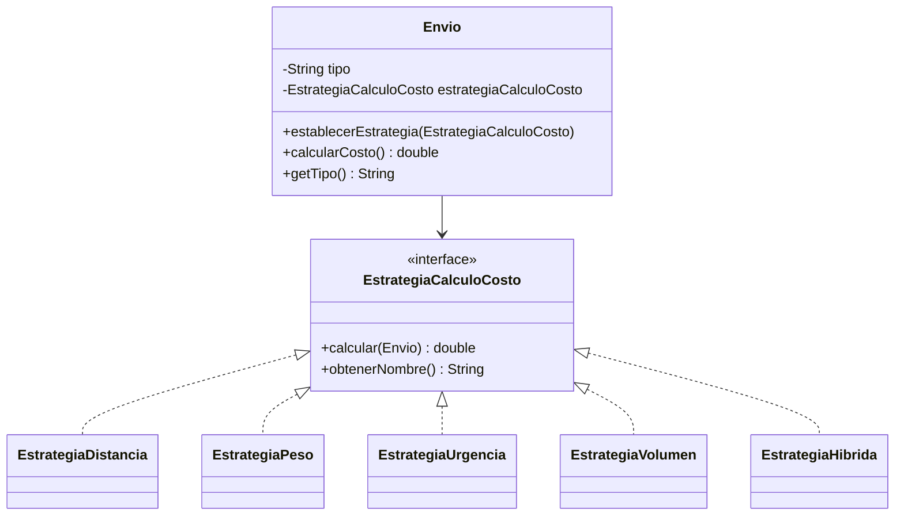

# Hito 12 - Actividad 2: Strategy

**Proyecto:** LogiSmart - Sistema de Gestion de Logistica  
**Patron:** Strategy  
**Paquete:** `com.logismart.strategy`  
**Contexto:** `com.logismart.dominio.Envio`

---

## Descripcion del Patron

El patron **Strategy** permite definir una familia de algoritmos, encapsular cada uno en una clase y hacerlos intercambiables en tiempo de ejecucion. El cliente puede cambiar la estrategia sin cambiar el objeto que la usa.

En LogiSmart se usa para calcular el costo de envio con distintas formulas:

- Por distancia.
- Por peso.
- Por urgencia.
- Por volumen.
- Hibrida.

---

## Problema en LogiSmart

El costo de un envio no siempre se calcula igual. Un envio comun puede depender de la distancia; un envio pesado puede depender de kg; un envio urgente puede tener una tarifa fija prioritaria; un envio voluminoso puede calcularse por volumen estimado.

Sin Strategy, `Envio.calcularCosto()` necesitaria condicionales como:

```java
if ("DISTANCIA".equals(tipoCalculo)) { ... }
else if ("PESO".equals(tipoCalculo)) { ... }
else if ("URGENCIA".equals(tipoCalculo)) { ... }
```

Con Strategy, `Envio` solo delega:

```java
return estrategiaCalculoCosto.calcular(this);
```

---

## Diagrama de Clases



---

## Diagrama de Secuencia

Cambio dinamico de estrategia:

```text
Cliente        Envio              EstrategiaPeso       EstrategiaHibrida
   |             |                       |                    |
   | establecerEstrategia(peso)          |                    |
   |------------>|                       |                    |
   | calcularCosto()                     |                    |
   |------------>| calcular(envio)       |                    |
   |             |---------------------->|                    |
   |             | costo por kg          |                    |
   |<------------|                       |                    |
   |             |                       |                    |
   | establecerEstrategia(hibrida)       |                    |
   |------------>|                       |                    |
   | calcularCosto()                     |                    |
   |------------>| calcular(envio)                            |
   |             |------------------------------------------->|
   |             | costo combinado                            |
   |<------------|                                            |
```

---

## Implementacion

### `EstrategiaCalculoCosto.java`

Contrato comun para todas las formulas.

```java
package com.logismart.strategy;

import com.logismart.dominio.Envio;

public interface EstrategiaCalculoCosto {
    double calcular(Envio envio);
    String obtenerNombre();
}
```

### `EstrategiaDistancia.java`

Calcula usando una distancia simulada. La simulacion es deterministica para que el resultado no cambie entre ejecuciones.

```java
public class EstrategiaDistancia implements EstrategiaCalculoCosto {

    private static final double COSTO_POR_KM = 10.0;

    @Override
    public double calcular(Envio envio) {
        return calcularDistancia(envio.getOrigen(), envio.getDestino()) * COSTO_POR_KM;
    }

    @Override
    public String obtenerNombre() {
        return "Por Distancia";
    }

    private double calcularDistancia(String origen, String destino) {
        int hash = Math.floorMod((origen + "->" + destino).hashCode(), 450);
        return 50.0 + hash;
    }
}
```

### `EstrategiaPeso.java`

Formula directa por kg.

```java
public class EstrategiaPeso implements EstrategiaCalculoCosto {

    private static final double COSTO_POR_KG = 5.0;

    @Override
    public double calcular(Envio envio) {
        return envio.getPeso() * COSTO_POR_KG;
    }

    @Override
    public String obtenerNombre() {
        return "Por Peso";
    }
}
```

### `EstrategiaUrgencia.java`

Usa el campo `tipo` del envio. Los tipos contemplados son `URGENTE`, `EXPRESS` y normal/default.

```java
public class EstrategiaUrgencia implements EstrategiaCalculoCosto {

    @Override
    public double calcular(Envio envio) {
        if ("URGENTE".equalsIgnoreCase(envio.getTipo())) {
            return 500.0;
        }
        if ("EXPRESS".equalsIgnoreCase(envio.getTipo())) {
            return 300.0;
        }
        return 100.0;
    }

    @Override
    public String obtenerNombre() {
        return "Por Urgencia";
    }
}
```

### `EstrategiaVolumen.java`

Usa una estimacion simple: volumen = peso * 2.

```java
public class EstrategiaVolumen implements EstrategiaCalculoCosto {

    @Override
    public double calcular(Envio envio) {
        double volumenEstimado = envio.getPeso() * 2.0;
        return volumenEstimado * 2.0;
    }

    @Override
    public String obtenerNombre() {
        return "Por Volumen";
    }
}
```

### `EstrategiaHibrida.java`

Combina tres estrategias existentes. Reutiliza clases en vez de duplicar formulas.

```java
public class EstrategiaHibrida implements EstrategiaCalculoCosto {

    @Override
    public double calcular(Envio envio) {
        double costoDistancia = new EstrategiaDistancia().calcular(envio);
        double costoPeso = new EstrategiaPeso().calcular(envio);
        double costoUrgencia = new EstrategiaUrgencia().calcular(envio);
        return (costoDistancia * 0.4) + (costoPeso * 0.3) + (costoUrgencia * 0.3);
    }

    @Override
    public String obtenerNombre() {
        return "Hibrida";
    }
}
```

### Modificaciones en `Envio`

Se agregan el tipo de envio y la estrategia actual:

```java
private String tipo;
private EstrategiaCalculoCosto estrategiaCalculoCosto;
```

El builder permite configurar el tipo:

```java
public EnvioBuilder tipo(String tipo) {
    this.tipo = tipo;
    return this;
}
```

La estrategia por defecto es distancia:

```java
this.estrategiaCalculoCosto = builder.estrategiaCalculoCosto != null
        ? builder.estrategiaCalculoCosto
        : new EstrategiaDistancia();
```

El contexto expone dos metodos principales:

```java
public void establecerEstrategia(EstrategiaCalculoCosto estrategia) {
    this.estrategiaCalculoCosto = estrategia;
    System.out.println("[Envio " + id + "] Estrategia cambiada a: "
            + estrategia.obtenerNombre());
}

public double calcularCosto() {
    return estrategiaCalculoCosto.calcular(this);
}
```

---

## Casos de Prueba

Demo ejecutable: `com.logismart.strategy.StrategyDemo`

```java
Envio envio = new Envio.EnvioBuilder("ENV-001", "Buenos Aires", "Cordoba")
        .peso(5.0)
        .tipo("EXPRESS")
        .build();

envio.establecerEstrategia(new EstrategiaPeso());
System.out.println(envio.calcularCosto());
```

| Caso | Estrategia | Configuracion | Resultado esperado |
|---|---|---|---|
| 1 | Distancia por defecto | `Buenos Aires -> Cordoba` | costo por km simulado |
| 2 | Peso | peso 5kg | `5 * 5 = 25` |
| 3 | Urgencia | tipo `EXPRESS` | tarifa 300 |
| 4 | Volumen | peso 5kg | volumen estimado * 2 |
| 5 | Hibrida | EXPRESS, peso y distancia | combinacion ponderada |
| 6 | Cambio dinamico | mismo envio, dos estrategias | cambia resultado sin recrear envio |
| 7 | Urgente | tipo `URGENTE` | tarifa prioritaria 500 |

---

## Decisiones de Diseno

**Por que distancia deterministica y no `Math.random()`?**  
El PDF usaba una simulacion con `Math.random()`, pero eso complica pruebas y demos porque cada ejecucion da un costo distinto. Se usa `Math.floorMod(hash, 450)` para producir una distancia estable entre 50 y 499 km.

**Por que `Envio` tiene una estrategia por defecto?**  
Para que `calcularCosto()` funcione sin configuracion previa. La estrategia default es `EstrategiaDistancia`, alineada con la consigna.

**Por que `EstrategiaHibrida` instancia otras estrategias?**  
Porque expresa composicion de algoritmos y evita repetir formulas. En una version productiva podria recibirlas por constructor para facilitar inyeccion y pruebas.

**Por que se agrego `tipo` al builder?**  
La estrategia por urgencia necesita distinguir envios `NORMAL`, `EXPRESS` y `URGENTE`. Agregarlo al builder mantiene la forma existente de crear envios.

---

## Ventajas y Desventajas

**Ventajas**
- Cambia formulas de costo en tiempo de ejecucion.
- Evita condicionales grandes dentro de `Envio`.
- Hace que cada formula sea testeable por separado.
- Permite combinar estrategias, como en `EstrategiaHibrida`.

**Desventajas**
- Aumenta la cantidad de clases.
- El cliente debe seleccionar una estrategia coherente.
- Si las formulas requieren muchos datos externos, hay que cuidar el acoplamiento de cada Strategy.
