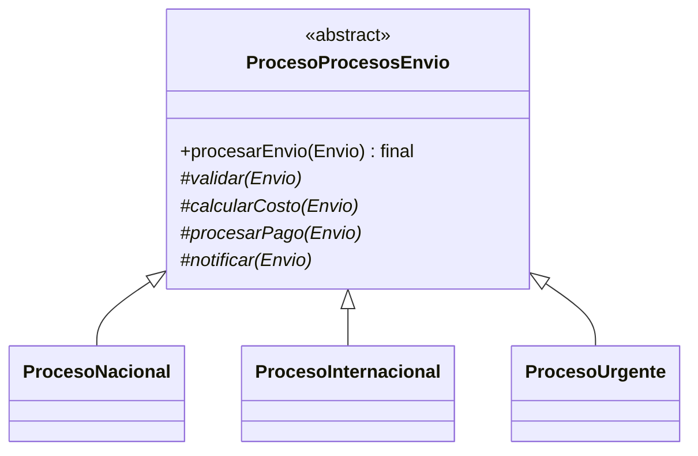

# Hito 12 - Actividad 3: Template Method

**Proyecto:** LogiSmart - Sistema de Gestion de Logistica  
**Patron:** Template Method  
**Paquete:** `com.logismart.template`

---

## Descripcion del Patron

El patron **Template Method** define el esqueleto de un algoritmo en una clase base y deja que las subclases implementen algunos pasos. El orden general queda fijo, pero cada variante puede personalizar los detalles.

En LogiSmart todos los procesos de envio siguen una secuencia similar:

```text
validar -> calcular costo -> procesar pago -> notificar
```

La diferencia esta en como se valida, como se calcula el costo, como se paga y como se notifica segun el tipo de envio.

---

## Problema en LogiSmart

Los procesos nacional, internacional y urgente tienen pasos similares, pero reglas distintas:

- Nacional: validacion simple y costo local.
- Internacional: validacion aduanera y recargo por aduana.
- Urgente: validacion acelerada y costo prioritario.

Sin Template Method, cada proceso podria duplicar el flujo completo y eventualmente cambiar el orden de pasos por error.

---

## Diagrama de Clases



---

## Diagrama de Secuencia

```text
Cliente       ProcesoProcesosEnvio        ProcesoUrgente          Envio
   |                  |                         |                  |
   | procesarEnvio(e) |                         |                  |
   |----------------->| validar(e)              |                  |
   |                  |------------------------>|                  |
   |                  | calcularCosto(e)        |                  |
   |                  |------------------------>| setCosto(costo)  |
   |                  |                         |----------------->|
   |                  | procesarPago(e)         |                  |
   |                  |------------------------>|                  |
   |                  | notificar(e)            |                  |
   |                  |------------------------>|                  |
   |<-----------------|                         |                  |
```

---

## Implementacion

### `ProcesoProcesosEnvio.java`

Clase base abstracta. El metodo `procesarEnvio` es `final` para que ninguna subclase pueda alterar el orden.

```java
package com.logismart.template;

import com.logismart.dominio.Envio;

public abstract class ProcesoProcesosEnvio {

    public final void procesarEnvio(Envio envio) {
        System.out.println("[Proceso] Iniciando procesamiento de " + envio.getId());
        validar(envio);
        calcularCosto(envio);
        procesarPago(envio);
        notificar(envio);
        System.out.println("[Proceso] Procesamiento completado\n");
    }

    protected abstract void validar(Envio envio);
    protected abstract void calcularCosto(Envio envio);
    protected abstract void procesarPago(Envio envio);
    protected abstract void notificar(Envio envio);
}
```

### `ProcesoNacional.java`

Proceso simple para envios dentro del pais.

```java
public class ProcesoNacional extends ProcesoProcesosEnvio {

    @Override
    protected void validar(Envio envio) {
        System.out.println("[Nacional] Validando envio nacional");
    }

    @Override
    protected void calcularCosto(Envio envio) {
        double costo = 100.0 + (envio.getPeso() * 5.0);
        envio.setCosto(costo);
        System.out.println("[Nacional] Costo: $" + String.format("%.2f", costo));
    }

    @Override
    protected void procesarPago(Envio envio) {
        System.out.println("[Nacional] Procesando pago local");
    }

    @Override
    protected void notificar(Envio envio) {
        System.out.println("[Nacional] Enviando notificacion al cliente");
    }
}
```

### `ProcesoInternacional.java`

Agrega validacion aduanera y recargo del 15%.

```java
public class ProcesoInternacional extends ProcesoProcesosEnvio {

    @Override
    protected void validar(Envio envio) {
        System.out.println("[Internacional] Validando documentacion aduanera");
    }

    @Override
    protected void calcularCosto(Envio envio) {
        double costoBase = 200.0 + (envio.getPeso() * 10.0);
        double costoAduanas = costoBase * 0.15;
        double costo = costoBase + costoAduanas;
        envio.setCosto(costo);
        System.out.println("[Internacional] Costo: $" + String.format("%.2f", costo));
    }

    @Override
    protected void procesarPago(Envio envio) {
        System.out.println("[Internacional] Procesando pago internacional");
    }

    @Override
    protected void notificar(Envio envio) {
        System.out.println("[Internacional] Enviando informacion aduanera");
    }
}
```

### `ProcesoUrgente.java`

Usa validacion acelerada y tarifa prioritaria.

```java
public class ProcesoUrgente extends ProcesoProcesosEnvio {

    @Override
    protected void validar(Envio envio) {
        System.out.println("[Urgente] Validacion acelerada");
    }

    @Override
    protected void calcularCosto(Envio envio) {
        double costo = 500.0 + (envio.getPeso() * 15.0);
        envio.setCosto(costo);
        System.out.println("[Urgente] Costo prioritario: $" + String.format("%.2f", costo));
    }

    @Override
    protected void procesarPago(Envio envio) {
        System.out.println("[Urgente] Procesando pago inmediato");
    }

    @Override
    protected void notificar(Envio envio) {
        System.out.println("[Urgente] Enviando SMS urgente");
    }
}
```

---

## Casos de Prueba

Demo ejecutable: `com.logismart.template.TemplateMethodDemo`

```java
ProcesoProcesosEnvio procesoNacional = new ProcesoNacional();
procesoNacional.procesarEnvio(envio1);
```

| Caso | Proceso | Validacion | Costo | Notificacion |
|---|---|---|---|---|
| 1 | Nacional | envio nacional | `100 + peso * 5` | cliente |
| 2 | Internacional | documentacion aduanera | `(200 + peso * 10) * 1.15` | aduana |
| 3 | Urgente | acelerada | `500 + peso * 15` | SMS urgente |
| 4 | Multiples procesos | lista de procesos | cada formula propia | cada notificacion propia |
| 5 | Extensibilidad | nuevo proceso | agregando subclase | sin tocar la base |
| 6 | Orden fijo | cualquiera | siempre antes de pago | siempre al final |

---

## Decisiones de Diseno

**Por que `procesarEnvio` es `final`?**  
Porque el objetivo del patron es fijar el esqueleto del algoritmo. Si una subclase pudiera sobrescribirlo, podria saltear validacion o cambiar el orden del pago.

**Por que los pasos son `protected abstract`?**  
Solo las subclases deben implementar los pasos. No forman parte de la API publica del proceso.

**Por que cada proceso actualiza `envio.setCosto`?**  
El costo calculado queda disponible para auditoria, reportes o integraciones posteriores.

**Por que no usar Strategy para cada paso?**  
Strategy seria mas flexible, pero el objetivo aca es demostrar un algoritmo con orden fijo y pasos especializados por herencia.

---

## Ventajas y Desventajas

**Ventajas**
- Evita duplicar el flujo de procesamiento.
- Garantiza el mismo orden para todos los procesos.
- Facilita agregar variantes (`ProcesoExpress`, `ProcesoFragil`, etc.).
- Hace visible que cambia y que permanece estable.

**Desventajas**
- Usa herencia, por lo que es menos flexible que composicion.
- Si aparecen muchas combinaciones de pasos, puede crecer la cantidad de subclases.
- El algoritmo base queda rigido: cambiar el orden afecta a todos los procesos.
