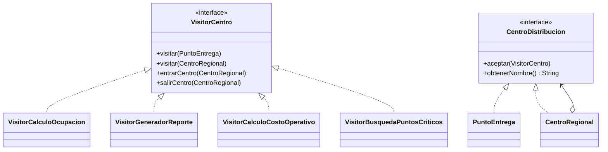

# Hito 12 - Actividad 4: Visitor

**Proyecto:** LogiSmart - Sistema de Gestion de Logistica  
**Patron:** Visitor  
**Paquete:** `com.logismart.visitor`

---

## Descripcion del Patron

El patron **Visitor** permite agregar operaciones sobre una estructura de objetos sin modificar las clases de esa estructura. La operacion se encapsula en un objeto visitante y los elementos aceptan la visita.

En LogiSmart se usa para analizar una estructura jerarquica de centros regionales y puntos de entrega.

---

## Problema en LogiSmart

La estructura de distribucion necesita multiples analisis:

- Calcular ocupacion promedio.
- Generar un reporte jerarquico.
- Calcular costo operativo.
- Buscar puntos criticos por ocupacion.

Sin Visitor, cada una de estas operaciones tendria que agregarse como metodo en `CentroRegional` y `PuntoEntrega`. Eso ensucia las clases de dominio con responsabilidades analiticas.

---

## Diagrama de Clases



---

## Diagrama de Secuencia

Recorrido de una estructura compuesta:

```text
Cliente       CentroRegional       VisitorReporte       PuntoEntrega
   |                |                    |                   |
   | aceptar(v)     |                    |                   |
   |--------------->| visitar(centro)    |                   |
   |                |------------------->|                   |
   |                | entrarCentro()     |                   |
   |                |------------------->|                   |
   |                | subcentro.aceptar  |                   |
   |                |--------------------------------------->|
   |                |                    | visitar(punto)    |
   |                |<---------------------------------------|
   |                | salirCentro()      |                   |
   |                |------------------->|                   |
   |<---------------|                    |                   |
```

---

## Implementacion

### `VisitorCentro.java`

Define una sobrecarga por cada tipo de elemento. Tambien agrega hooks opcionales para entrar y salir de centros, utiles para indentacion.

```java
package com.logismart.visitor;

public interface VisitorCentro {
    void visitar(PuntoEntrega punto);
    void visitar(CentroRegional centro);

    default void entrarCentro(CentroRegional centro) {
    }

    default void salirCentro(CentroRegional centro) {
    }
}
```

### `CentroDistribucion.java`

Interfaz de los elementos visitables.

```java
package com.logismart.visitor;

public interface CentroDistribucion {
    void aceptar(VisitorCentro visitor);
    String obtenerNombre();
}
```

### `PuntoEntrega.java`

Elemento hoja. Al aceptar un visitor, invoca la visita correspondiente.

```java
public class PuntoEntrega implements CentroDistribucion {

    private final String nombre;
    private final double ocupacion;

    public PuntoEntrega(String nombre, double ocupacion) {
        this.nombre = nombre;
        this.ocupacion = ocupacion;
    }

    @Override
    public void aceptar(VisitorCentro visitor) {
        visitor.visitar(this);
    }

    @Override
    public String obtenerNombre() {
        return nombre;
    }

    public double obtenerOcupacion() {
        return ocupacion;
    }
}
```

### `CentroRegional.java`

Elemento compuesto. Primero visita el centro y despues delega la visita a sus subcentros.

```java
public class CentroRegional implements CentroDistribucion {

    private final String nombre;
    private final List<CentroDistribucion> subcentros = new ArrayList<>();

    public void agregarSubcentro(CentroDistribucion centro) {
        subcentros.add(centro);
    }

    @Override
    public void aceptar(VisitorCentro visitor) {
        visitor.visitar(this);
        visitor.entrarCentro(this);
        for (CentroDistribucion centro : subcentros) {
            centro.aceptar(visitor);
        }
        visitor.salirCentro(this);
    }

    @Override
    public String obtenerNombre() {
        return nombre;
    }
}
```

---

## Visitors Concretos

### `VisitorCalculoOcupacion.java`

Acumula ocupacion total y cantidad de puntos visitados.

```java
public class VisitorCalculoOcupacion implements VisitorCentro {

    private double ocupacionTotal = 0.0;
    private int puntosContados = 0;

    @Override
    public void visitar(PuntoEntrega punto) {
        ocupacionTotal += punto.obtenerOcupacion();
        puntosContados++;
    }

    @Override
    public void visitar(CentroRegional centro) {
        System.out.println("[Ocupacion] Centro: " + centro.obtenerNombre());
    }

    public double obtenerOcupacionPromedio() {
        return puntosContados > 0 ? ocupacionTotal / puntosContados : 0.0;
    }
}
```

### `VisitorGeneradorReporte.java`

Genera un arbol textual. Usa los hooks `entrarCentro` y `salirCentro` para manejar el nivel.

```java
public class VisitorGeneradorReporte implements VisitorCentro {

    private final StringBuilder reporte = new StringBuilder();
    private int nivel = 0;

    @Override
    public void visitar(PuntoEntrega punto) {
        agregarIndentacion();
        reporte.append("- ")
                .append(punto.obtenerNombre())
                .append(" (")
                .append(String.format("%.1f", punto.obtenerOcupacion()))
                .append("%)\n");
    }

    @Override
    public void visitar(CentroRegional centro) {
        agregarIndentacion();
        reporte.append("+ ").append(centro.obtenerNombre()).append("\n");
    }

    @Override
    public void entrarCentro(CentroRegional centro) {
        nivel++;
    }

    @Override
    public void salirCentro(CentroRegional centro) {
        nivel--;
    }
}
```

### `VisitorCalculoCostoOperativo.java`

Calcula costo operativo a partir de la ocupacion de cada punto.

```java
public class VisitorCalculoCostoOperativo implements VisitorCentro {

    private double costoTotal = 0.0;

    @Override
    public void visitar(PuntoEntrega punto) {
        costoTotal += punto.obtenerOcupacion() * 10.0;
    }

    @Override
    public void visitar(CentroRegional centro) {
        System.out.println("[Costo] Centro: " + centro.obtenerNombre());
    }

    public double obtenerCostoTotal() {
        return costoTotal;
    }
}
```

### `VisitorBusquedaPuntosCriticos.java`

Guarda puntos con ocupacion superior al umbral.

```java
public class VisitorBusquedaPuntosCriticos implements VisitorCentro {

    private final List<String> puntosCriticos = new ArrayList<>();
    private final double umbral;

    public VisitorBusquedaPuntosCriticos() {
        this(80.0);
    }

    @Override
    public void visitar(PuntoEntrega punto) {
        if (punto.obtenerOcupacion() > umbral) {
            puntosCriticos.add(punto.obtenerNombre() + " ("
                    + String.format("%.1f", punto.obtenerOcupacion()) + "%)");
        }
    }
}
```

---

## Estructura de Prueba

```java
CentroRegional centroNacional = new CentroRegional("Centro Nacional");
CentroRegional centroCaba = new CentroRegional("Centro CABA");
centroCaba.agregarSubcentro(new PuntoEntrega("Punto San Telmo", 75.0));
centroCaba.agregarSubcentro(new PuntoEntrega("Punto Recoleta", 85.0));

CentroRegional centroMendoza = new CentroRegional("Centro Mendoza");
centroMendoza.agregarSubcentro(new PuntoEntrega("Punto Mendoza Centro", 60.0));
centroMendoza.agregarSubcentro(new PuntoEntrega("Punto Godoy Cruz", 92.0));

centroNacional.agregarSubcentro(centroCaba);
centroNacional.agregarSubcentro(centroMendoza);
```

---

## Casos de Prueba

Demo ejecutable: `com.logismart.visitor.VisitorDemo`

| Caso | Visitor | Resultado esperado |
|---|---|---|
| 1 | `VisitorCalculoOcupacion` | promedio de ocupacion de puntos |
| 2 | `VisitorGeneradorReporte` | reporte jerarquico indentado |
| 3 | `VisitorCalculoCostoOperativo` | costo total por ocupacion |
| 4 | `VisitorBusquedaPuntosCriticos` | puntos sobre 80% |
| 5 | multiples visitors | misma estructura, operaciones distintas |
| 6 | busqueda con umbral custom | lista critica ajustada |

---

## Decisiones de Diseno

**Por que crear un paquete `visitor` nuevo si ya habia distribucion?**  
El TP ya tenia clases en `com.logismart.dominio.distribucion` para un Composite anterior. Para cumplir la consigna del Hito 12 sin arriesgar regresiones, se creo una estructura especifica para Visitor.

**Por que `VisitorCentro` tiene hooks default?**  
El PDF solo pide `visitar(PuntoEntrega)` y `visitar(CentroRegional)`, pero el reporte jerarquico necesita saber cuando entra y sale de un centro para ajustar indentacion. Los hooks son default, por lo que no obligan a todos los visitors a implementarlos.

**Por que `CentroRegional` recorre recursivamente?**  
Porque representa un elemento compuesto. El cliente solo llama `centroNacional.aceptar(visitor)` y la estructura completa se recorre sola.

**Por que Visitor y Composite aparecen juntos?**  
Visitor suele aplicarse sobre estructuras estables. Aca la estructura jerarquica de centros funciona como Composite y los Visitors agregan operaciones analiticas.

---

## Ventajas y Desventajas

**Ventajas**
- Permite agregar operaciones sin modificar `CentroRegional` ni `PuntoEntrega`.
- Reutiliza la misma estructura para varios analisis.
- Mantiene las clases de datos limpias.
- Facilita reportes, auditorias y calculos externos.

**Desventajas**
- Si se agrega un nuevo tipo de elemento, hay que actualizar `VisitorCentro`.
- La doble-dispatch puede ser menos intuitiva al principio.
- Si las operaciones son pocas, puede ser mas estructura de la necesaria.
