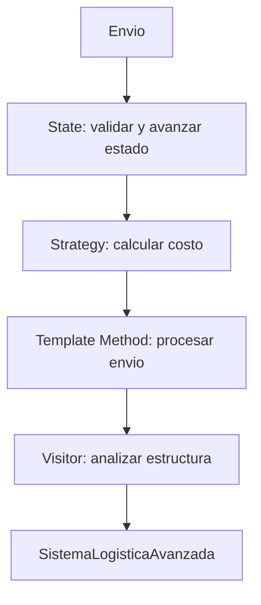

# Hito 12 - Actividad 5: Integracion Completa

**Proyecto:** LogiSmart - Sistema de Gestion de Logistica  
**Patrones integrados:** State, Strategy, Template Method, Visitor  
**Paquete:** `com.logismart.avanzada`

---

## Objetivo

La integracion muestra como los cuatro patrones del Hito 12 cooperan en un flujo completo:

1. **State** controla las transiciones validas del envio.
2. **Strategy** calcula el costo con una formula intercambiable.
3. **Template Method** procesa el envio con un flujo fijo.
4. **Visitor** analiza la red de centros y puntos de entrega.

---

## Diagrama de Arquitectura



---

## Flujo Integrado

```text
SistemaLogisticaAvanzada
  |
  |-- State
  |     envio.validar()
  |     envio.entregar()
  |
  |-- Strategy
  |     envio.establecerEstrategia(new EstrategiaHibrida())
  |     envio.calcularCosto()
  |
  |-- Template Method
  |     proceso.procesarEnvio(envio)
  |
  |-- Visitor
        estructura.aceptar(new VisitorCalculoOcupacion())
```

---

## Implementacion

### `SistemaLogisticaAvanzada.java`

Orquesta los cuatro patrones. Recibe el proceso y la estructura por parametro para no quedar atado a una unica variante.

```java
package com.logismart.avanzada;

public class SistemaLogisticaAvanzada {

    public void procesarEnvioCompleto(Envio envio, ProcesoProcesosEnvio proceso,
                                      CentroDistribucion estructura) {
        System.out.println("=== Sistema Logistica Avanzada ===");

        System.out.println("\n[Integracion] State");
        envio.validar();
        envio.entregar();

        System.out.println("\n[Integracion] Strategy");
        envio.establecerEstrategia(new EstrategiaHibrida());
        double costo = envio.calcularCosto();
        envio.setCosto(costo);
        System.out.println("Costo calculado: $" + String.format("%.2f", costo));

        System.out.println("\n[Integracion] Template Method");
        proceso.procesarEnvio(envio);

        System.out.println("[Integracion] Visitor");
        VisitorCalculoOcupacion visitor = new VisitorCalculoOcupacion();
        estructura.aceptar(visitor);
        System.out.println("Ocupacion promedio: "
                + String.format("%.2f", visitor.obtenerOcupacionPromedio()) + "%");
    }
}
```

### `IntegracionHito12Demo.java`

Ejecuta cinco escenarios integrados y complementarios.

```java
public class IntegracionHito12Demo {

    public static void main(String[] args) {
        SistemaLogisticaAvanzada sistema = new SistemaLogisticaAvanzada();
        CentroRegional estructura = VisitorDemo.crearEstructura();

        Envio urgente = crearEnvio("ENV-I-001", "URGENTE", 4.5);
        sistema.procesarEnvioCompleto(urgente, new ProcesoUrgente(), estructura);

        Envio nacional = crearEnvio("ENV-I-002", "NORMAL", 7.0);
        sistema.procesarEnvioCompleto(nacional, new ProcesoNacional(), estructura);
    }
}
```

---

## Relacion entre Patrones

| Patron | Objeto principal | Momento en el flujo | Resultado |
|---|---|---|---|
| State | `Envio` + estados concretos | Antes de calcular costo | el envio pasa por estados validos |
| Strategy | `EstrategiaCalculoCosto` | Despues de validar estado | costo calculado con algoritmo elegido |
| Template Method | `ProcesoProcesosEnvio` | Despues de calcular costo | proceso completo ejecutado en orden fijo |
| Visitor | `VisitorCentro` | Al final | estructura analizada sin modificar elementos |

---

## Casos de Integracion

Demo ejecutable: `com.logismart.avanzada.IntegracionHito12Demo`

| Caso | Descripcion | Patrones usados | Resultado esperado |
|---|---|---|---|
| 1 | Flujo completo urgente | State + Strategy + Template + Visitor | envio avanza, calcula costo hibrido, procesa urgente y analiza ocupacion |
| 2 | Flujo completo nacional | State + Strategy + Template + Visitor | mismo pipeline con proceso nacional |
| 3 | Cambio dinamico de estrategia | Strategy | costo por peso y luego hibrido para el mismo envio |
| 4 | Varios procesos | Template Method | nacional, internacional y urgente mantienen mismo orden |
| 5 | Analisis de puntos criticos | Visitor | lista puntos con ocupacion mayor a 80% |
| 6 | Estado retenido y liberado | State | retencion vuelve al flujo hacia reparto |
| 7 | Estructura reutilizada | Visitor | varios visitors recorren la misma red |

---

## Secuencia Completa

```text
Cliente     SistemaAvanzado     Envio/State     Strategy     Template     Visitor
   |              |                  |              |            |           |
   | procesar     |                  |              |            |           |
   |------------->| validar()        |              |            |           |
   |              |----------------->| CONFIRMADO -> EN_TRANSITO              |
   |              | entregar()       |              |            |           |
   |              |----------------->| EN_TRANSITO -> EN_REPARTO              |
   |              | establecer estrategia hibrida   |            |           |
   |              |-------------------------------> |            |           |
   |              | calcularCosto()  |              |            |           |
   |              |-------------------------------->|            |           |
   |              | proceso.procesarEnvio()         |            |           |
   |              |--------------------------------------------->|           |
   |              | estructura.aceptar(visitor)     |            |           |
   |              |--------------------------------------------------------->|
```

---

## Decisiones de Diseno

**Por que `SistemaLogisticaAvanzada` recibe el proceso como parametro?**  
Porque permite usar `ProcesoNacional`, `ProcesoInternacional` o `ProcesoUrgente` sin modificar la clase integradora.

**Por que se usa `EstrategiaHibrida` en la integracion principal?**  
Porque demuestra composicion de estrategias y usa distancia, peso y urgencia en un solo calculo.

**Por que Visitor se ejecuta al final?**  
Porque analiza la capacidad/ocupacion de la red luego de decidir y procesar el envio. En una version productiva podria ejecutarse antes para seleccionar centro de destino.

**Como se evita acoplamiento excesivo?**  
La integracion conoce interfaces o clases base: `ProcesoProcesosEnvio`, `CentroDistribucion` y `EstrategiaCalculoCosto` a traves de `Envio`. Cada patron mantiene su responsabilidad.

---

## Ventajas y Desventajas de la Integracion

**Ventajas**
- Muestra un flujo realista de negocio usando los cuatro patrones.
- Permite cambiar proceso, costo y analisis sin reescribir el pipeline.
- Reutiliza `Envio` como contexto comun.
- Mantiene separados comportamiento de estado, algoritmo de costo, proceso y analisis estructural.

**Desventajas**
- El flujo integrado requiere entender varios paquetes.
- `Envio` concentra varios roles de contexto por motivos academicos.
- En un sistema productivo convendria separar mas los casos de uso y usar inyeccion de dependencias.
