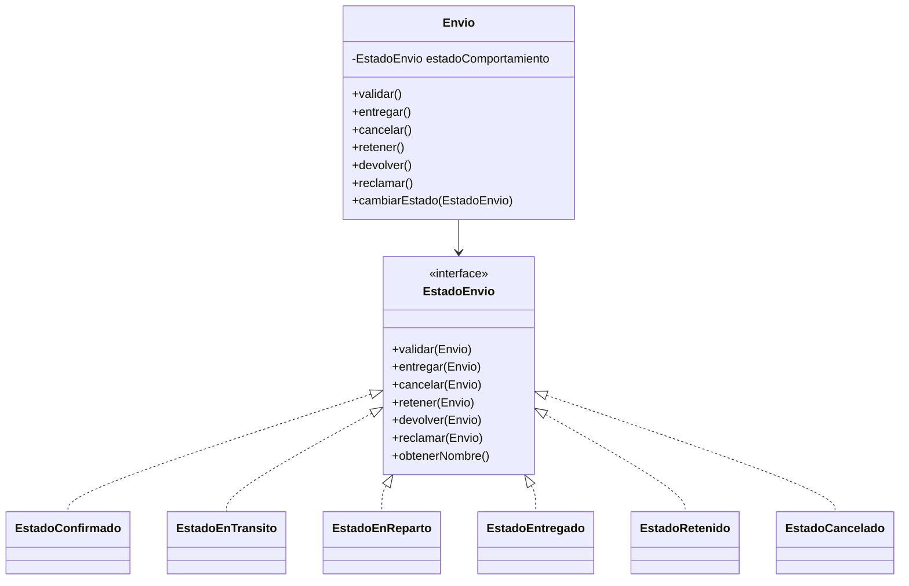
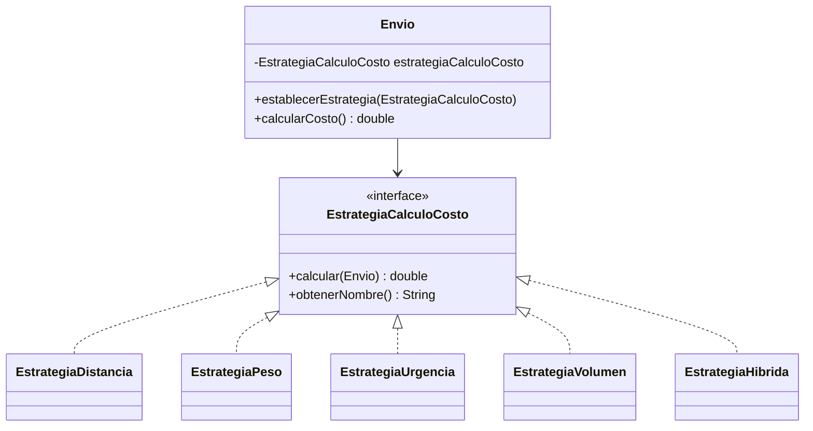
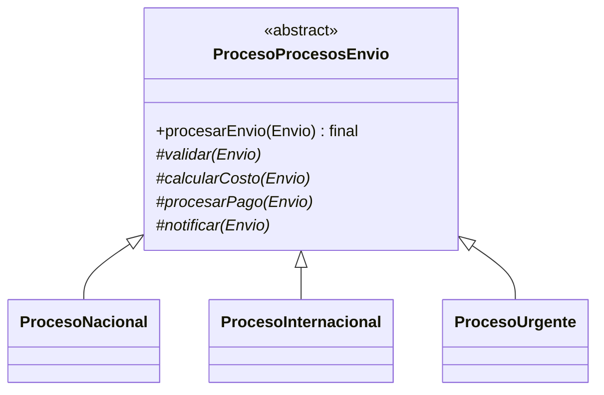
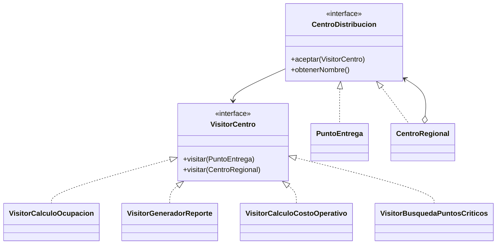
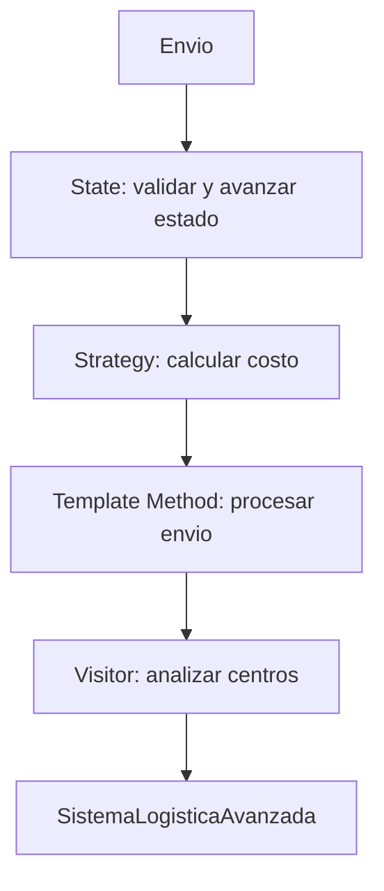

# Hito 12 - Diagramas UML

## State

```mermaid
classDiagram
    class Envio {
      -EstadoEnvio estadoComportamiento
      +validar()
      +entregar()
      +cancelar()
      +retener()
      +devolver()
      +reclamar()
      +cambiarEstado(EstadoEnvio)
    }
    class EstadoEnvio {
      <<interface>>
      +validar(Envio)
      +entregar(Envio)
      +cancelar(Envio)
      +retener(Envio)
      +devolver(Envio)
      +reclamar(Envio)
      +obtenerNombre()
    }
    EstadoEnvio <|.. EstadoConfirmado
    EstadoEnvio <|.. EstadoEnTransito
    EstadoEnvio <|.. EstadoEnReparto
    EstadoEnvio <|.. EstadoEntregado
    EstadoEnvio <|.. EstadoRetenido
    EstadoEnvio <|.. EstadoCancelado
    Envio --> EstadoEnvio
```

## Strategy

```mermaid
classDiagram
    class Envio {
      -EstrategiaCalculoCosto estrategiaCalculoCosto
      +establecerEstrategia(EstrategiaCalculoCosto)
      +calcularCosto() double
    }
    class EstrategiaCalculoCosto {
      <<interface>>
      +calcular(Envio) double
      +obtenerNombre() String
    }
    EstrategiaCalculoCosto <|.. EstrategiaDistancia
    EstrategiaCalculoCosto <|.. EstrategiaPeso
    EstrategiaCalculoCosto <|.. EstrategiaUrgencia
    EstrategiaCalculoCosto <|.. EstrategiaVolumen
    EstrategiaCalculoCosto <|.. EstrategiaHibrida
    Envio --> EstrategiaCalculoCosto
```

## Template Method

```mermaid
classDiagram
    class ProcesoProcesosEnvio {
      <<abstract>>
      +procesarEnvio(Envio) final
      #validar(Envio)*
      #calcularCosto(Envio)*
      #procesarPago(Envio)*
      #notificar(Envio)*
    }
    ProcesoProcesosEnvio <|-- ProcesoNacional
    ProcesoProcesosEnvio <|-- ProcesoInternacional
    ProcesoProcesosEnvio <|-- ProcesoUrgente
```

## Visitor

```mermaid
classDiagram
    class VisitorCentro {
      <<interface>>
      +visitar(PuntoEntrega)
      +visitar(CentroRegional)
    }
    class CentroDistribucion {
      <<interface>>
      +aceptar(VisitorCentro)
      +obtenerNombre()
    }
    CentroDistribucion <|.. PuntoEntrega
    CentroDistribucion <|.. CentroRegional
    CentroRegional o--> CentroDistribucion
    VisitorCentro <|.. VisitorCalculoOcupacion
    VisitorCentro <|.. VisitorGeneradorReporte
    VisitorCentro <|.. VisitorCalculoCostoOperativo
    VisitorCentro <|.. VisitorBusquedaPuntosCriticos
    CentroDistribucion --> VisitorCentro
```

## Integracion

```mermaid
flowchart TD
    A[Envio] --> B[State: validar y avanzar estado]
    B --> C[Strategy: calcular costo]
    C --> D[Template Method: procesar envio]
    D --> E[Visitor: analizar centros]
    E --> F[SistemaLogisticaAvanzada]
```
